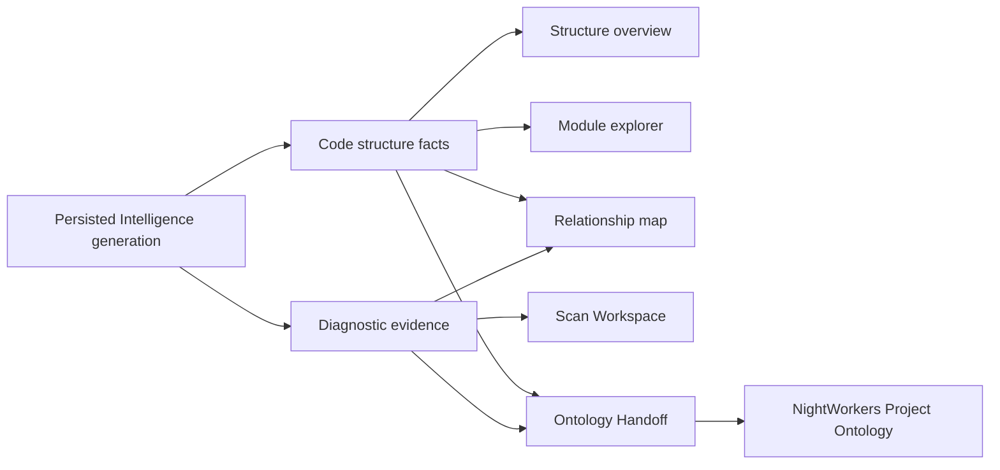

# Intelligence Structure-First UI Rework Plan

Status: Planned

## 1. Decision summary

Project Intelligence を、Scan 結果の再表示画面から、Static Intelligence generation に含まれる構造情報と外部 Ontology 連携候補を確認する画面へ戻す。

新しい画面の中心は次とする。

1. code structure facts
2. module candidates と依存関係
3. Diagnostic Evidence Graph と Scan evidence の重ね合わせ
4. NightWorkers への Ontology Handoff

Finding の一覧、個別詳細、review、decision の主導線は Scan Workspace が所有する。Intelligence は Finding を構造上の文脈へ重ねるが、同じ review UI を再実装しない。

## 2. Background and problem statement

現在の4画面は Finding を主語に設計されている。

| 現画面 | 主な内容 | 問題 |
| --- | --- | --- |
| 判断優先 | severity、Finding、優先ファイル | Scan summary と重複する |
| 調査ビュー | Finding 一覧と詳細 | Scan Workspace と重複する |
| リスクマップ | module × severity | Finding 0件では全セルが0になり、構造情報を活用できない |
| ガイド方式 | Finding decision | Scan review/decision と重複する |

実データでは Finding が0件でも、Project Structure generation に file inventory、module candidates、typed references、entrypoints、package dependencies、readiness が存在する。現UIは構造情報をリスク表示の補助に限定し、Ontology Handoff を閉じた「分析詳細」の中へ移したため、利用可能な Intelligence が見えなくなっている。

テストも Finding を持つモックを中心としており、「構造データは豊富だが Finding は0件」という実運用ケースを主要シナリオとして検証できていない。

## 3. Product boundary

### 3.1 Responsibility matrix

| 領域 | Scan Workspace | Project Intelligence | NightWorkers |
| --- | --- | --- | --- |
| scanner 実行と履歴 | 主担当 | evidence source として参照 | 実行要求のみ |
| Finding 一覧・詳細 | 主担当 | 構造への overlay と件数のみ | task evidence として参照 |
| review / decision | 主担当 | 読み取り要約と Scan へのリンク | task判断へ利用 |
| file / import / export facts | 参照しない | 主担当 | code evidence として利用 |
| module candidates | 参照しない | 主担当 | canonical Ontology への候補入力 |
| Diagnostic Evidence Graph | 個別証跡を表示 | 関係性の read model を表示 | planning context として利用 |
| canonical Project Ontology | 担当しない | 担当しない | 主担当 |
| task compilation / queue | 担当しない | 担当しない | 主担当 |

### 3.2 Naming rule

- vulnWorkbench の構造出力は `モジュール候補` と呼ぶ。
- `Ontology` と断定せず、`Ontology連携` または `Ontology Handoff` と表現する。
- Finding は画面上では `検出事項` と表現する。
- `安全`、`問題なし` は Finding 0件の意味として使用しない。

### 3.3 Data flow



Scan Workspaceは個別証跡を扱い、Project Intelligenceは構造と関係を扱う。Handoffは候補を渡すread modelであり、NightWorkers側の採用状態を表さない。

## 4. Target information architecture

タブは4つを維持し、利用目的を次へ変更する。

| No. | 表示 | canonical URL値 | 役割 |
| --- | --- | --- | --- |
| 01 | 構造サマリー | `overview` | generation の状態とプロジェクト構造を短時間で把握する |
| 02 | モジュール | `modules` | module、file、entrypoint、symbol、dependency を探索する |
| 03 | 関係マップ | `relationships` | module 間依存と Diagnostic Evidence の重なりを追う |
| 04 | Ontology連携 | `handoff` | NightWorkers へ渡す候補、provenance、readiness を確認する |

旧URL値は一リリース以上、互換 alias として受理する。

| legacy | canonical |
| --- | --- |
| `priority` | `overview` |
| `investigate` | `modules` |
| `landscape` | `relationships` |
| `guided` | `handoff` |

新しいリンクは canonical 値だけを生成する。legacy 値で開いた場合も同じ画面を表示し、次のタブ操作から canonical URL へ移行する。

## 5. Shared shell

Project navigation より下に、次の順序で配置する。

1. generation context
2. Intelligence tabs
3. active view

### 5.1 Generation context

Scan を主語にせず、永続化された generation を主語にする。

表示項目:

- generatedAt
- generation status / freshness
- source scan profile と completedAt
- source tree hash の短縮表示
- structure / evidence / handoff readiness の要約
- `Intelligenceを更新`
- `Scan Workspaceで証跡を見る`

現在の `Analysis scan` selector は `Intelligence source` または `分析スナップショット` へ変更する。各選択肢には scan profile、完了日時、Intelligence generation の有無を表示し、generation がない scan を選んだ場合は生成操作と理由を示す。

### 5.2 Loading and refresh

- GET で暗黙 refresh しない。
- refresh 中も現在の generation は stale 表示付きで閲覧可能にする。
- refresh 完了時だけ、新しい generationId へ切り替える。
- generationId が変わったら module 選択、file cursor、graph selection、tab-local error を破棄する。

## 6. View 01: 構造サマリー

### 6.1 Purpose

30秒以内に「どこまで解析できているか」「どの構造が主要か」「外部連携へ渡せるか」を判断できるようにする。

### 6.2 Content order

1. readiness callout
2. structure metrics
3. module candidates preview
4. analysis coverage / diagnostics
5. security evidence overlay
6. next actions

### 6.3 Metrics

- inventory files
- analyzed files
- module candidates
- resolved / unresolved references
- package dependencies
- entrypoints
- route / handler / schema / worker / test / config counts
- scan evidence count

Finding 0件でも structure metrics を通常表示する。Finding 件数は metrics の一つに留め、画面全体の empty state を決める条件にしない。

### 6.4 Module preview

- fileCount 降順で上位6件
- label / pathPrefix
- confidence と reason
- entrypoint count
- inbound / outbound module dependency count
- risk overlay が存在する場合だけ severity と検出件数
- `モジュールで開く` から View 02 へ遷移

### 6.5 Readiness callout

優先順位:

1. generation missing / failed
2. structure analysis failed
3. resolution / module inference degraded
4. handoff stale / degraded
5. available

Critical / High Finding は補足アラートに表示するが、structure readiness の主メッセージを上書きしない。

## 7. View 02: モジュール

### 7.1 Purpose

Project Structure Snapshot を人が探索できる master-detail UI にする。

### 7.2 Layout

Desktop:

```text
┌────────────────────────┬─────────────────────────────────────┐
│ Module list / filters  │ Selected module                     │
│                        │ overview / dependencies / files     │
└────────────────────────┴─────────────────────────────────────┘
```

Narrow viewport では module list、selected module、files の順に1カラム化する。

### 7.3 Module list

検索対象:

- label
- pathPrefix
- role tag
- entrypoint
- package dependency

フィルター:

- boundary / role
- confidence band
- analysis readiness
- risk overlay の有無

各行には file count、entrypoint count、internal dependency count を必ず表示する。Finding 0件でも情報密度を維持する。

### 7.4 Module detail

- label / pathPrefix / confidence / reasons
- role tags
- entrypoint files
- inbound module dependencies
- outbound module dependencies
- external package dependencies
- exported symbols
- module files
- fileごとの language / analysis status / tags / reference count / export count
- risk / evidence overlay がある file の印

file body や secret は表示しない。

### 7.5 URL state

- `moduleId`: selected module candidate
- `focusPath`: selected file
- 不正値または generation に存在しない値は無視する
- 初期選択は fileCount 最大、同値は pathPrefix 昇順

## 8. View 03: 関係マップ

### 8.1 Purpose

module dependency と Diagnostic Evidence Graph を同じ構造文脈で確認する。

### 8.2 Default relationship view

初期表示は module dependency とする。

- node: module candidate
- edge: internal dependency
- node summary: files / entrypoints / confidence
- optional overlay: max severity / finding count / evidence quality

専用 chart library は追加しない。最初の実装は accessible な隣接リストと relationship table を主表示にし、CSS/SVG の簡易図は補助表示に限定する。

### 8.3 Selected module context

- inbound / outbound relationship
- shared packages
- affected files
- entrypoints
- unresolved references
- risk overlay
- `モジュールで開く`
- `Scan Workspaceで証跡を見る`

### 8.4 Diagnostic Evidence mode

表示切り替えで次を確認できるようにする。

- finding -> evidence
- finding -> file
- finding -> scanner / rule
- finding -> verification / artifact
- file -> module

Evidence が0件の場合も module dependency view は利用可能とし、画面全体を empty にしない。

### 8.5 Accessibility

- node / edge の情報は図だけに依存しない。
- relationship table を常に提供する。
- keyboard で module 選択と mode 切り替えができる。
- 色は overlay の補助にのみ使い、件数とラベルを併記する。

## 9. View 04: Ontology連携

### 9.1 Purpose

vulnWorkbench の候補データが NightWorkers に取得可能かを、人が検証できる画面にする。

### 9.2 Boundary message

画面上部へ常時表示する。

> vulnWorkbench は正式なProject Ontologyを管理しません。ここでは、NightWorkersがOntologyへ採用・対応付けするための構造候補と診断証跡を確認します。

### 9.3 Content

1. handoff readiness
2. generation provenance
3. consumer boundary
4. module candidate payload preview
5. graph summary
6. source refs
7. verification command candidates
8. manifest / MCP pull commands
9. degraded reasons

### 9.4 Status semantics

- `available`: persisted payload を取得できる
- `stale`: source state と generation が一致しない
- `degraded`: payload は取得できるが一部 capability が不足
- `missing`: generation または必要bundleがない
- `failed`: generation/buildに失敗

`available` は NightWorkers が実際に接続・採用済みである意味にはしない。外部 adoption は unknown と明記する。

### 9.5 Actions

- command copy
- manifest copy
- source refs copy
- generation refresh
- module selected state を View 02 と共有

外部システムへの自動送信は行わない。

## 10. API and data contract changes

### 10.1 Reuse

次は既存契約を維持する。

- `GET /api/projects/:projectId/intelligence`
- `GET /api/projects/:projectId/intelligence/project-structure`
- `GET /api/projects/:projectId/intelligence/ontology-handoff`
- `GET /api/scans/:scanRunId/intelligence/agent-query`
- `POST /api/projects/:projectId/intelligence/refresh`

### 10.2 Project structure query

既存 `view=summary|files|references` を用途別に利用する。

- overview: `view=summary`
- modules: `view=summary` + selected module の `view=files`
- relationships: `view=summary`、必要時だけ `view=references`

次の bounded query を追加する。

```ts
moduleId?: string;
direction?: "inbound" | "outbound" | "both";
```

- `moduleId` は generation 内の module candidate ID と完全一致させる。
- `moduleId` は長さを制限し、存在しないIDは404とする。
- `direction` を `moduleId` なしで指定した場合は400とする。
- files は module が所有する file paths で server-side filter する。
- references は module file set に対する from/to で filter する。
- cursor / limit は既存上限を維持する。
- project ownership、scan ownership、generation pinning を維持する。

クライアント側では、現在のoptional field中心の単一型を次へ分割する。

- `ProjectStructureSummaryResponse`
- `ProjectStructureFilesResponse`
- `ProjectStructureReferencesResponse`

API responseへ `view` discriminatorを追加し、itemsの内容を型で区別する。既存fieldの削除や意味変更は行わない。

### 10.3 Client state separation

現在の `useIntelligenceWorkspaceData` を resource ごとに分割する。

- `useIntelligenceGeneration`
- `useProjectStructureSummary`
- `useProjectStructureFiles`
- `useProjectRelationships`
- `useOntologyHandoff`

Finding/detail/decision state は Intelligence workspace hook から削除する。Scan Workspace側の既存データ取得を利用し、Intelligence には戻さない。

### 10.4 Cache keys

```text
generation: projectId + scanRunId
structure summary: projectId + scanRunId + generationId
module files: projectId + generationId + moduleId + filters + cursor
relationships: projectId + generationId + moduleId + direction + cursor
handoff: projectId + scanRunId + generationId
```

古い request の完了で新しい selection を上書きしないよう、AbortController または request sequence を維持する。

## 11. State design

各 view は次を区別する。

- initial idle
- loading without data
- refreshing with stale data
- available
- degraded with usable data
- empty by domain meaning
- failed with retry

### 11.1 Empty state rules

| 条件 | 表示 |
| --- | --- |
| generationなし | 生成理由と `Intelligenceを生成` |
| inventory 0 | 対象sourceがないことを説明 |
| modules 0 | file inventoryを表示し、module inference diagnosticsを示す |
| findings 0 | structureを通常表示し、risk overlayだけ0件と示す |
| evidence 0 | module dependencyを通常表示し、evidence overlayだけ未取得と示す |
| handoff null | missing bundle / generation の理由と再生成導線 |

Finding 0件を Intelligence 全体の empty state にしない。

## 12. Component plan

### 12.1 New components

- `project-intelligence-overview-panel.tsx`
- `project-intelligence-module-panel.tsx`
- `project-intelligence-relationship-panel.tsx`
- `project-intelligence-handoff-panel.tsx`
- `project-intelligence-generation-context.tsx`
- `project-intelligence-structure-model.ts`
- `project-intelligence-route-model.ts`

### 12.2 Reuse and refactor

- `StructureExplorer` は module detail の表示ロジックを新しい module panel へ移す。
- `OntologyHandoffSection` は View 04 の主要コンテンツへ昇格し、日本語の boundary 表示へ変更する。
- `EvidenceGraphSection` は relationship panel の evidence mode へ移す。
- `ReadinessStrip` は structure / handoff readiness の要約として再利用する。
- `SourceHealthSection` は overview の diagnostics に統合する。

### 12.3 Remove from Intelligence

移行完了後、次の Intelligence 専用実装を削除する。

- Finding master-detail
- guided Finding decision
- Intelligence 専用 finding pagination
- Finding queue / progress model

Scan Workspace の同等機能は削除しない。

### 12.4 Existing working-tree changes

現在の未コミット変更は、現行Finding中心UIの文言とempty stateを調整した暫定修正であり、新しいproduct baselineにはしない。

- active / hoverを分離したCSSは新タブへ引き継ぐ。
- `Finding` を `検出事項` とした日本語表記はrisk/evidence overlayで維持する。
- 廃止対象componentのempty stateやguided decision testは、新画面へ移植せず削除する。
- 実装開始時にworking treeの差分を再確認し、構造中心UIと無関係な変更を巻き込まない。

## 13. Responsive and interaction requirements

- viewport 390px で page-level horizontal scroll を発生させない。
- module / relationship table はコンポーネント内スクロールまたは stacked cards に切り替える。
- tab labels は省略せず、狭い画面では2列または横スクロール可能な tablist とする。
- active / hover / focus-visible を別表現にする。
- `aria-current="page"` は1件だけにする。
- master-detail selection は `aria-pressed` または適切な listbox pattern を使う。
- loading、refreshing、error は status / alert を適切に分ける。

## 14. Migration slices

### Slice A: Contract and routing foundation

- canonical view IDs と legacy alias parser
- `moduleId` route state
- project-structure bounded module query
- pure structure view models
- API / route / model unit tests

Exit gate:

- legacy URL 4種が対応する canonical view を表示する
- generation切替で stale state が混入しない
- ownership境界とlimit上限を維持する

### Slice B: Structure overview

- generation context
- structure-first metrics
- module preview
- coverage / diagnostics
- security evidence overlay

Exit gate:

- Finding 0件、modulesありの fixture で主要情報が表示される
- Scan summaryだけを表示するカードが主役になっていない

### Slice C: Module explorer

- module search / filter / selection
- exact module files query
- dependencies / entrypoints / packages / symbols
- pagination and retry

Exit gate:

- 500件を超える file inventory でも bounded paging できる
- deep link で module と file を再現できる

### Slice D: Relationship map

- module adjacency model
- accessible relationship table
- selected module context
- Diagnostic Evidence mode
- Scan Workspaceへのevidence link

Exit gate:

- Finding 0件でも dependency relation を探索できる
- evidence edge がある fixture では module / file context へ辿れる

### Slice E: Ontology Handoff

- handoffを主要タブへ移動
- provenance / consumer boundary / commands
- missing / stale / degraded / failed states
- command copy feedback

Exit gate:

- canonical Ontology を所有しないことが常時明示される
- available と external adoption が混同されない

### Slice F: Legacy removal and polish

- Intelligence Finding/decision componentsを撤去
- obsolete CSS と testsを削除
- UI copyを日本語へ統一
- accessibility / responsive / full verification

Exit gate:

- Scan WorkspaceのFinding/review/decisionに回帰がない
- dead import、dead route state、unused CSS がない

## 15. Test strategy

### 15.1 Pure model tests

- legacy -> canonical view mapping
- module sort and initial selection
- inbound / outbound adjacency
- confidence band / role filters
- evidence node -> file -> module resolution
- unresolved refs / missing module handling

### 15.2 API tests

- summary / files / references view
- exact moduleId filtering
- cursor / limit
- invalid moduleId
- mismatched project / scan / generation
- stale generation pinning
- empty structure generation

### 15.3 Component and integration tests

- loading -> available
- available -> refresh with stale data
- module change during in-flight request
- missing / degraded / failed readiness
- copy success / failure
- Finding 0件でも structure content が残る

### 15.4 E2E scenarios

最低限次の fixture を分ける。

1. structure-rich / zero-findings
2. structure-rich / findings-and-evidence
3. degraded resolution
4. missing handoff
5. stale generation

各fixtureで確認すること:

- 4ビューのURL同期とbrowser back/forward
- project base data の不要な再取得がない
- selected generation の全API一致
- 390px layout
- serious / critical axe violation なし
- Scan Workspaceへのリンク
- legacy URL compatibility

### 15.5 Verification commands

```bash
bun run lint
bun run typecheck
bun test web/src/domains/projects
bun test api/routes/static-intelligence.route.test.ts
bun run test:e2e -- tests/e2e/project-intelligence.spec.ts
bun run verify
```

## 16. Acceptance criteria

- Intelligence の主要4画面が Scan の Finding review UI を複製していない。
- Finding 0件でも file、module、reference、dependency、handoff が利用できる。
- module candidate と canonical Ontology の違いがUIで明示される。
- Overview から module、relationship、handoff へ一操作で移動できる。
- module と relationship の選択状態をURLで共有できる。
- generation provenance と freshness を全画面から確認できる。
- data unavailable、zero、degraded、failed を混同しない。
- legacy URLs が壊れない。
- Scan Workspace の Finding、review、decision に回帰がない。
- unit、API、E2E、accessibility、responsive、full verify が成功する。

## 17. Risks and mitigations

| Risk | Mitigation |
| --- | --- |
| large projectでfiles取得が重い | summary-first、moduleId filter、bounded pagination |
| graphを視覚化してaccessibilityが落ちる | table / adjacency listをprimaryにする |
| Ontologyを所有しているように見える | `候補` と consumer boundary を常時表示 |
| refresh中にgenerationが混在する | generationId pinning と cache key分離 |
| risk情報を外すことでsecurity contextが弱くなる | risk/evidenceはoverlayとして維持 |
| legacy URLやbookmarksが壊れる | alias parserとE2E compatibility |
| 既存Finding UI削除で機能喪失する | Scan Workspaceの同等導線を先に回帰検証 |

## 18. Completion definition

次をすべて満たした時点で改修完了とする。

1. 4つのstructure-first viewがproduction routeで利用できる。
2. structure-rich / zero-findings fixtureが主要E2Eとして成功する。
3. Ontology Handoffが折りたたみ内ではなく独立画面にある。
4. Intelligence専用Finding review/decision実装が撤去されている。
5. API queryがboundedでownership / generation境界を維持している。
6. responsive / accessibility gateが成功する。
7. `bun run verify` が成功する。
8. 文書と実装のview名、URL、責務境界が一致している。
