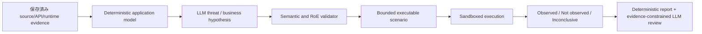

# Phase 50: Automated Professional Web/API Assessment Gap Closure Plan

Status: Implementation-ready draft; Section 20のhard start条件後にSlice 50.0を開始可能

Predecessor: `spec/phase-49-professional-web-api-assessment-capability-plan.md`

Implementation baseline commit: `6a92f3c9fff4c399a0c08b4a26bf486526c31aa5`

Baseline date: 2026-07-30

Owner: vulnWorkbench maintainers

Target: Phase 49で残したscanner coverage、active DAST、外部benchmark、
business-logic assessment、threat modelingの差を、人手の承認待ちなしで、
再現可能かつ測定可能な自動診断能力へ変換する。

## 1. 結論と製品境界

Phase 50は、単にtoolやruleの数を増やす計画ではない。次の5項目を、
versioned contract、保存証跡、vulnerable/fixed fixture、数値gateを持つ
製品能力として実装する。

1. 3ルールのSemgrep smoke setを、offline curated rulesetへ置き換える。
2. npm限定のOSV offline databaseを主要8 ecosystemへ拡張する。
3. ZAP active/API scanをdisposable environment専用profileとして実装する。
4. OWASP BenchmarkとOWASP Juice Shop系fixtureでrecall、precision、
   false-positive rateを測定する。
5. source/API/runtime evidenceからapplication model、threat hypothesis、
   business-logic scenarioを自動生成し、実行可能なものを自動検証する。

Phase 50完了後に許可する表現は次とする。

> vulnWorkbenchは、宣言済みの言語、ecosystem、Web/API protocol、
> test scenarioに対して、再現可能なSAST、SCA、active DAST、
> authorization、business-logic検査、threat-model reviewを自動実行し、
> 測定済みのcoverageと限界を含む診断結果を出力する。

次の表現は引き続き禁止する。

- あらゆるプロ診断を完全代替する
- 未対応の言語、protocol、business domainも検査済みである
- LLMが生成した未検証仮説を確認済み脆弱性として扱う
- benchmark対象外のreal-world recallを保証する
- network、cloud、AD、mobile、wireless、social engineeringを対象とする

`professionalAssessmentEquivalent`はglobal booleanとしてtrueにしない。
代わりに、release evidenceへ次のscope付きclaimを追加する。

```ts
type MeasuredCapabilityClaim = {
  claimId: "measured-automated-web-api-assessment-v1";
  status: "met" | "not_met";
  scopeCatalogVersion: string;
  benchmarkPolicyVersion: string;
  passingBenchmarkRunId: string | null;
  unsupportedCapabilities: string[];
};
```

## 2. 人手待ちを廃止する固定原則

production workflowでhuman approval、manual review、manual decisionを完了条件に
しない。ただし、LLMの推測を証跡の代用にもしない。

診断対象は次の状態を必ず区別する。

| 状態 | 意味 | finding生成 |
| --- | --- | --- |
| `hypothesis` | LLMまたはdeterministic ruleが生成した検査候補 | 不可 |
| `planned` | schema、scope、budget、安全性を検証済み | 不可 |
| `observed` | 実行証跡が期待する違反を示した | 可 |
| `not_observed` | 実行したが違反を示さなかった | 不可 |
| `inconclusive` | timeout、5xx、cleanup失敗等で判定不能 | 不可 |
| `not_tested` | unsupportedまたは安全なplanへ変換不能 | 不可 |

人手判断の代わりに、次の自動gateを使う。

1. LLM outputのZod validation。
2. input bundle外のID、path、actor、asset参照を拒否するsemantic validation。
3. request method、path、origin、identity、budgetをRoEと照合するplan validation。
4. executable evidenceがないhypothesisをfindingへ昇格させない。
5. LLM不在時はdeterministic modelとscenarioだけで完了し、
   `completed_with_limitations`を出力する。
6. cleanupまたはenvironment resetが確認できないactive runは
   `failed_cleanup`または`inconclusive`にする。



## 3. 対象範囲とsupport tier

### 3.1 Tier

| Tier | 意味 | Phase 50 release gate |
| --- | --- | --- |
| `supported` | benchmark、positive/negative fixture、offline data、normalizerが揃う | 必須 |
| `experimental` | scanner実行可能だがbenchmarkまたはfixtureが不足 | limitation必須 |
| `unsupported` | 実行contractを提供しない | `not_tested`表示 |

### 3.2 Semgrep supported language

Phase 50の`curated-sast-v1`でsupportedとする言語:

- JavaScript
- TypeScript
- Python
- Java
- Go

Semgrep Community Editionのlocal/offline解析を前提とする。cross-file、
cross-function、framework固有のdeep analysisを実測せずsupported claimへ
含めない。これらが必要なcontrolは`experimental`または`not_tested`にする。

次は初期状態をexperimentalとし、supported gateには数えない。

- C#
- PHP
- Ruby
- Kotlin
- Rust
- Terraform

### 3.3 OSV supported ecosystem

Phase 50でoffline supportedとするecosystem:

- `npm`
- `PyPI`
- `Go`
- `Maven`
- `crates.io`
- `NuGet`
- `Packagist`
- `RubyGems`

databaseに存在しても、対象lockfileの抽出fixtureがないecosystemは
supportedとして表示しない。

### 3.4 Web/API scope

supported:

- HTTP/HTTPS
- HTML formとbrowser navigation
- REST/OpenAPI 3.x
- cookie、bearer、API keyを暗号化auth contextから注入する検査
- declarative BOLA、BFLA、state transition、bounded transaction
- localまたはephemeral targetに対するZAP active

experimental:

- GraphQL query/mutation
- multi-step browser-authenticated ZAP active

unsupported:

- WebSocket
- GraphQL subscription
- gRPC
- SOAP
- arbitrary user-supplied scanner script
- production targetへのactive attack

## 4. Release gate

`measured-automated-web-api-assessment-v1`を`met`にするには、同じrelease commit、
toolbox image digest、scanner-data manifest hash、corpus lock hashに対して
次をすべて満たす。

| Gate | 必須値 |
| --- | ---: |
| owned/curated Semgrep rule tests | positive recall 100%、negative false positive 0件 |
| supported language fixture coverage | 各言語6 security family以上 |
| curated Semgrep rule catalog | 40 rule ID以上、ただしrule数だけで合格にしない |
| OSV offline ecosystem matrix | 8/8 ecosystemでvulnerable/fixed fixture成功 |
| offline scan network request | 0 |
| OWASP Benchmark overall recall | 70%以上 |
| OWASP Benchmark overall precision | 80%以上 |
| OWASP Benchmark overall false-positive rate | 10%以下 |
| OWASP Benchmark score `TPR - FPR` | 0.60以上 |
| OWASP Benchmark category recall | ground truth 20件以上の各categoryで50%以上 |
| Juice Shop eligible scenario | 20件以上、8 category以上 |
| Juice Shop paired-fixture recall | 60%以上 |
| Juice Shop paired-fixture precision | 80%以上 |
| active cleanup/reset success | 100% |
| credential canary leakage | 0 |
| public/production active request | 0 |
| business-logic paired-fixture recall | 70%以上 |
| business-logic paired-fixture precision | 80%以上 |
| owned endpoint-discovery fixture recall | 90%以上 |
| owned endpoint-discovery fixture precision | 90%以上 |
| confirmed finding with no executable evidence | 0 |
| clean checkout strict gate | pass |

初回benchmarkが閾値を下回った場合、baselineを合格扱いしない。
`limited_release_candidate`を維持し、rule、scenario、normalizerを改善する。

閾値変更は`benchmark-policy.json`のmajor version変更として扱い、変更理由と
新旧metric diffをrelease evidenceへ保存する。tool updateに合わせて閾値を
黙って下げない。

## 5. Versioned capability artifacts

次をrepositoryへ追加する。

```text
docker/toolbox/scanner-data/
  scanner-data-manifest.json
  semgrep-rules/
    catalog.json
    javascript/
    typescript/
    python/
    java/
    go/
    vendor/
      NOTICE.md
  osv/
    README.md

spec/security-capability/
  scope-catalog.v1.json
  benchmark-policy.v1.json
  corpora.lock.json
  semgrep-rule-sources.lock.json
  zap-active-policy.v1.yaml
  zap-active-rule-catalog.v1.json
  juice-shop-ground-truth.v1.json
  business-logic-control-catalog.v1.json
  threat-model-control-catalog.v1.json
```

### 5.1 `corpora.lock.json`

```ts
type CorpusLock = {
  schemaVersion: 1;
  corpora: Array<{
    id: "owasp-benchmark-java" | "owasp-juice-shop";
    version: string;
    sourceUrl: string;
    sourceCommit: string;
    archiveSha256: `sha256:${string}`;
    image: string | null;
    imageDigest: `sha256:${string}` | null;
    license: string;
    groundTruthSha256: `sha256:${string}`;
  }>;
};
```

tagや`latest`だけを保存しない。update jobでsource commit、archive、
container imageを取得してhashを検証し、benchmark run中はnetworkを無効にする。

初期lock候補はOWASP Benchmark Java 1.2とOWASP Juice Shop v20.1.1とする。
Slice 50.0でupstream commit、archive SHA-256、expected-resultsまたはlocal
ground-truth hash、Juice Shop image digestを確定し、候補と一致しない場合は
理由をdecision recordへ残す。

### 5.2 Scanner data manifest v2

現行manifest v1のtool単位entryではOSV ecosystemとSemgrep rule sourceを
個別に追跡できない。v2へ拡張する。

```ts
type ScannerDataManifestV2 = {
  version: 2;
  generatedAt: string;
  manifestHash: `sha256:${string}`;
  tools: Record<string, {
    version: string;
    binaryDigest: `sha256:${string}` | null;
    dataBundles: Array<{
      id: string;
      kind: "ruleset" | "vulnerability-db" | "add-on" | "template";
      sourceRef: string;
      sourceCommit: string | null;
      license: string;
      generatedAt: string;
      maxAgeHours: number;
      digest: `sha256:${string}`;
      coverage: string[];
    }>;
  }>;
};
```

v1 readerは1 release cycle維持する。v1を読んだscanは
`ready_with_limitations`とする。

## 6. Semgrep curated offline ruleset

### 6.1 Ruleset構成

defaultを`owned`から`curated-sast-v1`へ変更する。

`curated-sast-v1`は次の2層から構成する。

1. `owned-core`: vulnWorkbenchが直接保守するrules。
2. `vendored-reviewed`: license確認済みのupstream ruleをfixed commitから
   repositoryへvendorし、必要なfalse-positive修正を適用したrules。

production scanでSemgrep registry `auto`を使用しない。`auto`は引き続き
明示的exploratory modeだけで許可し、release metricへ混ぜない。

Semgrep Community Edition rulesをvendorする場合はsource commitと
`LicenseRef-Semgrep-Rules-1.0`をsource lockへ記録し、license textを
`vendor/NOTICE.md`から参照可能にする。別licenseのruleを同じidentifierで
扱わない。

各ruleに次のmetadataを必須とする。

```yaml
metadata:
  cwe: CWE-000
  owasp:
    - A00:0000
  security-family: injection
  confidence: high
  source-kind: owned-core
  source-ref: repo:path-or-upstream-commit
  license: SPDX-ID-or-LicenseRef
  rule-version: "1"
  supported-frameworks:
    - generic
```

### 6.2 Security family

supported 5言語について、適用可能な次のfamilyをcatalog化する。

- command injection
- SQL/NoSQL/LDAP/XPath injection
- XSS/template injection
- SSRF
- path traversal/file access
- unsafe deserialization
- weak cryptography/hash/randomness
- authentication/session misuse
- authorization guard omission
- dangerous process execution
- insecure temporary file/permission
- security logging and sensitive-data exposure

言語に適用できないfamilyは理由付き`not_applicable`にする。

### 6.3 Rule quality contract

各rule PRは次を同時に追加する。

- `ruleid:` positive case 2件以上
- `ok:` negative case 2件以上
- framework wrapperまたはsafe APIを使うhard negative 1件以上
- CWE、message、remediation、source reference
- normalized finding snapshot
- stable fingerprint regression

`todoruleid`と`todook`はrelease gateで0件を要求する。

検証command:

```bash
semgrep --validate --config docker/toolbox/scanner-data/semgrep-rules
semgrep --test \
  --config docker/toolbox/scanner-data/semgrep-rules \
  tests/security-capability/semgrep
bun run test:semgrep:catalog
```

### 6.4 主な変更先

- `docker/toolbox/scanner-data/semgrep-rules/`
- `scripts/prepare-scanner-data.ts`
- `scripts/verify-toolbox-provenance.ts`
- `api/modules/scans/tools/scanner-provenance.ts`
- `api/modules/scans/tools/semgrep-runner.ts`
- `api/modules/scans/normalizers/semgrep.ts`
- `api/modules/scans/profiles.ts`
- `tests/security-capability/semgrep/`

### 6.5 受入条件

- supported 5言語すべてにpositive/negative fixtureがある。
- catalogのrule ID、CWE、family、source、licenseが空でない。
- duplicate rule IDがない。
- rule tree、catalog、source lockのhashがmanifest v2に含まれる。
- network disabled toolboxで全ruleが実行できる。
- source line移動後もlogical fingerprintが安定する。
- unsupported languageを「検査済み」と表示しない。

## 7. OSV multi-ecosystem offline database

### 7.1 Database取得

OSV公式offline directory構造をそのまま使う。

```text
<cache>/osv-scanner/
  npm/all.zip
  PyPI/all.zip
  Go/all.zip
  Maven/all.zip
  crates.io/all.zip
  NuGet/all.zip
  Packagist/all.zip
  RubyGems/all.zip
```

`scanner-data:prepare`だけがnetworkを使用できる。各ecosystemの`all.zip`を
staging directoryへdownloadし、次を検証してからatomic renameする。

- HTTPS source host allowlist
- compressed fileと展開後entryのsize上限
- zip-slip拒否
- SHA-256
- JSON parse
- ecosystem名一致
- record countが0でない
- withdrawn recordを消さない
- freshness 168時間以内

scanは`OSV_SCANNER_LOCAL_DB_CACHE_DIRECTORY`を固定し、`--offline`を使う。
`--offline-vulnerabilities`だけを使って他機能がnetworkへ接続できる状態にしない。
untrusted projectに対してpackage managerやguided remediationを起動しない。

### 7.2 Ecosystem fixture

各ecosystemに次を追加する。

```text
tests/security-capability/osv/<ecosystem>/
  vulnerable/
  fixed/
  expected.json
```

fixtureはlockfile/manifestをparseするだけで、install scriptを実行しない。
vulnerableとfixedで同一package familyを使い、expected OSV ID、alias、
affected/fixed versionを固定する。

### 7.3 主な変更先

- `scripts/prepare-scanner-data.ts`
- `scripts/verify-offline-toolbox.ts`
- `docker/toolbox/Dockerfile`
- `docker/toolbox/scanner-data/scanner-data-manifest.json`
- `api/modules/scans/tools/osv-runner.ts`
- `api/modules/scans/normalizers/osv.ts`
- `tests/security-capability/osv/`
- `docs/production-runbook.md`

### 7.4 受入条件

- 8 ecosystemすべてのDB entryに個別digest、record count、sourceRefがある。
- vulnerable fixtureで期待OSV IDを検出する。
- fixed fixtureで同じfindingを生成しない。
- aliasesを重複findingにしない。
- `network=none`で8 ecosystem matrixが成功する。
- database欠落、stale、digest mismatchはscan successにならない。
- offline limitationであるMaven transitive resolution等をcoverageへ残す。

## 8. ZAP active/API scan

### 8.1 実行方式

`zap-full-scan.py`を直接使用せず、ZAP Automation Framework planを
typed builderから生成する。

planのjob順序を固定する。

1. environment/context
2. authenticationまたはgateway-side credential injection
3. OpenAPI importまたはbounded spider
4. passive scan wait
5. active scan policy
6. active scan
7. report
8. exit status

active scan policyは`defaultThreshold: Off`とし、versioned catalogで
明示許可したrule IDだけを有効にする。初期strengthは`Low`、
thresholdは`Medium`とする。`High`、`Insane`をschemaで拒否する。

### 8.2 Active safety contract

ZAP activeを許可するのは次をすべて満たす場合だけとする。

- engagement statusが`active`
- environmentが`local`または`ephemeral`
- purposeが`internal`
- targetがloopback/privateかつpublic/metadata addressでない
- active用RoEが未期限切れ
- allowed method/pathがtarget scopeのsubset
- reset strategyが構成済み
- cumulative engagement request budgetにplan全体が収まる
- `VULN_WORKBENCH_ZAP_ACTIVE_ENABLED=true`

productionとshared stagingではfail-closedとする。

reset strategy:

```ts
type ActiveResetStrategy =
  | {
      kind: "container_recreate";
      fixtureId: string;
      expectedBaselineHash: string;
    }
  | {
      kind: "http_transaction";
      seedRequests: ActiveRequest[];
      cleanupRequests: ActiveRequest[];
      baselineAssertions: ActiveAssertion[];
    };
```

arbitrary shell commandをreset strategyとして保存しない。

### 8.3 Gateway

現行`container-target-gateway.ts`はGET/HEAD/OPTIONS固定である。
read-only gatewayを変更せず、active専用gatewayを別classで追加する。

active gatewayの責務:

- exact origin pinning
- RoE method/path allowlist
- query、redirect、request body上限
- cumulative request budget
- request rateとconcurrency上限
- secret/transport header rejection
- upstream response body上限
- target redirectの再検証
- ZAPへcredentialを返さずgateway側でauth contextを注入
- request/response bodyをartifactへ保存しない
- method/path/status/timing/request hashだけをevidence化

credential canaryをZAP report、stdout、stderr、DB、artifact全体から検索する。

初期supported authは、gateway側で注入できるcookie、bearer、API keyとする。
login flowの再実行、CSRF token更新、browser authenticationが必要なtargetは
experimentalとし、token refreshを証跡制約付きplanへ変換できない場合は
`not_tested`にする。認証失敗を未検出扱いにしない。

### 8.4 初期resource policy

| 項目 | 上限 |
| --- | ---: |
| Docker memory | 2 GiB |
| Docker CPU | 1.5 |
| Docker PIDs | 256 |
| ZAP threads per host | 1 |
| gateway concurrency | 2 |
| requests per second | 2 |
| default total request budget | 500 |
| absolute request budget | 2,000 |
| default duration | 10分 |
| absolute duration | 20分 |
| response body forwarded | 1 MiB/request |
| report size | 64 MiB |

上限を超えたrunは`inconclusive`または`failed_cleanup`とし、部分結果を
passing coverageに使わない。

### 8.5 Profile

- `runtime-zap-active-lab`
- `api-zap-active-lab`

既存profileへ暗黙に追加しない。UI/APIから明示選択し、server-side policyが
再検証する。

### 8.6 主な変更先

- `shared/schemas/assessment.schema.ts`
- `shared/schemas/dast.schema.ts`
- `api/modules/dast/active-container-target-gateway.ts`
- `api/modules/runtime-scans/zap-automation-plan.ts`
- `api/modules/runtime-scans/zap-active-runner.ts`
- `api/modules/runtime-scans/zap-active-policy.ts`
- `api/modules/runtime-scans/zap-report-schema.ts`
- `api/modules/runtime-scans/zap-normalizer.ts`
- `api/modules/scans/profile-runtime-step-runner.ts`
- `api/modules/scans/profiles.ts`
- `tests/security-capability/zap-active/`

### 8.7 受入条件

- public、production、expired RoE、missing resetをcontainer起動前に拒否する。
- allowlist外method/pathをgatewayが拒否する。
- disabled rule IDが発行したrequestをtest gatewayが検出して失敗させる。
- vulnerable/fixed fixtureを区別する。
- reset後のDB/state hashがbaselineと一致する。
- cleanup/reset失敗時に次のactive runを同projectで開始しない。
- credential canary leakageが0。
- Docker networkからgateway以外へ接続できない。

## 9. External benchmark harness

### 9.1 Benchmark run schema

migration `0023_security_capability_benchmarks.sql`を追加する。

```ts
type SecurityCapabilityBenchmarkRun = {
  id: string;
  corpusId: string;
  corpusVersion: string;
  corpusDigest: string;
  gitCommit: string;
  toolboxImageDigest: string;
  scannerManifestHash: string;
  benchmarkPolicyVersion: string;
  status: "queued" | "running" | "completed" | "failed" | "inconclusive";
  startedAt: Date;
  completedAt: Date | null;
  metricsArtifactId: string | null;
  errorCode: string | null;
};

type BenchmarkMetric = {
  runId: string;
  category: string;
  truePositive: number;
  falseNegative: number;
  trueNegative: number;
  falsePositive: number;
  recall: number | null;
  precision: number | null;
  falsePositiveRate: number | null;
  score: number | null;
};
```

### 9.2 OWASP Benchmark adapter

expected-results CSVをground truthとしてparseする。

Semgrep findingは次の両方でtest caseへ対応付ける。

- repository-relative pathに含まれる`BenchmarkTestNNNNN`
- normalized CWE

pathだけまたはCWEだけの一致をTPにしない。unmapped findingはFP候補として
別集計し、parser errorと区別する。

ZAP findingはURL pathのtest case IDとCWE/plugin mappingで対応付ける。
scorecard互換CSVとvulnWorkbench canonical metric JSONを両方生成する。

Semgrep、ZAP、全scannerのevidence unionについてmetricを別々に保存する。
Section 4のoverall gateはunionだけでなく、`benchmark-policy.v1.json`で
scannerにapplicableと宣言したcategoryごとのgateにも適用する。
applicabilityからcategoryを外す変更はpolicy major変更とし、release reportへ
coverage減少として表示する。union結果だけで個別scannerのregressionを隠さない。

### 9.3 Juice Shop adapter

upstream Juice Shopはversioned image digestで起動する。
`juice-shop-ground-truth.v1.json`は次を保持する。

```ts
type JuiceShopScenario = {
  id: string;
  challengeKey: string;
  category: string;
  cwe: string[];
  actors: string[];
  entrypoints: string[];
  expectedEvidenceKind: string;
  scannerFamilies: Array<"zap" | "authorization" | "business_logic">;
  pairedFixedFixture: string;
};
```

upstream applicationだけではnegative controlを作れないため、eligible scenario
ごとに最小のpaired fixed fixtureをrepositoryへ持つ。precisionはこのpairで
測定し、ground truthにないalertを自動的に無視しない。

### 9.4 Reproducibility

heavy benchmarkは次を保存する。

- corpus lock hash
- expected-results hash
- toolbox image digest
- rule/DB/add-on manifest hash
- raw scanner artifact hash
- normalized finding snapshot hash
- metric JSON hash
- duration、peak memory、request count
- reset/cleanup result

run中はcorpus、scannerとも外部networkへ接続しない。

### 9.5 Commands

```bash
bun run security-corpora:prepare
bun run security-corpora:verify
bun run benchmark:owasp
bun run benchmark:juice-shop
bun run benchmark:business-logic
bun run benchmark:all
bun run verify:professional-capability
```

現行`test:security-capability:heavy`は`benchmark:all`のcompatibility aliasにする。

### 9.6 主な変更先

- `scripts/security-corpora-prepare.ts`
- `scripts/security-corpora-verify.ts`
- `scripts/security-capability-heavy.ts`
- `scripts/benchmark/owasp-benchmark.ts`
- `scripts/benchmark/juice-shop.ts`
- `scripts/benchmark/metric-scorer.ts`
- `api/db/schema/schema-assessment.ts`
- `api/modules/benchmarks/`
- `spec/evidence/phase-50-*.json`

### 9.7 受入条件

- wrong corpus hash、wrong expected-results versionを実行前に拒否する。
- synthetic metric fixtureでTP/FN/TN/FP計算を検証する。
- zero denominatorを0として偽装せず`null`にする。
- same input digestでmetric JSONが一致する。
- benchmark failureをscanner regression、corpus failure、environment failure、
  parser failureへ分類する。
- release reportがpassing benchmark run IDを参照する。

## 10. Automated application model and threat modeling

### 10.1 Application model

source structure、route、OpenAPI、DB schema、auth middleware、scan evidenceから
deterministic application modelを生成する。

```ts
type ApplicationModel = {
  version: 1;
  projectId: string;
  sourceFingerprint: string;
  actors: ModelActor[];
  assets: ModelAsset[];
  entrypoints: ModelEntrypoint[];
  trustBoundaries: ModelTrustBoundary[];
  dataStores: ModelDataStore[];
  dataFlows: ModelDataFlow[];
  authorizationGuards: ModelAuthorizationGuard[];
  stateMachines: ModelStateMachine[];
  assumptions: ModelAssumption[];
  evidenceRefs: ModelEvidenceRef[];
  snapshotHash: string;
};
```

全nodeとedgeにsource path/line、OpenAPI operation、DB table、runtime route等の
evidence referenceを最低1件要求する。証跡がないLLM生成nodeは
`unresolvedSuggestion`へ分離し、model本体へ入れない。

初期endpoint extractor:

| Language | supported framework |
| --- | --- |
| JavaScript / TypeScript | Hono、Express、Fastify |
| Python | FastAPI、Flask、Django |
| Java | Spring MVC、JAX-RS |
| Go | `net/http`、Gin、Echo |

OpenAPI operation、static route、runtime observationをcanonical
`method + path template`へ正規化し、同一endpointへ統合する。sourceとOpenAPIが
矛盾する場合は一方を捨てず`model_conflict`にする。dynamic stringで構築され、
安全に解決できないrouteは`unresolvedSuggestion`として`not_tested`へ結び付ける。

各frameworkにdeclared route ground truthを持つpositive/negative fixtureを追加し、
endpoint discoveryのprecision/recallを測定する。

### 10.2 Threat hypothesis

OWASP Four Question Frameworkに沿って次を生成する。

```ts
type ThreatHypothesis = {
  id: string;
  modelSnapshotHash: string;
  title: string;
  category:
    | "spoofing"
    | "tampering"
    | "repudiation"
    | "information_disclosure"
    | "denial_of_service"
    | "elevation_of_privilege"
    | "business_logic";
  actorIds: string[];
  assetIds: string[];
  entrypointIds: string[];
  preconditions: string[];
  expectedImpact: string;
  evidenceRefs: ModelEvidenceRef[];
  confidence: "high" | "medium" | "low";
  validationKind:
    | "authorization_matrix"
    | "state_transition"
    | "metamorphic"
    | "bounded_transaction"
    | "static_query"
    | "unsupported";
  status:
    | "hypothesis"
    | "planned"
    | "observed"
    | "not_observed"
    | "inconclusive"
    | "not_tested";
};
```

LLMはcatalog外category、model外ID、scope外pathを追加できない。
criticalityは実行結果が出るまで`unknown`とする。

### 10.3 Migration

`0024_application_threat_models.sql`:

- `application_model_snapshots`
- `threat_hypotheses`
- `threat_model_runs`
- `threat_model_evidences`

project owner境界を全queryで強制する。model snapshotはimmutableとし、
source fingerprintが変わった場合は新versionを作る。

### 10.4 主な変更先

- `shared/schemas/application-model.schema.ts`
- `shared/schemas/threat-model.schema.ts`
- `api/modules/threat-models/application-model-builder.ts`
- `api/modules/threat-models/endpoint-extractors/`
- `api/modules/threat-models/threat-hypothesis-runner.ts`
- `api/modules/threat-models/threat-output-validator.ts`
- `api/modules/threat-models/threat-model-repository.ts`
- `api/routes/threat-models.route.ts`
- `web/src/domains/threat-models/`

### 10.5 受入条件

- same source fingerprintからsame deterministic model hashを生成する。
- supported framework fixtureでendpoint precision/recall 90%以上を満たす。
- arbitrary LLM model ID、finding ID、pathをsemantic validatorが拒否する。
- evidenceのないnode/edgeをmodelへ保存しない。
- LLM failureでもdeterministic modelとcatalog-based hypothesisを生成する。
- source変更後に古いmodelをcurrentとして返さない。
- model、hypothesis、reportにcredential/secretを含めない。

## 11. Automated business-logic assessment

### 11.1 対象control

初期control catalog:

- owner isolation
- role/operation separation
- state transition bypass
- replay/idempotency
- duplicate submission
- quantity、amount、priceの境界
- negative/zero value
- server-side calculated value tampering
- sequence/order bypass
- one-time token reuse
- rate/quota bypass
- cross-tenant reference substitution

payment provider、配送、外部メール送信等の不可逆side effectは実行しない。

### 11.2 Scenario schema

```ts
type BusinessLogicScenario = {
  id: string;
  hypothesisId: string;
  engagementId: string;
  targetConfigId: string;
  actors: Array<{
    actorId: string;
    authContextId: string;
  }>;
  preconditions: ScenarioAssertion[];
  seed: ActiveRequest[];
  actions: ActiveRequest[];
  invariants: ScenarioInvariant[];
  cleanup: ActiveRequest[];
  maxRequests: number;
  timeoutSec: number;
  expectedBaselineHash: string | null;
};
```

許可するinvariant:

- status class comparison
- response JSON primitive equality/inequality
- owner-visible object count delta
- state enum transition
- bounded numeric delta
- duplicate side-effect count
- exact database fixture hash

任意JavaScript、shell、SQL、正規表現DoSを起こせるassertionを保存しない。

### 11.3 Scenario generation

1. deterministic application modelからactor、state machine、numeric field、
   ownership relationを抽出する。
2. control catalogからcandidateを生成する。
3. LLMがprecondition、action、invariant候補を選択する。
4. semantic validatorがmodel ID、OpenAPI/schema、RoEと照合する。
5. full request budgetとcleanup budgetを予約する。
6. local/ephemeral targetで実行する。
7. invariant violationが観測された場合だけfindingを生成する。
8. cleanupとbaseline hashを確認する。

### 11.4 Migration

`0025_business_logic_scenarios.sql`:

- `business_logic_scenarios`
- `business_logic_runs`
- `business_logic_evidences`

scenario planはhash付きimmutable JSONとして保存する。secret-bearing auth materialは
IDだけを保存する。

### 11.5 Fixture

最低限、次のvulnerable/fixed pairを作る。

- cross-tenant order read/update
- admin-only refund
- order status skip
- duplicate coupon redemption
- negative quantity
- client-controlled total price
- one-time reset token replay
- quota reset raceを直列化したdeterministic variant

race conditionの初期実装はbounded concurrency 2、request 10件以下とする。

### 11.6 受入条件

- 8 scenario pairをvulnerable/fixedで区別する。
- fixed fixtureで同じfindingを生成しない。
- scenario外endpointへrequestしない。
- incomplete cleanupをpassing resultにしない。
- LLMが存在しなくてもcatalog-based scenarioを最低1件生成できる。
- unsupported hypothesisをconfirmed findingにしない。
- final reportにtested/not-tested business controlを明示する。

## 12. Reporting and UI

reportに次を追加する。

- measured capability claim
- scanner language/ecosystem matrix
- active DAST policy IDとrule catalog hash
- benchmark run IDとmetric summary
- application model snapshot hash
- threat hypothesis status summary
- business-logic control coverage
- unsupported/not-tested reason
- LLM availabilityとlimitation

LLM reviewはmetric、finding severity、verification outcomeを書き換えない。
LLM namespaceにはcriticality rationale、business impact、priority proposal、
remediation、unknownsだけを保存する。

UIは次の順で表示する。

1. Confirmed observations
2. Inconclusive runs
3. Tested controls with no observed violation
4. Unvalidated threat hypotheses
5. Not tested / unsupported coverage

仮説件数をfinding件数へ加算しない。

## 13. 実装slice

| Slice | Priority | 内容 | 前提 | 目安 |
| --- | --- | --- | --- | ---: |
| 50.0 | P0 | scope、schema、policy、feature flag固定 | Phase 49 | 4–6人日 |
| 50.1 | P0 | corpus lock、metric scorer、benchmark DB | 50.0 | 8–12人日 |
| 50.2 | P1 | Semgrep curated rulesetとfixture | 50.0、50.1 | 18–28人日 |
| 50.3 | P1 | OSV 8 ecosystem offline bundle | 50.0 | 7–11人日 |
| 50.4 | P0 | ZAP active policy、gateway、reset | 50.0、50.1 | 15–22人日 |
| 50.5 | P1 | application model | 50.0 | 10–15人日 |
| 50.6 | P1 | threat hypothesis pipeline | 50.5 | 10–16人日 |
| 50.7 | P0 | business-logic scenario executor | 50.4–50.6 | 18–28人日 |
| 50.8 | P1 | report、UI、coverage統合 | 50.2–50.7 | 8–13人日 |
| 50.9 | P0 | external benchmark、ratchet、closeout | 全slice | 8–12人日 |

合計: 106–163人日。

50.2と50.3、50.5はschema contract固定後に並行可能。
50.4と50.7はactive gatewayを同時変更しない。

## 14. Slice別Definition of Done

### 14.1 Slice 50.0

- [ ] `scope-catalog.v1.json`を追加する。
- [ ] `benchmark-policy.v1.json`を追加する。
- [ ] manifest v2 schemaとv1 compatibility testを追加する。
- [ ] hypothesis/scenario schemaを追加する。
- [ ] feature flagをproductionでfail-closedにする。
- [ ] unsupported capabilityをcoverageへ反映する。

### 14.2 Slice 50.1

- [ ] corpus lockをhash検証できる。
- [ ] benchmark run/metric migrationを適用できる。
- [ ] synthetic TP/FN/TN/FP fixtureがpassする。
- [ ] run input/output hashを保存する。
- [ ] incomplete corpusをbenchmark passにしない。

### 14.3 Slice 50.2

- [ ] supported 5言語のrule catalogを満たす。
- [ ] `semgrep --validate`と`semgrep --test`がpassする。
- [ ] positive recall 100%、negative FP 0件。
- [ ] vendored source/license inventoryが完全である。
- [ ] offline toolboxで同じfinding fingerprintを生成する。

### 14.4 Slice 50.3

- [ ] OSV 8 ecosystem DBを個別hashで保存する。
- [ ] vulnerable/fixed matrix 8/8がpassする。
- [ ] offline runのnetwork accessが0。
- [ ] stale/missing/tampered DBがfail-closedになる。

### 14.5 Slice 50.4

- [ ] ZAP Automation planをtyped builderから生成する。
- [ ] explicit rule allowlist以外を無効化する。
- [ ] active専用gatewayがmethod/path/budgetを強制する。
- [ ] local/ephemeral以外を拒否する。
- [ ] reset成功率100%、credential leakage 0。

### 14.6 Slice 50.5–50.7

- [ ] application modelの全要素にevidence refがある。
- [ ] supported frameworkのendpoint discovery metricがgateを満たす。
- [ ] LLM外部参照をsemantic validatorが拒否する。
- [ ] hypothesisとfindingが別table/stateである。
- [ ] business-logic 8 pairを区別する。
- [ ] cleanup/reset失敗をinconclusiveにする。
- [ ] LLM不在時もdeterministic pipelineが完了する。

### 14.7 Slice 50.8–50.9

- [ ] report/UIがhypothesisをfindingとして数えない。
- [ ] OWASP Benchmark thresholdを満たす。
- [ ] Juice Shop paired thresholdを満たす。
- [ ] clean checkoutから全gateを再現する。
- [ ] release evidenceが同一commit/digestを参照する。
- [ ] READMEの制約記述を実測値へ更新する。

## 15. Feature flagとrollout

追加するflag:

- `VULN_WORKBENCH_CURATED_SAST_ENABLED`
- `VULN_WORKBENCH_MULTI_ECOSYSTEM_OSV_ENABLED`
- `VULN_WORKBENCH_ZAP_ACTIVE_ENABLED`
- `VULN_WORKBENCH_THREAT_MODEL_ENABLED`
- `VULN_WORKBENCH_BUSINESS_LOGIC_ENABLED`

rollout:

1. `disabled`: schema/migration/testだけを導入する。
2. `shadow`:結果を保存するがrelease readinessとfindingへ反映しない。
3. `measured`:benchmarkとcoverageへ反映するがdefault profileに追加しない。
4. `enforced`:passing benchmarkを参照できる場合だけsupported claimへ含める。

ZAP activeは`enforced`後もdefault profileへ追加しない。明示的active profileだけで
実行する。

rollback:

- flagをfalseにしてnew executionを停止する。
- migrationはappend-onlyとし、旧readerを1 release cycle維持する。
- scanner-data/corpusは直前のdigestへ戻す。
- active run中のrollbackはrunner shutdown recoveryで
  `failed_cleanup`として閉じる。

## 16. CIとscheduled verification

PR必須:

```bash
bun install --frozen-lockfile
bun run verify:strict
bun run test:security-capability
bun run test:semgrep:catalog
bun run test:osv:offline-fixtures
bun run test:zap-active:contract
bun run test:threat-model
bun run test:business-logic
```

corpus、scanner data、ZAP add-onを変更するPR:

```bash
bun run benchmark:all
bun run verify:professional-capability
```

scheduled weekly:

- pinned corpusを使うfull benchmark
- DB freshness check
- metric drift diff
- runtime/resource trend
- credential canary search

corpus refresh jobだけnetworkを許可する。benchmark jobはprepared artifactを
downloadした後にscanner/target networkを隔離する。

artifact retention:

- passing release metric: release lifetime
- failed benchmark raw artifact: 30日
- reportにはsecret-bearing request/responseを含めない

## 17. Verification inventory

追加command:

```json
{
  "test:semgrep:catalog": "bun run scripts/test-semgrep-catalog.ts",
  "test:osv:offline-fixtures": "bun run scripts/test-osv-offline-fixtures.ts",
  "test:zap-active:contract": "bun test api/modules/runtime-scans/zap-active-runner.test.ts api/modules/dast/active-container-target-gateway.test.ts",
  "test:threat-model": "bun test api/modules/threat-models",
  "test:business-logic": "bun test api/modules/business-logic tests/security-capability/business-logic",
  "benchmark:owasp": "bun run scripts/benchmark/owasp-benchmark.ts",
  "benchmark:juice-shop": "bun run scripts/benchmark/juice-shop.ts",
  "benchmark:business-logic": "bun run scripts/benchmark/business-logic.ts",
  "benchmark:all": "bun run scripts/benchmark/all.ts",
  "verify:professional-capability": "bun run scripts/verify-professional-capability.ts"
}
```

test inventory checkerへ全test fileを登録し、duplicate executionを0に保つ。

## 18. Release evidence

追加する成果物:

- `spec/evidence/phase-50-baseline.json`
- `spec/evidence/phase-50-semgrep-capability.json`
- `spec/evidence/phase-50-osv-capability.json`
- `spec/evidence/phase-50-zap-active-capability.json`
- `spec/evidence/phase-50-threat-business-capability.json`
- `spec/evidence/phase-50-external-benchmark.json`
- `spec/evidence/phase-50-release-report.json`

release reportは次を機械検証する。

- required owner/residual riskが空でない
- passing benchmark runが同じrelease commitを参照する
- corpus/toolbox/manifest hashが一致する
- supported capabilityにpassing fixture/metricがある
- unsupported capabilityを隠していない
- human approvalがcompletion条件に含まれない
- LLM-only hypothesisがconfirmed findingへ昇格していない

## 19. Risk register

| Risk | Prevention | Detection | Failure behavior |
| --- | --- | --- | --- |
| Semgrep rule数だけ増えてFPが増える | positive/negative pair、category gate | benchmark diff | supported claimを維持しない |
| vendored ruleのlicense不明 | source lockとSPDX必須 | catalog check | bundle build失敗 |
| OSV DBが巨大化する | ecosystem allowlist、size budget | prepare metric | old verified bundleを維持 |
| offline scanがnetworkへ接続する | `--offline`、network none | egress canary | scan失敗 |
| ZAPがscope外を攻撃する | active gateway、exact allowlist | blocked-request metric | run中止、inconclusive |
| active scanがstateを壊す | disposable target、reset contract | baseline hash | failed_cleanup、project lock |
| credentialがZAP artifactへ漏れる | gateway-side injection | canary search | artifact隔離、run失敗 |
| benchmark parserがmetricを誤る | synthetic confusion matrix | golden snapshot | release gate失敗 |
| LLMが架空のasset/pathを作る | input ID semantic validation | invalid-output test | hypothesis保存拒否 |
| 仮説をfindingと誤表示する | separate schema/table | API/UI contract test | report gate失敗 |
| business scenarioが不可逆操作を行う | typed request/reset only | fixture state hash | active機能停止 |
| external corpusに過適合する | owned pairと複数corpus | category drift | scope claimを限定 |

## 20. 実装開始条件

Slice 50.0開始前に満たすhard start条件:

- [ ] 本計画をcommitする。
- [ ] worktreeがcleanである。
- [ ] `bun install --frozen-lockfile`が成功する。
- [ ] `bun run verify:strict`が成功する。
- [ ] migration `0023`–`0025`を予約する。

active executionまたはsupported claimを有効化する前に、Slice 50.0で満たす
capability preflight:

- [ ] corpus/rule sourceのSPDX IDまたはcommitted license text付き
      `LicenseRef-*`がversioned allowlistに含まれ、unknownまたは禁止licenseが
      自動gateで0件になる。
- [ ] corpus lockの初期versionとdigestを固定する。
- [ ] benchmark実行に必要なdisk、memory、time budgetをCIで確認する。

ZAP active executionとsupported claimはcapability preflightをすべて満たすまで
有効化しない。

## 21. Phase 50最終Definition of Done

- [ ] Semgrep defaultが3-rule smoke setではなく`curated-sast-v1`である。
- [ ] supported 5言語のrule/fixture/metricが揃う。
- [ ] OSV offlineが8 ecosystemを検証済みである。
- [ ] ZAP activeがlocal/ephemeral、RoE、reset付きで実行できる。
- [ ] OWASP Benchmark metricが数値gateを満たす。
- [ ] Juice Shop paired metricが数値gateを満たす。
- [ ] application modelとthreat hypothesisが自動生成される。
- [ ] supported frameworkのendpoint inventoryがsource/OpenAPI/runtime evidenceから
      自動生成される。
- [ ] business-logic scenarioが自動生成・検証される。
- [ ] confirmed findingは必ずscannerまたはexecutable evidenceを持つ。
- [ ] LLM unavailableでもreport pipelineが停止しない。
- [ ] completionにhuman approvalを要求しない。
- [ ] clean checkoutで`verify:professional-capability`がpassする。
- [ ] release evidenceが同一commit、corpus、toolbox digestを参照する。
- [ ] README/UIがsupported、experimental、unsupportedを正確に表示する。

## 22. 公式仕様

- [Semgrep rule tests](https://docs.semgrep.dev/writing-rules/testing-rules)
- [Semgrep supported languages](https://docs.semgrep.dev/supported-languages)
- [OSV-Scanner offline mode](https://google.github.io/osv-scanner/usage/offline-mode/)
- [OSV-Scanner supported artifacts and manifests](https://google.github.io/osv-scanner/supported-languages-and-lockfiles/)
- [OSV data sources and ecosystem dumps](https://google.github.io/osv.dev/data/)
- [ZAP Automation Framework](https://www.zaproxy.org/docs/automate/automation-framework/)
- [ZAP active scan policy](https://www.zaproxy.org/docs/desktop/addons/automation-framework/job-ascanpolicy/)
- [OWASP Benchmark](https://owasp.org/www-project-benchmark/)
- [OWASP Juice Shop running guide](https://pwning.owasp-juice.shop/companion-guide/latest/part1/running.html)
- [OWASP Threat Modeling Project](https://owasp.org/www-project-threat-modeling/)
