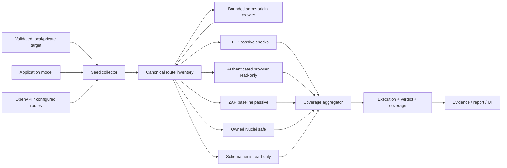

# Phase 51: DAST Coverage, Depth, and Verdict Hardening Plan

Status: Implemented in working tree; local product and capability gates pass. Linux real-ZAP, Juice Shop 20-scenario, and same-commit release evidence remain release-environment gates.

Predecessor:
`spec/phase-50-automated-professional-web-api-gap-closure-plan.md`

Implementation baseline commit:
`75cb168ca67c7ef67d5b44b461dad932ec9cd4af`

Baseline date: 2026-07-31

Owner: vulnWorkbench maintainers

Target: 標準 DAST を単発の HTTP hardening check から、既知の到達対象を
bounded に探索し、未走査・通信失敗・認証失敗・budget 打ち切りを合格と
誤認せず、対象範囲と限界を定量表示できる Web/API assessment へ適正化する。

## 1. 結論

Phase 51 では、標準 DAST に無制限の active attack を追加しない。
最初に修正すべきなのは、現在の `http-baseline` が担っている範囲と
`passed` の意味が一致していないことである。

実装順序を次に固定する。

1. 失敗・未走査を `passed` にしない verdict contract を導入する。
2. 既知 endpoint と runtime discovery を統合した bounded route inventory を作る。
3. `maxDepth` と request budget を実際の crawler に適用する。
4. passive check の対象 response と判定条件を限定し、誤検知を減らす。
5. authenticated read-only profile を API、CLI、UI から実用可能にする。
6. HTTP、browser、ZAP baseline、Nuclei safe、Schemathesis の coverage を
   同じ runtime assessment として集約する。
7. ZAP active、authorization matrix、business-logic scenario は
   disposable target 専用の明示的な active assessment として維持する。
8. 実 scanner と vulnerable/fixed application fixture により、
   DAST 固有の recall、precision、route coverage を測定する。

Phase 51 完了後も、`passed` は「アプリケーションに脆弱性がない」を意味しない。
UI と report では次の表現を使用する。

> 宣言済み範囲で計画された検査が完了し、今回の検査では finding が
> 観測されなかった。未対応 protocol、未到達 route、未実行 active scenario は
> limitation として別記する。

## 2. 現行 baseline

### 2.1 標準 scan path

現行の通常プロファイルが直接実行する DAST step は
`dast:http-baseline` である。

- `web-app-baseline`: optional `http-baseline`
- `runtime-web-safe`: optional `http-baseline`、Nuclei safe、ZAP baseline
- `runtime-http-check`: required `http-baseline`
- `full-security-scan`: optional `http-baseline`、Nuclei safe、
  ZAP baseline、Schemathesis read-only

auto target は次の設定で作られる。

```json
{
  "allowedPaths": ["/"],
  "maxDepth": 0,
  "maxRequests": 20,
  "rateLimitPerSec": 2,
  "timeoutSec": 120
}
```

profile config がない通常実行で `http-baseline` が作る候補は次の5 pathだけである。

```text
/
/.env
/openapi.json
/swagger.json
/debug
```

全 request は `GET` で、response body は保存・解析せず破棄する。
`maxDepth` は target validation から runner へ運ばれるが、HTTP と browser の
探索処理では使用されていない。全 DAST profile の `crawlerEnabled` は
`false` であり、`form-baseline` は disabled である。

### 2.2 現行 finding

`http-baseline` が生成する finding は次に限定される。

- 5xx response
- CSP、X-Frame-Options、X-Content-Type-Options の不足
- Secure、HttpOnly、SameSite の不足した Cookie
- wildcard CORS
- `/.env` または `/debug` の 2xx response

現行実装には次の精度上の問題がある。

- 404 や API JSON response にも HTML 向け security header 不足を適用し得る。
- SPA fallback が `/.env` に generic HTML 200 を返しても exposed path と判定する。
- local HTTP development target で Secure/HSTS を production 相当として
  評価すると、deployment context と合わない。
- wildcard CORS の exploitability を credential mode、response sensitivity、
  preflight behavior と分離していない。
- browser console error は証跡として保存するが、脆弱性 finding とは区別されない。

### 2.3 現行 verdict

現行 normalizer は finding が0件なら HTTP DAST を `passed` にする。
request error、timeout、接続拒否は response observation に残るだけで、
verdict gate に使われない。

baseline 調査では、5 request 全件が `ECONNREFUSED` でも次の結果になった。

```json
{
  "requestCount": 5,
  "findingCount": 0,
  "outcome": "passed"
}
```

browser normalizer も route error、page error、failed request が存在しても
常に `passed` を返す。Phase 51 の P0 はこの false-pass path の除去である。

### 2.4 Scanner coverage

- ZAP baseline は passive scan であり、active attack を実行しない。
- ZAP baseline gateway は `GET`、`HEAD`、`OPTIONS` のみ許可し、
  既定20 requestで打ち切る。
- owned Nuclei safe template は `/.env` exposure の1件である。
- Schemathesis は schema が見つかった場合だけ実行し、
  `GET`、`HEAD`、`OPTIONS` に限定される。
- ZAP active は9 rule限定で実装済みだが、専用 profile、feature flag、
  active RoE、disposable target、reset contract が必要である。
- authorization matrix と business-logic scenario は実装済みだが、
  標準 scan launcher から自動実行されない。

### 2.5 Capability evidence

2026-07-30 の Phase 50 evidence では次の状態である。

- professional capability claim: `not_met`
- OWASP Benchmark result: Semgrep SAST による測定であり、DAST測定ではない
- Juice Shop eligible scenario: 20
- Juice Shop executed scenario: 0
- ZAP active capability: contract test と事前作成 report fixture を中心に検証
- browser-authenticated ZAP active: experimental
- production active attack: unsupported

### 2.6 Baseline artifact

Slice 51.0 で次を
`spec/evidence/phase-51-dast-baseline.json` に保存する。

```ts
type DastBaselineEvidence = {
  schemaVersion: 1;
  gitCommit: string;
  generatedAt: string;
  defaultProfiles: Array<{
    profileId: string;
    dastSteps: string[];
    required: boolean[];
  }>;
  httpBaseline: {
    candidatePathsWithoutConfig: string[];
    crawlerEnabled: boolean;
    maxDepthConsumedByRunner: boolean;
    methods: string[];
    responseBodyAnalyzed: boolean;
  };
  falsePassReproductions: Array<{
    caseId: string;
    requestCount: number;
    transportErrorCount: number;
    currentOutcome: string;
  }>;
  scannerCoverage: {
    nucleiOwnedTemplateCount: number;
    zapBaselineMode: "passive";
    zapBaselineRequestBudget: number;
    juiceShopExecutedScenarios: number;
  };
};
```

secret、cookie value、Authorization header、absolute home path は保存しない。

## 3. 適正化の定義

Phase 51 における「適正な標準 DAST」は、次の5条件をすべて満たすものとする。

| 軸 | 必須条件 |
| --- | --- |
| 到達範囲 | known route inventory を作り、何件を計画・実行・未実行にしたか説明できる |
| 検査深度 | crawler depth、method、request、response size、duration の上限が実際に強制される |
| 認証 | 未認証、認証成功、session失効、権限拒否を区別し、認証失敗を clean verdict にしない |
| 判定 | finding 0件と coverage完了を別々に評価し、未走査・失敗を `passed` にしない |
| 能力測定 | DAST自身の route recall、check recall、precision を実 scanner fixture で測定する |

標準 DAST は次を保証しない。

- 未発見 endpoint を含むアプリケーション全体の完全走査
- business domain 固有の不正操作の自動推論と完全検証
- production target へのactive attack
- WebSocket、gRPC、SOAP、GraphQL subscriptionの検査
- multi-factor authentication、CAPTCHA、外部IdPの自動突破
- scannerが対応しない0-day vulnerabilityの不存在
- penetration testや専門家レビューの完全代替

## 4. Scope

### 4.1 In scope

- DAST execution status、verdict、coverage status の分離
- false-pass の除去
- known route inventory
- source/OpenAPI/configured route/runtime link/browser network の統合
- same-origin bounded HTTP crawler
- `maxDepth` の実適用
- aggregate request budget
- redirect、query、response size、content type の制御
- passive HTTP finding の精度改善
- browser smoke の coverage 判定改善
- authenticated read-only の API、CLI、UI 導線
- ZAP baseline、Nuclei safe、Schemathesis の coverage aggregation
- standard profile v2
- DAST-specific benchmark
- report、UI、event、diagnostic limitation
- backward-compatible migration と段階 rollout

### 4.2 Non-goals

- public internet target の許可
- production target へのactive scan
- active scan の既定有効化
- Docker socket mount
- arbitrary Nuclei template や scanner script の実行
- target repository への dependency、test account、fixture の自動追加
- state-changing form の標準 crawler による自動送信
- browser-authenticated ZAP active の supported 昇格
- network/cloud/mobile/AD assessment
- scan finding の自動修正
- LLM hypothesis だけによる finding 生成

## 5. 固定する安全境界

### 5.1 Target

- standard DAST は loopback target を既定とする。
- private network は保存済み target の明示許可がある場合だけ read-only scan を許可する。
- public、link-local、metadata service、wildcard host を拒否する。
- validation 後の address pinning を維持し、redirect ごとに origin と path を再検証する。
- target process に host LLM credential を渡さない。

### 5.2 Method

標準 profile で許可する method は次だけとする。

```text
GET
HEAD
OPTIONS
```

標準 crawler は form を inventory に記録するが、POST/PUT/PATCH/DELETE を
送信しない。state-changing request は active assessment とし、
RoE、disposable target、seed、cleanup、reset contract を必須にする。

### 5.3 Budget

budget は scanner単位ではなく runtime assessment 全体でも強制する。

初期 `web-passive-standard` budget:

| 項目 | 上限 |
| --- | ---: |
| aggregate forwarded request | 250 |
| owned crawler / passive checks | 100 |
| ZAP baseline | 100 |
| Nuclei safe | 20 |
| Schemathesis read-only | 30 |
| crawler depth | 2 |
| discovered URL | 500 |
| distinct query shape per path | 3 |
| rate | 2 req/sec |
| concurrent request | 2 |
| response body read | 1 MiB/response |
| response body total | 64 MiB |
| redirect hop | 5 |
| wall clock | 600 sec |

profile config はこれらを厳しくする方向だけ上書き可能とする。
上限緩和は versioned policy の変更として扱う。

### 5.4 Secret

- default header に secret を保存しない。
- auth context は既存の encrypted storage と target/role binding を使う。
- URL query、artifact、console、network evidence で secret-like value をredactする。
- authenticated response body は原則保存しない。
- screenshot は既定無効とし、mask selector と sensitivity がある場合だけ許可する。
- canary secret が artifact、report、logに残ったrunはfailedとする。

### 5.5 Scanner

- ZAP image digest、rule catalog、Nuclei template tree hash を固定する。
- ZAP baseline は passive のまま標準 profile に残す。
- ZAP active は dedicated profile 以外から呼び出せないようにする。
- full scan の名称だけで active attack を暗黙実行しない。

## 6. 状態と verdict contract

### 6.1 3軸を分離する

```ts
type DastExecutionStatus =
  | "queued"
  | "running"
  | "completed"
  | "failed"
  | "timed_out"
  | "cancelled";

type DastVerdict =
  | "findings"
  | "no_findings_observed"
  | "inconclusive"
  | "not_tested"
  | "unknown_legacy";

type DastCoverageStatus = "covered" | "partial" | "gap";
```

- execution status は runner が終了したかを示す。
- verdict は脆弱性観測結果を示す。
- coverage status は計画した検査をどこまで実施できたかを示す。

`completed` と `no_findings_observed` は同義ではない。
finding が存在しても coverage は `partial` になり得る。

### 6.2 Clean verdict gate

`no_findings_observed` を許可するのは次をすべて満たす場合だけとする。

1. required seed route を100% attemptした。
2. actionable known route の90%以上を検査した。
3. transport error、timeout、runner error が0件である。
4. auth profile では login preflight と authenticated marker が成功した。
5. session refresh失敗が0件である。
6. request、response、duration budget が未検査routeを残していない。
7. required scanner step が全て valid structured output を返した。
8. out-of-scope redirect と blocked subresource を limitation として分類済みである。
9. artifact書き込みとnormalizationが成功した。
10. finding が0件である。

### 6.3 Truth table

| 条件 | Execution | Verdict | Coverage |
| --- | --- | --- | --- |
| 全required check完了、finding 0 | completed | no_findings_observed | covered |
| finding 1件以上、全check完了 | completed | findings | covered |
| finding 1件以上、一部timeout | completed | findings | partial |
| finding 0、1件以上transport error | completed | inconclusive | partial |
| auth preflight失敗 | completed | inconclusive | gap |
| budget枯渇でroute未実行 | completed | inconclusive | partial |
| schema未発見でschema stepのみ未実行 | completed | inconclusive | partial |
| target起動不能、request 0 | failed | not_tested | gap |
| runner crash、artifact不正 | failed | inconclusive | gap |
| user cancel | cancelled | inconclusive | partialまたはgap |
| Phase 51以前の履歴 | 保存済み値 | unknown_legacy | gap |

### 6.4 Legacy outcome

既存 `dast_runs.outcome` と API consumer を一度に破壊しない。

- `verdict` と `coverageStatus` を新規保存する。
- legacy `passed` は
  `verdict=no_findings_observed && coverageStatus=covered` の場合だけ出力する。
- `finding 0 + partial` は legacy `inconclusive` にmapする。
- 新規 UI、report、MCP/API response は `verdict` をprimaryにする。
- Phase 51 closeout後もDB read互換のため既存 `passed` rowは保持するが、
  `verdict=unknown_legacy` として再解釈し、現在のclean baselineに数えない。

## 7. Coverage model

### 7.1 Route inventory

route inventory の source を次に固定する。

```ts
type DastRouteSource =
  | "configured"
  | "readiness"
  | "application_model"
  | "openapi"
  | "html_link"
  | "html_form"
  | "browser_network"
  | "redirect"
  | "common_probe";
```

各routeは次を持つ。

```ts
type DastRouteInventoryEntry = {
  method: "GET" | "HEAD" | "OPTIONS";
  path: string;
  canonicalQueryShape: string[];
  source: DastRouteSource;
  depth: number;
  required: boolean;
  authMode: "anonymous" | "authenticated";
  state:
    | "discovered"
    | "planned"
    | "attempted"
    | "succeeded"
    | "denied_expected"
    | "denied_unexpected"
    | "blocked"
    | "failed"
    | "not_tested";
  statusCode: number | null;
  limitationCode: string | null;
};
```

### 7.2 Denominator

Webアプリ全体の未知route数は計測できないため、coverage denominator を
「known actionable route」と明示する。

```text
knownRouteCount
actionableKnownRouteCount
plannedRouteCount
attemptedRouteCount
successfulRouteCount
failedRouteCount
blockedRouteCount
notTestedRouteCount
requiredSeedCoverage
actionableRouteCoverage
```

`actionableRouteCoverage` は次で計算する。

```text
(succeeded + denied_expected) / actionableKnownRouteCount
```

未知routeを含むapplication全体のcoverageとして表示してはならない。

### 7.3 Parameterized route

- OpenAPI example/default/enum があるGET operationはbounded exampleを作れる。
- source extractorで得た `/users/:id`、`/users/{id}` は、保存済みexampleまたは
  OpenAPI exampleがなければ `not_tested: parameter_example_missing` とする。
- object ID を推測して列挙しない。
- query value はartifactへ保存せず、key shapeだけをcoverageへ保存する。
- secret-like query keyを持つURLは値をredactし、再queue時に値を引き継がない。

## 8. 目標アーキテクチャ



### 8.1 実行順

1. target config とexecution pathを検証する。
2. targetを起動しreadinessを確認する。
3. auth profileならlogin preflightを実行する。
4. configured route、application model、OpenAPIからseedを作る。
5. required seedを最初に検査する。
6. same-origin HTML link、redirect、browser networkからrouteを追加する。
7. budget内でdepth順、source優先順に検査する。
8. passive scanner stepを順番に実行する。
9. route inventoryとscanner step resultをcoverage aggregatorへ渡す。
10. findingとcoverageを別々にnormalizationする。
11. verdict truth tableを適用する。
12. artifact、evidence、event、reportを保存する。

### 8.2 優先順位

budget内でrouteを選ぶ順序:

1. configured required route
2. auth marker route
3. OpenAPI required/read-only operation
4. application modelのparameter不要entrypoint
5. rootから到達したHTML link
6. browser networkで観測したsame-origin GET
7. redirect先
8. common probe

common probeがbusiness routeを押し出してはならない。

## 9. Data model と migration

### 9.1 Migration

実装開始時に次の空き番号を再確認し、現時点では
`drizzle/0026_dast_coverage_hardening.sql` を予定する。

`dast_runs` に追加:

```text
verdict                  TEXT NULL
coverage_status          TEXT NULL
coverage_summary_json    TEXT NOT NULL DEFAULT '{}'
limitation_codes_json    TEXT NOT NULL DEFAULT '[]'
policy_id                TEXT NULL
policy_hash              TEXT NULL
```

新規 `dast_route_inventory`:

```text
id
dast_run_id
project_id
scan_run_id
method
path
query_keys_json
query_shape_hash
source
depth
required
auth_mode
state
status_code
limitation_code
metadata
created_at
updated_at
```

index:

- `(dast_run_id, state)`
- `(dast_run_id, source)`
- `(project_id, created_at)`
- unique `(dast_run_id, method, path, query_shape_hash, auth_mode)`

response body、query value、secret headerはtableへ保存しない。

### 9.2 Shared schema

主な変更先:

- `shared/schemas/dast.schema.ts`
- new `shared/schemas/dast-coverage.schema.ts`
- `shared/schemas/scan-profile.schema.ts`
- `api/db/schema/schema-dast.ts`
- `api/db/schema.ts`
- `api/modules/dast/dast-repository.ts`

### 9.3 Migration behavior

- existing rowは `verdict = NULL` のまま移行する。
- backfillで過去の `passed` をclean verdictへ昇格しない。
- APIはNULLを `unknown_legacy` として返す。
- rollbackは新column/tableを読まない旧binaryへ戻せるforward-compatible形にする。
- production backup/restore rehearsalをmigration gateに含める。

## 10. Profile redesign

### 10.1 Profile inventory

| Profile | 目的 | Crawler | Auth | Active | Default |
| --- | --- | --- | --- | --- | --- |
| `http-baseline` | 互換用5-path smoke | no | optional header only | no | deprecated |
| `web-passive-standard` | bounded route discovery + passive assessment | depth 2 | no | no | new standard |
| `authenticated-readonly-standard` | login後のbounded read-only assessment | depth 2 | required | no | explicit opt-in |
| `runtime-zap-baseline` | isolated ZAP passive確認 | ZAP spider | no | no | focused |
| `runtime-zap-active-lab` | disposable Web active assessment | policy依存 | optional gateway injection | yes | explicit only |
| `api-zap-active-lab` | disposable API active assessment | OpenAPI-aware | optional gateway injection | yes | explicit only |

### 10.2 Default scan profile

移行後:

- `web-app-baseline` は `web-passive-standard` を使用する。
- `runtime-http-check` は `web-passive-standard` をrequiredで使用する。
- `runtime-web-safe` は同じ runtime target と aggregate budget を共有する。
- `full-security-scan` は passive standard、Nuclei safe、ZAP baseline、
  Schemathesis read-only を実行するがactive attackは実行しない。
- DAST stepがoptionalな総合profileでも、未実行時はscan diagnosticを
  `ready_with_limitations` にする。
- runtime専用profileではrequired DAST失敗をprofile failureにする。

### 10.3 Scan profile schema

現行 `dastProfileStepSchema.profileId` は `http-baseline` literalであるため、
versioned profile ID unionへ拡張する。

```ts
profileId:
  | "http-baseline"
  | "web-passive-standard"
  | "authenticated-readonly-standard";
```

step options:

```ts
{
  maxDepth?: 0 | 1 | 2 | 3;
  maxRequests?: number;
  aggregateRequestBudget?: number;
  maxDiscoveredUrls?: number;
  maxResponseBytes?: number;
  includeApplicationModelSeeds?: boolean;
  includeOpenApiSeeds?: boolean;
  includeBrowserNetworkSeeds?: boolean;
}
```

## 11. Bounded discovery と crawler

### 11.1 Components

new modules:

```text
api/modules/dast/route-inventory.ts
api/modules/dast/seed-collector.ts
api/modules/dast/bounded-crawler.ts
api/modules/dast/html-route-discovery.ts
api/modules/dast/coverage-evaluator.ts
api/modules/dast/request-budget.ts
```

### 11.2 Canonicalization

- originはvalidated originと完全一致する。
- fragmentを削除する。
- pathは既存 `normalizeRelativeHttpPath` を使う。
- `allowedPathsJson` の配下だけをqueueし、`excludedPathsJson` を常に優先する。
- path traversal、userinfo、non-HTTP schemeを拒否する。
- query keyをsortし、valueはroute identityに含めない。
- tracking parameterはdropする。
- secret-like queryは値を保存しない。
- trailing slashの扱いをpolicyで固定する。
- duplicate routeはsource listをmergeする。

### 11.3 HTML discovery

bounded body readerでHTMLだけを最大1 MiB読む。

収集対象:

- `<a href>`
- `<link href>` のnavigation対象だけ
- `<form action method>` はinventoryのみ
- same-origin canonical redirect

収集しないもの:

- `mailto:`
- `tel:`
- `javascript:`
- data URL
- download attribute付きlink
- cross-origin URL
- WebSocket URL
- form body value

script source自体はresource evidenceにできるが、navigation queueへ入れない。

### 11.4 Browser network discovery

- document、fetch、xhrのsame-origin read-only requestだけを候補にする。
- POST/PUT/PATCH/DELETEは観測記録だけ残し、標準profileで再送しない。
- blocked third-party requestはfindingにしない。
- page error、console error、failed requestはreliability evidenceとして保持し、
  coverage limitationの原因にだけ使う。

### 11.5 Crawler completion

次のいずれかでcrawlerを終了する。

- queue empty
- maxDepth到達
- aggregate request budget到達
- max discovered URL到達
- wall clock timeout
- cancel

queue empty以外で終了し未実行actionable routeが残る場合、
coverageは `partial`、verdictは少なくとも `inconclusive` にする。

## 12. Passive check の適正化

### 12.1 Header applicability

| Check | 適用対象 |
| --- | --- |
| CSP | 2xx/3xx HTML document |
| frame protection | 2xx/3xx HTML document |
| X-Content-Type-Options | browser-consumable active content |
| HSTS | HTTPS targetのみ |
| Referrer-Policy | HTML document |
| Permissions-Policy | HTML document、info severity |
| cache control | authenticated/sensitive-marked response |
| CORS | API responseとexplicit preflight observation |

404、204、generic health responseにHTML向けheader不足を一律適用しない。

### 12.2 Cookie

- 複数 `Set-Cookie` をRFC準拠parserで分離する。
- cookie valueは保存しない。
- `HttpOnly` はsession-like cookieに適用する。
- `Secure` はHTTPS deployment contextで評価する。
- SameSite未指定と明示値を区別する。
- `__Host-`、`__Secure-` prefix整合性を検査する。
- local HTTP targetではproduction cookie判定を
  `transport_not_representative` limitationとして扱う。

### 12.3 Exposed common path

`2xx` だけでfindingにしない。

- `/.env`: assignment patternとsecret-like keyの両方を要求する。
- `/openapi.json`、`/swagger.json`: valid schemaならinventory evidenceにする。
- `/debug`: framework固有signatureまたはdebug metadataを要求する。
- generic SPA HTML、login page、custom 200 error pageを除外する。
- body hashとmatcher IDは保存できるがraw secret bodyは保存しない。

### 12.4 CORS

結果を次に分ける。

- wildcard without credentials: informational observation
- reflected arbitrary origin
- wildcard/reflect + credentials
- unsafe preflight method/header allowance
- unverified due to auth/response sensitivity

exploitabilityを確認していないwildcardだけでhigh/critical findingを作らない。

### 12.5 Browser evidence

- console/page errorを脆弱性findingへ自動変換しない。
- secret leakage、mixed content、blocked CSP、unsafe cross-origin response等の
  security matcherがある場合だけfinding化する。
- security matcherがなくroute load自体に失敗した場合はcoverage limitationにする。

## 13. Authenticated read-only

### 13.1 Operational path

次を同じrelease sliceで実装する。

- auth context作成・rotate・revoke UI
- identity role選択
- DAST profile configとのbinding
- CLI `--auth-context-id`、`--identity-role`
- API request field
- run historyで使用したcontext IDとroleの非secret表示

secretはcreate/rotate responseへ返さない。

### 13.2 Auth preflight

auth contextに次を追加する。

```ts
type AuthSuccessAssertion =
  | { kind: "url"; pathPattern: string }
  | { kind: "selector"; selector: string }
  | { kind: "status"; path: string; expected: number[] };
```

login flow後にassertionを1件以上満たさなければscanを開始しない。

### 13.3 Session state

- anonymous baselineとauthenticated preflightを区別する。
- configured protected routeがloginへredirectした場合はauth失敗とする。
- 401/403後のrefreshはrun全体で1回だけ許可する。
- refresh後も401/403ならremaining routeを `not_tested: session_expired` とする。
- auth failureをfindingにしないがclean verdictにも含めない。
- role間比較はauthorization matrixへ委譲する。

### 13.4 UI safety

- secret inputは再表示しない。
- screenshotは既定OFF。
- private/authenticated response bodyをUIへ表示しない。
- selectorとlogin flowはtarget scope validationを通す。
- external IdP redirectはunsupportedとしてfail closedにする。

## 14. Runtime scanner integration

### 14.1 Shared runtime target

同一profile内のowned DAST、Nuclei、ZAP baseline、Schemathesisは、
同じprepared target、normalized origin、route policy、aggregate budgetを共有する。
scannerごとに独立した上限を消費してaggregate上限を超えてはならない。

### 14.2 ZAP baseline

- passive modeを維持する。
- spiderが発見したURLとgateway metricsをroute inventoryへimportする。
- budget-blocked responseが1件でもあればcoverageをpartialにする。
- 401/403 preflightは `authentication_required` gapにする。
- valid reportがないrunをfinding 0として完了しない。
- real ZAP Docker fixtureをLinux CIで実行する。

### 14.3 Nuclei safe

owned templateを段階的に増やす。初期必須family:

1. exposed environment file
2. exposed source-control metadata
3. exposed API documentation
4. debug/actuator exposure
5. directory listing
6. unsafe CORS evidence
7. common backup file exposure
8. framework error disclosure

各templateに vulnerable/fixed fixture、body size上限、offline execution、
no-OAST、no-headless、no-code contractを要求する。
template数だけをrelease gateにしない。

### 14.4 Schemathesis

- discovered OpenAPI sourceとhashをroute inventoryへ記録する。
- GET/HEAD/OPTIONS operationだけを実行する。
- write operationは `not_tested: write_operation_excluded` として数える。
- schema parse failure、server error、example不足を別reason codeにする。
- schema未発見を「API脆弱性なし」と表示しない。

### 14.5 Coverage aggregation

new module:

```text
api/modules/scans/runtime-assessment-coverage.ts
```

各stepは次を返す。

```ts
type RuntimeStepCoverage = {
  stepId: string;
  applicability: "applicable" | "not_applicable";
  coverageEffect: "covered" | "partial" | "gap";
  planned: number;
  attempted: number;
  succeeded: number;
  failed: number;
  limitationCodes: string[];
  requestCount: number;
};
```

## 15. Active assessment の境界

### 15.1 維持するもの

- explicit active engagement
- internal purpose
- local/ephemeral environment
- finite start/expiry
- exact origin/path/method
- cumulative request budget
- reset strategy
- cleanup fail-closed
- single active run per project
- pinned nine-rule ZAP catalog
- public/production rejection

### 15.2 標準profileとの関係

- standard passive resultからactive runを自動開始しない。
- reportは「active未実行」をlimitationとして表示できる。
- userが明示的にactive labを選ぶ場合だけsetup readinessを表示する。
- active findingはstandard passive findingと同じscan reportへ統合できるが、
  profile ID、RoE ID、reset resultを必ず保持する。

### 15.3 Active UI

project security capability panelに、実行buttonではなく先にreadinessを表示する。

```text
feature flag
target disposable status
engagement active/expiry
allowed methods/paths
request budget remaining
reset strategy
auth context availability
Linux Docker availability
```

全条件を満たした場合だけrun requestを作れる。

## 16. Reporting、UI、observability

### 16.1 Terminology

禁止:

- 「脆弱性なし」
- 「完全に安全」
- partial/gap runに対する「合格」
- active未実行なのに「総合DAST完了」

使用:

- 「対象範囲でfinding未観測」
- 「一部未走査」
- 「認証失敗により判定不能」
- 「request budget到達」
- 「active assessment未実行」

### 16.2 UI

DAST resultに次を表示する。

- execution status
- verdict
- coverage status
- known / planned / attempted / successful route
- crawler depth reached
- request budget used / total
- anonymous/authenticated
- scanner step別coverage
- limitation codes
- finding count
- artifact/evidence link

0 findingだけをgreen表示するのではなく、
`no_findings_observed + covered` の組み合わせだけをclean表示する。

### 16.3 Report

deterministic reportに次を追加する。

```markdown
## DAST scope and coverage

- Verdict:
- Coverage:
- Known actionable routes:
- Attempted routes:
- Failed/not-tested routes:
- Authentication:
- Request budget:
- Passive scanners:
- Active assessment:
- Limitations:
```

### 16.4 Events and metrics

scan event:

```text
dast.discovery.started
dast.discovery.completed
dast.auth.preflight_succeeded
dast.auth.preflight_failed
dast.budget.exhausted
dast.coverage.partial
dast.verdict.finalized
```

runtime metrics:

- request count by scanner
- response status class
- transport error count
- auth refresh count
- discovered route by source
- budget blocked count
- response bytes read
- duration

metric labelにraw URL、token、cookie、query valueを入れない。

## 17. Benchmark と release gate

### 17.1 Owned runtime fixture

new fixture:

```text
tests/security-capability/dast-standard/
  app/
  ground-truth.json
  vulnerable/
  fixed/
```

最低構成:

- public route 30件以上
- depth 0/1/2/3
- linked routeとunlinked source/OpenAPI route
- SPA fallback
- same-origin/internal redirect
- external redirect
- excluded route
- parameterized route with/without example
- anonymous route
- authenticated route
- session expiry
- GET form
- state-changing form
- CORS vulnerable/fixed pair
- cookie vulnerable/fixed pair
- header vulnerable/fixed pair
- exposed file vulnerable/fixed pair
- debug disclosure vulnerable/fixed pair

### 17.2 DAST-specific metrics

| Gate | 必須値 |
| --- | ---: |
| required seed attempt | 100% |
| owned route discovery recall | 90%以上 |
| owned route discovery precision | 95%以上 |
| passive check recall | 90%以上 |
| passive check precision | 95%以上 |
| all-transport-error false pass | 0件 |
| auth-failure false pass | 0件 |
| budget-exhaustion false pass | 0件 |
| finding without executable evidence | 0件 |
| secret canary leakage | 0件 |
| public/production request | 0件 |
| active cleanup/reset success | 100% |
| fixture standard DAST duration | 300秒以内 |
| aggregate request budget violation | 0件 |

### 17.3 Real scanner gate

fast PR gate:

- owned crawler fixture
- HTTP normalizer vulnerable/fixed pair
- authenticated Playwright fixture
- ZAP/Nuclei command and policy contract
- pre-generated report parser test

Linux Docker integration gate:

- real ZAP baseline against owned fixture
- real Nuclei safe against owned fixture
- real Schemathesis against owned OpenAPI fixture
- gateway metrics and request budget assertion

scheduled isolated gate:

- real ZAP active against disposable vulnerable/fixed fixture
- Juice Shop 20 eligible scenarioのevidence-bound実行
- reset/cleanup確認
- DAST-specific recall/precision report

mock reportだけでreal scanner gateを合格にしない。

### 17.4 Juice Shop

既存policyを維持する。

| Gate | 必須値 |
| --- | ---: |
| eligible scenario | 20以上 |
| category | 8以上 |
| executed scenario | eligibleの100% |
| recall | 60%以上 |
| precision | 80%以上 |
| evidence file hash verification | 100% |
| reset success | 100% |

standard passive、authorization matrix、business logic、ZAP activeの
どのexecutorがscenarioを担当したかをobservationに保存する。

## 18. 実装 slice

### 18.1 Slice 51.0: Baseline と contract

目的:

- 現状を再現可能に固定する。
- Phase 51 schema、policy、benchmark denominatorをversion管理する。

変更:

- `spec/evidence/phase-51-dast-baseline.json`
- new `spec/security-capability/dast-standard-policy.v1.json`
- new `spec/security-capability/dast-standard-ground-truth.v1.json`
- baseline生成script
- false-pass regression test

受入条件:

- 5 request全件errorが現行 `passed` になることをbaseline evidenceに記録する。
- browser route errorの現行 verdictを記録する。
- baseline commit、policy hash、fixture hashが一致する。
- secret/absolute home pathがartifactに含まれない。

検証:

```bash
bun test api/modules/dast/http-runner.test.ts
bun test api/modules/dast/browser-runner.test.ts
bun run scripts/verify-phase-51-dast-baseline.ts
```

### 18.2 Slice 51.1: Verdict fail-closed

目的:

- false-passを最初に除去する。

主な変更先:

- `shared/schemas/dast.schema.ts`
- `api/modules/dast/dast-normalizer.ts`
- new `api/modules/dast/coverage-evaluator.ts`
- `api/modules/dast/dast-runner.ts`
- `api/modules/scans/profile-dast-step-runner.ts`
- `api/modules/scans/scan-diagnostic-runner.ts`
- migrationとrepository

受入条件:

- 全request errorは `inconclusive/partial`。
- request 0は `not_tested/gap`。
- browser route errorはclean verdictにならない。
- findingあり+partial coverageはfindingを保持し、coverageもpartial。
- legacy API mappingがdocumented truth tableと一致する。
- reportがpartial runをpassed表示しない。

検証:

```bash
bun test api/modules/dast
bun test api/modules/scans/scan-diagnostic-runner.test.ts
bun test api/modules/scans/report-builder.test.ts
```

### 18.3 Slice 51.2: Route inventory と bounded crawler

目的:

- `maxDepth` を実際の探索制御にする。
- known route denominatorを保存する。

主な変更先:

- new route inventory/crawler modules
- `api/modules/dast/http-runner.ts`
- `api/modules/dast/browser-runner.ts`
- `api/modules/dast/target-validator.ts`
- `api/modules/threat-models/application-model-builder.ts`
- `api/modules/api-schema-fuzz/schema-discovery.ts`
- repository/migration

受入条件:

- depth 0/1/2/3 fixtureが設定どおり到達する。
- cross-origin、excluded path、unsafe schemeはqueueへ入らない。
- duplicate/query explosionが上限内に収まる。
- common probeよりrequired routeが優先される。
- budget終了時に未実行routeとreasonが保存される。
- response body sizeとtotal sizeを超えない。

検証:

```bash
bun test api/modules/dast/bounded-crawler.test.ts
bun test api/modules/dast/route-inventory.test.ts
bun test tests/security-capability/dast-standard
```

### 18.4 Slice 51.3: Passive check precision

目的:

- response applicabilityとbody signatureを導入する。

主な変更先:

- `api/modules/dast/dast-normalizer.ts`
- `api/modules/dast/http-runner.ts`
- new `api/modules/dast/passive-checks/`
- `docker/toolbox/nuclei-safe-templates/`
- `scripts/audit-nuclei-safe-templates.ts`

受入条件:

- SPA fallbackの`/.env`でfindingを作らない。
- actual `.env` signatureを検出する。
- 404 JSONにCSP不足findingを作らない。
- HTTP local targetでHSTS/Secureをproduction failureにしない。
- CORS vulnerable/fixed pairを区別する。
- Nuclei familyごとにvulnerable/fixed fixtureがある。

検証:

```bash
bun run scripts/audit-nuclei-safe-templates.ts
bun test tests/security-capability/nuclei-*
bun test tests/security-capability/dast-standard/passive-checks
```

### 18.5 Slice 51.4: Authenticated read-only operationalization

目的:

- 実装済みauth contextとPlaywright adapterを利用可能な製品導線にする。

主な変更先:

- `shared/schemas/dast-auth.schema.ts`
- `api/modules/dast/playwright-browser-adapter.ts`
- `api/modules/dast/auth-context-repository.ts`
- `api/routes/dast-auth.route.ts`
- `api/routes/dast.route.ts`
- `api/cli/scan-dast.ts`
- `web/src/api/runtime-scans.ts`
- `web/src/domains/scans/use-dast-controller.ts`
- DAST/auth UI components

受入条件:

- create/rotate/revoke後にsecretをread APIが返さない。
- URL/selector/status assertionでlogin successを確認できる。
- wrong credential、login redirect、session expiryがinconclusiveになる。
- protected routeを認証済みで走査できる。
- screenshotはmask/sensitivityなしで保存できない。
- artifact canary leakageが0。

検証:

```bash
bun test api/modules/dast/playwright-browser-adapter.test.ts
bun test api/modules/dast/auth-context-repository.test.ts
bun test api/routes/dast-auth.route.test.ts
bun run test:e2e -- --grep "authenticated read-only DAST"
```

### 18.6 Slice 51.5: Standard profile v2 と runtime aggregation

目的:

- crawler、Nuclei、ZAP baseline、Schemathesisを同じcoverage modelで統合する。

主な変更先:

- `shared/schemas/scan-profile.schema.ts`
- `api/modules/scans/profiles.ts`
- `api/modules/scans/profile-step-orchestrator.ts`
- `api/modules/scans/profile-dast-step-runner.ts`
- `api/modules/scans/profile-runtime-step-runner.ts`
- new `api/modules/scans/runtime-assessment-coverage.ts`
- runtime scanner runner/gateway

受入条件:

- aggregate request budgetを全step合計で超えない。
- ZAP gateway budget blockがpartial coverageになる。
- schema未発見がgapとして残る。
- optional DAST failureでもdiagnosticは`ready_with_limitations`になる。
- runtime専用required profileはrunner failure時にprofileを失敗させる。
- full-security-scanがactive requestを送らない。

検証:

```bash
bun test api/modules/scans/profile-runner.test.ts
bun test api/modules/scans/profile-step-orchestrator.test.ts
bun test api/modules/runtime-scans
bun run test:security-capability
```

### 18.7 Slice 51.6: Reporting、UI、active readiness

目的:

- userがfinding 0とcoverage完了を混同しない表示にする。

主な変更先:

- report builder modules
- scan summary/overview components
- project security capability panel
- runtime scan API types
- localization/display model

受入条件:

- verdict、coverage、route count、budget、auth、limitationを表示する。
- partial/gap runをgreen passed表示しない。
- legacy runを`unknown legacy coverage`と表示する。
- active readinessを満たさない状態でrun buttonを有効にしない。
- report snapshot testがterminology contractを満たす。

検証:

```bash
bun run test:web
bun test api/modules/scans/report-builder.test.ts
bun run test:e2e -- --grep "DAST coverage verdict"
```

### 18.8 Slice 51.7: Real scanner benchmark

目的:

- mock/report parserではなく実scannerでDAST能力を測定する。

変更:

- owned runtime vulnerable/fixed fixture
- DAST metric scorer
- Linux Docker integration workflow
- scheduled Juice Shop workflow
- Phase 51 release evidence verifier

受入条件:

- Section 17の全gateを同一commit/policy/scanner hashで満たす。
- Juice Shop 20 scenarioのevidence fileが存在する。
- mock spawn resultをreal scanner metricへ混ぜない。
- cleanup/reset失敗時はgate fail。
- DASTとSAST metricを別々に表示する。

検証:

```bash
bun run benchmark:dast-standard
bun run benchmark:juice-shop
bun run verify:dast-capability
```

### 18.9 Slice 51.8: Rollout と closeout

目的:

- standard v2を安全に既定化し、旧profileを縮退する。

変更:

- feature flag rollout
- migration/backup/restore rehearsal
- README/README.jp/runbook
- release evidence
- old profile deprecation notice

受入条件:

- Section 23のDefinition of Doneを満たす。
- clean checkoutでstrict verificationが成功する。
- default profileが`web-passive-standard`を使用する。
- `http-baseline`は明示指定時だけ利用できる。
- active scanの安全境界が回帰していない。

## 19. Verification inventory

### 19.1 Unit

- URL/path/query canonicalization
- queue priorityとdedupe
- depth/request/response budget
- redirect scope
- coverage truth table
- HTTP applicability
- cookie parser
- CORS matcher
- exposed path signature
- auth preflight/session refresh
- legacy outcome mapping

### 19.2 Integration

- real local HTTP fixture
- real Playwright login
- route inventory persistence
- shared target lifecycle
- aggregate budget
- scan diagnostic limitation
- report rendering
- API authorization
- migration/backfill

### 19.3 Docker

- ZAP baseline real image
- Nuclei real binary/template tree
- Schemathesis real schema run
- gateway request metrics
- no Docker socket
- no public egress
- resource limit
- timeout cleanup

### 19.4 Full commands

```bash
git status --short
git rev-parse HEAD
bun run typecheck
bun run lint
bun run format:check
bun run test
bun run test:security-capability
bun run test:zap-active:contract
bun run benchmark:dast-standard
bun run verify:dast-capability
bun run verify:strict
```

`format:check` scriptは現状write/check semanticsを再確認し、
CIでmutationしないcommandを使用する。

## 20. Rollout と backward compatibility

### 20.1 Feature flags

追加:

```text
VULN_WORKBENCH_DAST_STANDARD_V2_ENABLED=false
VULN_WORKBENCH_DAST_STANDARD_V2_DEFAULT=false
```

既存:

```text
VULN_WORKBENCH_ZAP_ACTIVE_ENABLED=false
VULN_WORKBENCH_BUSINESS_LOGIC_ENABLED=false
```

active flagsの既定値は変更しない。

### 20.2 Stages

| Stage | 動作 | Exit |
| --- | --- | --- |
| 0 | verdict fixのみ常時有効 | false-pass regression pass |
| 1 | v2をshadow plan、requestは旧runのみ | route denominator差分を確認 |
| 2 | v2 opt-in実行 | owned fixture gate pass |
| 3 | runtime専用profileをv2既定 | Docker integration gate pass |
| 4 | web-app/full profileをv2既定 | p95 duration/budget/precision gate pass |
| 5 | old baselineをdeprecated | 1 release cycleの互換期間完了 |

### 20.3 Rollback

- default flagをfalseに戻して旧profileへ戻せる。
- verdict schema/migrationは残し、false-pass behaviorへは戻さない。
- new tableはrollback中も保持する。
- active feature flagとRoEは変更しない。
- benchmark failure時はv2 default化だけを止め、evidenceを破棄しない。

## 21. Risk register

| Risk | Impact | Mitigation | Release gate |
| --- | --- | --- | --- |
| crawlerでrequest爆発 | target負荷、scan timeout | canonicalization、depth、aggregate budget | budget violation 0 |
| SPA fallback誤検知 | false positive | body signature、content type、paired fixture | precision 95%以上 |
| authenticated response漏えい | credential/data exposure | body非保存、redaction、canary | leakage 0 |
| local devとproduction差 | header/cookie誤評価 | deployment context limitation | transport limitation表示 |
| ZAP spiderがbudgetを消費 | coverage不足 | priority、100 request allocation、metrics | blockedならpartial |
| known route denominator過大 |見かけのlow coverage | actionable分類、parameter reason | reason code 100% |
| known route denominator過小 |見かけのhigh coverage | source/OpenAPI/runtime統合 | owned recall 90%以上 |
| auth flow不安定 | flaky scan | declarative assertion、single retry | E2E安定率 |
| optional step failureの隠蔽 | false clean report | diagnostic limitation gate | false pass 0 |
| real scanner CIが遅い | PR latency | fast/real/scheduledの分離 | scheduled freshness |
| active scan誤起動 | target破壊 | dedicated profile、RoE、reset、flag | public/production 0 |
| migration失敗 | history loss | backup/restore rehearsal | restore pass |

## 22. PR 分割と工数

1 PRに複数の大きな安全境界変更を混ぜない。

| PR | Slice | 目安 |
| --- | --- | ---: |
| 1 | 51.0 baseline/policy | 2–3人日 |
| 2 | 51.1 verdict/schema/migration | 3–5人日 |
| 3 | 51.2 route inventory/crawler | 5–8人日 |
| 4 | 51.3 passive precision/Nuclei | 4–6人日 |
| 5 | 51.4 authenticated read-only | 5–8人日 |
| 6 | 51.5 profile/runtime aggregation | 4–6人日 |
| 7 | 51.6 report/UI | 3–5人日 |
| 8 | 51.7 real benchmark | 5–8人日 |
| 9 | 51.8 rollout/closeout | 2–4人日 |

合計目安: 33–53人日。

各PRは次を満たす。

- migrationとschema testを同じPRに含める。
- behavior変更と受入testを同じPRに含める。
- policy hashを変更したらrelease evidenceを更新する。
- unrelated refactorを混ぜない。
- generated artifactを追跡対象にしない。
- capability claimをgate前に更新しない。

## 23. Phase 51 Definition of Done

次をすべて満たすまでPhase 51を完了扱いにしない。

- [x] 全transport errorのrunがclean verdictにならない。
- [x] browser route error/auth failure/budget exhaustionがclean verdictにならない。
- [x] execution、verdict、coverageが分離して保存・表示される。
- [x] legacy `passed` rowが現在のclean baselineに数えられない。
- [x] `maxDepth` がcrawler behaviorを制御する。
- [x] known route inventoryとsourceが保存される。
- [x] required seed attemptが100%である。
- [x] owned route discovery recall 90%以上、precision 95%以上である。
- [x] passive check recall 90%以上、precision 95%以上である。
- [x] SPA fallback、404、development HTTPの誤検知fixtureが通る。
- [x] authenticated read-onlyをAPI、CLI、UIから実行できる。
- [x] auth secretがAPI response、artifact、log、reportに漏れない。
- [x] aggregate runtime request budgetを超えない。
- [x] ZAP baseline budget blockがpartial coverageになる。
- [x] Nuclei safe各familyにvulnerable/fixed fixtureがある。
- [ ] real ZAP/Nuclei/Schemathesis integration gateが通る。
- [ ] Juice Shop 20 scenarioがevidence-boundで実行される。
- [ ] active cleanup/reset successが100%である。
- [x] public/production active requestが0件である。
- [x] report/UIが「脆弱性なし」と表現しない。
- [x] missing/failed optional runtime stepが`ready_with_limitations`になる。
- [x] backup/restore/migration rehearsalが通る。
- [ ] `bun run verify:strict` がclean checkoutで成功する。
- [ ] Phase 51 release evidenceが同一commit、policy hash、
      scanner manifest hash、fixture hashを参照する。

2026-07-31 local closeout note:

- owned DAST benchmark、full test、security capability、coverage、build、
  E2E、backup/restore/migration rehearsalは成功した。
- real-scanner harnessではNucleiとSchemathesisの実行を確認した。
- pinned ZAP imageの取得がlocal Docker credential helperで完了せず、
  real-scanner全体の証跡は未確定である。Linux CI gateは同一harnessと
  evidence hash verifierを実行する。
- Phase 50 evidence verifierは、参照release commit以後に
  non-evidence commitが存在するためfail-closedした。Phase 51の
  same-commit release evidenceとJuice Shop 20 scenario evidenceは
  実測後にのみ完了扱いとする。

## 24. 実装開始条件

Slice 51.0開始前に次を確認する。

1. baseline commitを固定する。
2. migration番号の競合がない。
3. owned runtime fixtureにのみactive payloadを送る。
4. Linux Docker integration runnerが利用可能である。
5. `DAST_AUTH_ENCRYPTION_KEY` test keyの保管方法がCI secret policyと一致する。
6. Juice Shop corpus digestとlicense/provenanceを固定する。
7. `dast-standard-policy.v1.json` のownerを決める。
8. rollout flagのdefault falseを確認する。

開始条件を満たさない場合でもSlice 51.1のfalse-pass修正は延期しない。
false-pass修正は独立したP0として先行可能とする。

## 25. 参照

- `api/modules/dast/profiles.ts`
- `api/modules/dast/http-runner.ts`
- `api/modules/dast/browser-runner.ts`
- `api/modules/dast/dast-normalizer.ts`
- `api/modules/dast/playwright-browser-adapter.ts`
- `api/modules/dast/active-assessment-runner.ts`
- `api/modules/runtime-scans/zap-baseline-runner.ts`
- `api/modules/runtime-scans/zap-active-runner.ts`
- `api/modules/scans/profiles.ts`
- `api/modules/scans/profile-step-orchestrator.ts`
- `shared/schemas/dast.schema.ts`
- `shared/schemas/active-assessment.schema.ts`
- `shared/schemas/scan-profile.schema.ts`
- `spec/security-capability/benchmark-policy.v1.json`
- `spec/security-capability/scope-catalog.v1.json`
- `spec/evidence/phase-50-release-report.json`
- `spec/evidence/phase-50-external-benchmark.json`
- `spec/evidence/phase-50-zap-active-capability.json`
- `README.md`
- `docs/production-runbook.md`
