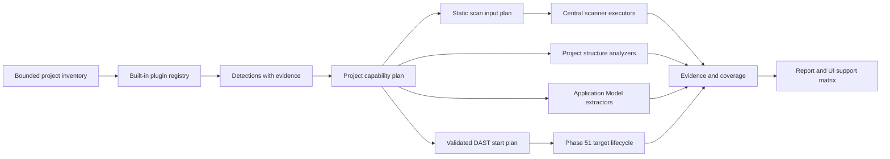
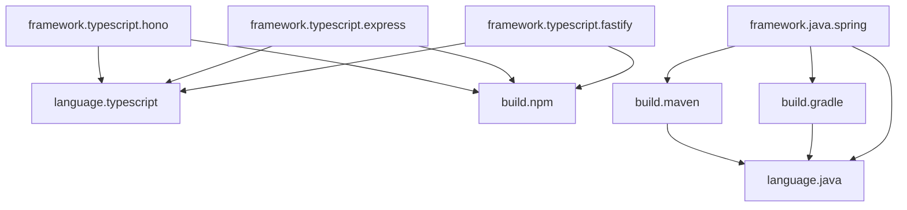

# Phase 52: Plugin-Oriented Language, Build-System, and Framework Refactoring Plan

Status: Implementation in progress; Phase 51 local start gate satisfied.
Slices 52.0–52.5、validated DAST start-plan generation、consent UI、post-scan
technology reporting are implemented in the working tree. Sandboxed Java target
execution、pre-scan capability UI、enforced rollout、legacy removal、same-commit
release closeout remain pending.

Predecessor: Phase 51 DAST Coverage, Depth, and Verdict Hardening（完了）

Implementation baseline commit:
`aff18b530a8fddfdc67c2a7fc21a0b825712d9b6`

Baseline date: 2026-07-31

Owner: vulnWorkbench maintainers

Target: 初期の正式対応をTypeScript/npmと
Java/Maven・Gradle/Springに限定し、scanner execution、dependency scope、
diff applicability、project structure、Application Model、DAST target start、
reportingを、後から言語・build system・frameworkを追加できる
versioned plugin contractへ段階移行する。

Local implementation evidence:

- `spec/evidence/phase-52-plugin-refactor-baseline.json`
- `.artifacts/benchmark/phase-52-capability.json`
- built-in registry digest:
  `sha256:b2c655a3f3dea597c3e30704515902a563cfbfe74a8599b3d667baae733c3ede`
- `bun run verify:phase-52-capability` successful
- affected module regression: 532 tests passed
- Phase 51 baseline and DAST capability gates successful after the refactor
- Maven/Gradle start plans fail closed with
  `project_code_execution_sandbox_required`; unsandboxed Java project code is
  never spawned

上記はlocal working treeの実装証跡であり、toolbox image digest、offline
vulnerability databaseを使った実scanner vulnerable/fixed gate、
same-commit clean checkoutを満たすrelease claimではない。

## 1. 結論

Phase 52では、言語ごとの条件分岐を既存moduleへ追加し続けない。
次の3種類を独立したbuilt-in pluginとして扱う。

1. language plugin
2. build-system plugin
3. framework plugin

初期の正式対応を次に固定する。

| Plugin kind | 初期正式対応 |
| --- | --- |
| language | TypeScript、Java |
| build system | npm、Maven、Gradle |
| framework | 現行TypeScript Web framework adapter、Spring Boot / Spring MVC |

JavaScript、Python、Go、PHP、Ruby、Rust、Kotlin、JAX-RS、Quarkus、
Micronaut、SBTは、既存scanner dataや実装の一部が存在しても
Phase 52の正式対応に含めない。

Phase 52の目的は、将来対象を実装することではなく、core変更なしに
独立pluginを追加できる境界を、TypeScriptとJavaの実運用で成立させることである。

初期loaderは任意のnpm packageやfilesystem上のJavaScriptを動的実行しない。
信頼済みbuilt-in pluginを明示importするbuild-time registrationとする。
外部配布plugin、署名、sandboxed plugin runtimeは後続phaseの対象とする。

## 2. Phase 51完了待ちと着手ゲート

### 2.1 Hard start gate

Slice 52.0より後のproduction code変更は、次をすべて満たすまで開始しない。

1. Phase 51のDAST詳細化コード、schema、migration、CLI、API、UIが
   intended integration branchへ統合されている。
2. Phase 51計画書のstatusが、少なくとも
   `local implementation complete`相当へ更新されている。
3. 次のlocal gateが同一commitで成功する。

```bash
bun run verify:phase-51-baseline
bun run verify:dast-capability
bun test api/modules/dast
bun test api/modules/scans/profile-runner.test.ts
bun test api/modules/scans/profiles-dast-budget.test.ts
bun test api/modules/scans/runtime-assessment-coverage.test.ts
```

4. 次のPhase 51 contractが凍結され、Phase 52から参照可能である。
   - DAST target preparation
   - shared runtime target lifecycle
   - runtime assessment coverage
   - profile step result
   - DAST verdict / limitation
5. DAST詳細化由来の未commit変更がない、またはPhase 52と重ならない状態へ
   明示的に分離されている。
6. Slice 52.0でbaseline commit、scanner-data manifest hash、
   Semgrep ruleset digest、toolbox image digestを採取できる。

### 2.2 Phase 51 external release gateの扱い

Linux real-ZAP、Juice Shop scenario、same-commit release evidenceなど、
Phase 51がrelease environment gateとして残している項目は、Phase 52の
implementation start時に黙って合格扱いしない。

- Phase 51由来の未完了release gateとして引き継ぐ。
- Phase 52のlanguage plugin変更によりDAST結果が変わる場合は再測定する。
- Phase 52を開始するためだけに、Phase 51の外部gateを削除または緩和しない。

### 2.3 Gate未達時

hard start gate未達時に許可する作業は次だけである。

- 計画書の更新
- read-onlyなbaseline調査
- fixture設計
- plugin contractの非production prototype

production module、schema、migration、profile、report、UIは変更しない。

## 3. 現行baselineと問題

### 3.1 Dependency scope

現行`DEPENDENCY_MANIFEST_SCOPE`はnpm系fileだけを含む。

```text
package.json
bun.lock
bun.lockb
package-lock.json
npm-shrinkwrap.json
yarn.lock
pnpm-lock.yaml
```

この定義を通常OSV、dependency profile、diff applicabilityが共有するため、
`pom.xml`、`gradle.lockfile`、`buildscript-gradle.lockfile`、
`gradle/verification-metadata.xml`をdependency inputとして扱えない。

### 3.2 Scanner能力と製品経路の不一致

変更前調査では次を確認済みである。

- curated Semgrep rulesetにJava 13 ruleがある。
- Java fixtureで13 rule、26 findingを検出できる。
- OSVのMaven vulnerable/fixed fixtureはoffline scanで区別できる。
- TrivyはMaven fixtureのvulnerabilityを検出できる。
- Spring MVC endpoint extractorが存在する。
- しかしbaseline profileのOSV manifest workspaceには`pom.xml`が
  1件もcopyされず、scanが失敗する。

scanner単体の対応を、profile全体の正式対応として表示してはならない。

### 3.3 Project structure

project structure inventoryはTypeScript/JavaScriptをsourceとして分類するが、
`.java`をresourceとして扱う。このためJava sourceが存在しても
`analyzedFileCount=0`となり、module/reference/package graphを作れない。

adapter未対応のfileを`resource`へ落として`completed`と表示することは、
coverageの誤表示である。

### 3.4 Application Model

endpoint extractorはTypeScript/JavaScript、Python、Java、Goを
extension switchで直接選択する。Spring対応自体は存在するが、
language/build-system/framework detectionと独立している。

Java plugin導入後は、Spring extractorをframework contributionとして選択する。
`.java`であることだけを理由にSpringとして扱わない。

### 3.5 DAST auto target

現行auto targetは`package.json`から
`dast/dev/start/serve/preview` scriptを選択する。
Java/Maven/Gradle/Springのstart planを表現できない。

Phase 52ではPhase 51のDAST runner、coverage、verdictを作り直さない。
pluginはvalidated start planを返し、Phase 51で確定したcentral target lifecycleが
実行、readiness、停止、coverage記録を担当する。

### 3.6 Capability claim

reportにはSAST languageとoffline SCA ecosystemの宣言がhard-codeされている。
scanner dataが存在することと、現在のprojectで適用・実行・検証されたことを
分離できない。

Phase 52では、plugin detection、step applicability、execution evidenceから
claimを生成する。

## 4. Scope

### 4.1 In scope

- versioned plugin contract
- deterministic built-in plugin registry
- language / build-system / framework dependency graph
- TypeScript language plugin
- npm build-system plugin
- Java language plugin
- Maven build-system plugin
- Gradle build-system plugin
- Spring Boot / Spring MVC framework plugin
- plugin-driven project capability detection
- plugin-driven dependency scope
- plugin-driven diff applicability
- plugin-selected Semgrep rule input
- OSV / Trivy dependency input materialization
- Java project structure classification and minimal analyzer
- Spring endpoint extraction contribution
- Maven / Gradle Spring DAST start plan
- applicability、coverage、support tierの保存と表示
- existing TypeScript behaviorの後方互換
- shadow rolloutとlegacy rollback
- fixture pluginによる拡張性contract test

### 4.2 Non-goals

- TypeScript、Java以外の正式対応
- JavaScriptを独立した正式対応languageへ昇格すること
- Python、Go、PHP、Ruby、Rust、Kotlin対応
- JAX-RS、Quarkus、Micronaut、Play Framework、SBT対応
- runtimeでの任意npm package loading
- user-supplied JavaScript pluginの実行
- remote plugin marketplace
- pluginの自動downloadまたは自動update
- unsigned binary plugin
- scanner executableそのものをpluginが提供・実行すること
- baseline scan中の`gradlew dependencies`自動実行
- baseline scan中のMaven/Gradle dependency download
- Gradle lockfileの自動生成・自動commit
- target repositoryへの設定file追加
- Phase 51 DAST verdict、crawler、auth、request budgetの再設計
- target build scriptを同意なしに実行すること

## 5. Support tierと用語

### 5.1 Plugin availability

| 状態 | 意味 |
| --- | --- |
| `registered` | coreと互換なplugin manifestがregistryへ登録済み |
| `detected` | project evidenceによりpluginが対象と判定された |
| `applicable` | 必要inputが存在し、stepを実行できる |
| `executed` | scannerまたはanalyzerが完了した |
| `verified` | vulnerable/fixed、positive/negative、profile E2E gateが通る |

`registered`だけでsupported claimを生成しない。

### 5.2 Capability support

| Tier | 意味 |
| --- | --- |
| `verified` | current digestとfixtureでrelease gateを満たす |
| `partial` | 一部input、direct dependency、framework surfaceのみ確認済み |
| `unsupported` | 実行contractまたは検証証跡がない |

### 5.3 Coverage rule

- finding 0件とcoverage完了を分離する。
- plugin未登録をclean resultにしない。
- lockfile不足を`not_applicable`ではなく、projectが対象build systemなら
  `gap`として扱う。
- unsupported frameworkでDASTを自動起動できなくても、
  static scanの成功まで失敗扱いにしない。
- incidental scanner findingは捨てないが、正式対応範囲外なら
  `supportTier: "unverified"`を付ける。

## 6. 目標アーキテクチャ



coreは次を所有する。

- filesystem boundary
- bounded read
- DB access
- process execution
- Docker execution
- network policy
- artifact storage
- secret redaction
- timeoutとresource budget
- schema validation
- event、coverage、report

pluginは次だけを提供する。

- detection rule
- manifest group
- source analyzer
- endpoint extractor
- Semgrep rule reference
- scan input plan
- DAST start plan

pluginはDB、network、process、credential、artifact storageへ直接accessしない。

## 7. Plugin kind

### 7.1 Language plugin

責務:

- source extension
- language detection
- Semgrep rule contribution
- project structure analyzer
- source role hint
- generic endpoint extractor contribution

初期plugin:

```text
language.typescript
language.java
```

### 7.2 Build-system plugin

責務:

- build system detection
- primary manifest / lockfile
- companion file
- dependency ecosystem mapping
- installed dependency directory
- build output directory
- dependency coverage semantics
- OSV / Trivy scan input

初期plugin:

```text
build.npm
build.maven
build.gradle
```

### 7.3 Framework plugin

責務:

- framework detection
- required language / build system
- endpoint extraction
- schema discovery hint
- route seed
- DAST start planner
- framework-specific limitation

初期plugin:

```text
framework.typescript.hono
framework.typescript.express
framework.typescript.fastify
framework.java.spring
```

framework plugin数は、Slice 52.0の現行TypeScript behavior inventoryで確定する。
既存で測定されていないTypeScript frameworkを、移行時についでに追加しない。

## 8. Versioned plugin contract

### 8.1 Manifest

```ts
type TechnologyPluginManifestV1 = {
  schemaVersion: 1;
  pluginApiVersion: "1";
  id: string;
  version: string;
  kind: "language" | "build_system" | "framework";
  displayName: string;
  requires: {
    allOf: string[];
    oneOf: string[];
  };
  declaredCapabilities: Array<
    | "source_detection"
    | "sast"
    | "dependency_detection"
    | "dependency_scan"
    | "project_structure"
    | "endpoint_extraction"
    | "schema_discovery"
    | "dast_start"
  >;
};
```

manifestは能力を宣言するが、`verified` statusは宣言しない。
verified statusはrelease evidenceから計算する。

### 8.2 Runtime contract

```ts
type TechnologyPluginV1 = {
  manifest: TechnologyPluginManifestV1;
  detectors: readonly ProjectDetector[];
  dependencyProviders: readonly DependencyProvider[];
  sourceAnalyzers: readonly SourceAnalyzer[];
  endpointExtractors: readonly EndpointExtractor[];
  semgrepRules: readonly SemgrepRuleContribution[];
  startPlanners: readonly StartPlanner[];
};
```

各hookはcoreから渡されたbounded valueだけを使用する。

```ts
type PluginContext = {
  inventory: readonly InventoryEntry[];
  readText: (path: string) => Promise<BoundedTextResult>;
  limits: {
    maxFiles: number;
    maxFileBytes: number;
    maxTotalBytes: number;
  };
};
```

absolute path、raw environment、DB handle、process runnerを渡さない。

### 8.3 Registration

初期registrationは明示importとする。

```ts
registerBuiltInPlugins([
  typescriptLanguagePlugin,
  npmBuildPlugin,
  javaLanguagePlugin,
  mavenBuildPlugin,
  gradleBuildPlugin,
  springFrameworkPlugin,
]);
```

plugin directory scan、dynamic import、`require()`、remote fetchは行わない。

### 8.4 Validation

registry construction時に次を拒否する。

- duplicate plugin ID
- unsupported plugin API version
- dependency cycle
- missing required plugin
- ambiguous exclusive detector
- duplicate analyzer ownership
- duplicate primary manifest claim
- start planner ID collision
- Semgrep rule contributionのmissing digest
- path traversalを含むasset path

registry orderはregistration orderに依存させず、
dependency orderとplugin IDで決定論的に解決する。

## 9. 初期plugin dependency graph



`framework.java.spring`のdependencyは
`language.java` AND (`build.maven` OR `build.gradle`)とする。
上図のMaven/Gradle両方を必須と解釈しない。

## 10. TypeScript/npm plugin

### 10.1 Language

- 正式source extension: `.ts`、`.tsx`、`.mts`、`.cts`
- existing TypeScript Semgrep ruleだけをselected rulesetへ含める
- existing TypeScript/JavaScript structure analyzerをadapter経由で再利用する
- JavaScript互換入力はlegacy behaviorとして測定するが、
  Phase 52の独立supported claimには含めない

### 10.2 npm

primary / lock input:

```text
package-lock.json
npm-shrinkwrap.json
bun.lock
bun.lockb
yarn.lock
pnpm-lock.yaml
```

companion:

```text
package.json
pnpm-workspace.yaml
```

installed/build directory:

```text
node_modules/**
dist/**
dist-web/**
.next/**
.turbo/**
```

### 10.3 Framework

現行Application ModelとDAST auto targetのbehaviorをplugin adapterへ移す。
移行時にroute detection、port selection、readiness pathを変更しない。

TypeScript behavior改善が必要な場合は、compatibility migration完了後の
独立sliceへ分ける。

## 11. Java language plugin

### 11.1 Detection

正式source extension:

```text
.java
```

次はPhase 52ではJava sourceとして扱わない。

```text
.kt
.kts
.groovy
.scala
```

### 11.2 Semgrep

- curated rulesetのJava 13 ruleをplugin contributionとして登録する。
- config root全体ではなく、検出済みlanguageのrule pathだけをSemgrepへ渡す。
- positive/negative fixtureとrule metadata gateを維持する。
- Java以外のexisting rulesを削除しないが、enforced modeでは選択しない。

### 11.3 Project structure

最小analyzerは次を抽出する。

- `package`
- `import`
- top-level class / interface / enum / record
- annotation名
- package間reference
- Maven/Gradle module boundary

Phase 52ではJava semantic type resolution、bytecode解析、call graphを実装しない。

`.java`は`resource`ではなく`source`に分類する。
analyzer失敗または未対応syntaxは`partial`とdiagnosticを保存する。

## 12. Maven build-system plugin

### 12.1 Detectionとscope

primary:

```text
pom.xml
**/pom.xml
```

excluded build output:

```text
target/**
**/target/**
```

multi-module projectでは、root pomだけでなくscan scope内のchild pomを
同じworkspaceへmaterializeする。

### 12.2 Dependency coverage

現行offline OSV実行は`--no-resolve`を使用するため、Mavenのtransitive
dependency resolutionを実行しない。

Maven coverageを次に分ける。

| 状態 | Coverage |
| --- | --- |
| `pom.xml` direct dependencyを解析 | `partial: direct_dependencies` |
| pinned SBOMまたは検証済みresolved graphあり | `verified: resolved_dependencies` |
| pom parse失敗 | `gap: dependency_manifest_invalid` |
| network resolutionが必要だが禁止 | `gap: dependency_resolution_not_performed` |

direct dependencyだけでJava SCA全体をcoveredと表示しない。

### 12.3 Spring relation

Spring dependency、plugin、annotation evidenceは
`framework.java.spring` detectorへ渡す。
Maven plugin自身はSpring固有判断を行わない。

## 13. Gradle build-system plugin

### 13.1 Detection

project marker:

```text
build.gradle
build.gradle.kts
settings.gradle
settings.gradle.kts
gradlew
gradlew.bat
gradle/wrapper/gradle-wrapper.properties
gradle/libs.versions.toml
```

markerはGradle project detectionに使用するが、
すべてをdependency version evidenceとして扱わない。

### 13.2 正式SCA input

OSV / Trivyの初期正式input:

```text
gradle.lockfile
**/gradle.lockfile
buildscript-gradle.lockfile
**/buildscript-gradle.lockfile
gradle/verification-metadata.xml
**/gradle/verification-metadata.xml
```

Trivy向けに`*gradle.lockfile`を認識する場合も、OSVが同じbasenameを
解析可能かをfixtureで確認し、tool別applicabilityを分ける。

### 13.3 Companion input

構造解析、framework detection、module boundaryのため次をbounded readする。

```text
build.gradle
build.gradle.kts
settings.gradle
settings.gradle.kts
gradle/libs.versions.toml
```

version catalogやbuild scriptを、resolved dependency lockの代用にしない。

### 13.4 Coverage

| 状態 | Coverage |
| --- | --- |
| Gradle project + lockfileあり | `verified: locked_dependencies` |
| verification metadataのみ | `partial: verification_metadata` |
| build fileのみ | `gap: gradle_dependency_lock_missing` |
| lockfile parse失敗 | `gap: dependency_lock_invalid` |
| multi-project child lock未収集 | `partial: module_lock_coverage` |

Gradle projectでlockfileがない場合、OSVを`not_applicable`としてcleanにしない。

### 13.5 禁止する自動処理

baseline static scanでは次を実行しない。

```text
./gradlew dependencies
./gradlew --write-locks
gradle dependencies
```

理由:

- project build scriptは任意コードを実行できる。
- dependency downloadがnetwork policyを破る。
- target repositoryを変更し得る。
- scan前後でdependency stateが変わる。

lock生成はproject ownerの責務とし、gap remediationとして安全な説明だけを出す。

### 13.6 Exclude

```text
.gradle/**
**/.gradle/**
build/**
**/build/**
```

full-deep profileで含める場合も、installed cacheとfirst-party sourceを
coverage上で区別する。

## 14. Spring framework plugin

### 14.1 Initial scope

supported:

- Spring Boot
- Spring MVC
- `@RequestMapping`
- `@GetMapping`
- `@PostMapping`
- `@PutMapping`
- `@PatchMapping`
- `@DeleteMapping`
- class-level pathとmethod-level pathの結合

initially unsupported:

- Spring WebFluxの完全semantic解析
- functional routingの完全解析
- Spring Security authorization policyの完全推論
- JAX-RS
- GraphQL subscription
- messaging endpoint

### 14.2 Detection

複数evidenceを使用する。

- Maven dependency
- Gradle build scriptまたはversion catalog
- Spring annotation
- Spring Boot plugin
- application configuration

1 annotationだけでframeworkを確定せず、confidenceとevidence refを保存する。

### 14.3 Endpoint extraction

既存Java endpoint extractorをframework contributionへ移す。
class-level mapping、method-level mapping、HTTP method、path parameterを
fixtureで検証する。

source parserが未対応syntaxを含む場合、routeを推測で補わず
coverage limitationを保存する。

### 14.4 Schema hint

次をOpenAPI discovery hintとして提供できる。

```text
/v3/api-docs
/v3/api-docs.yaml
/swagger-ui/index.html
```

hintはexposure findingではなく、Phase 51 route inventoryのseed候補とする。

## 15. Plugin-driven scan planning

### 15.1 Detection result

```ts
type ProjectPluginDetection = {
  pluginId: string;
  detected: boolean;
  confidence: "low" | "medium" | "high";
  evidence: Array<{
    path: string;
    kind: "extension" | "manifest" | "dependency" | "annotation" | "config";
  }>;
  limitations: string[];
};
```

raw file bodyやabsolute pathをmetadataへ保存しない。

### 15.2 Capability plan

```ts
type ProjectCapabilityPlanV1 = {
  schemaVersion: 1;
  registryDigest: `sha256:${string}`;
  activePluginIds: string[];
  languages: string[];
  buildSystems: string[];
  frameworks: string[];
  steps: Array<{
    stepId: string;
    pluginIds: string[];
    applicability: "applicable" | "not_applicable";
    reasonCode: string | null;
    coverageEffect: "covered" | "partial" | "gap";
  }>;
};
```

planをscan開始時に保存し、実行後にresultと比較する。
実行中にproject detectionが変わった場合は、silentに別planへ切り替えない。

### 15.3 Static tool

- Semgrep: active language pluginのrule contributionだけを使用する。
- Gitleaks: source scope全体へ適用し、language pluginに依存しない。
- OSV: active build-system pluginがmaterializeしたdependency workspaceを使う。
- Trivy vulnerability: dependency workspaceを使う。
- Trivy secret/misconfig: source/config scopeを使う。

Trivy vulnerabilityとsecret/misconfigを同一inputへ強制しない。

## 16. Diff scan

dependency change判定を固定npm globからplugin contributionへ変更する。

### 16.1 Rules

- primaryまたはcompanion file変更でbuild-system pluginをapplicableにする。
- Maven child pom変更時はfull Maven dependency stateを再評価する。
- Gradle lockfile変更時は対象moduleとroot build evidenceをmaterializeする。
- `build.gradle`変更、lockfile未変更は
  `partial: dependency_definition_changed_without_lock_update`とする。
- unsupported pluginのmanifestらしきfileをclean coverageにしない。

### 16.2 Diff evidence

diff manifestへ次を追加する。

```ts
type PluginDiffContext = {
  detectedPluginIds: string[];
  affectedPluginIds: string[];
  dependencyStateChanged: boolean;
  lockStateChanged: boolean;
  limitationCodes: string[];
};
```

existing digest、snapshot、path boundaryを維持する。

## 17. DAST start plan

### 17.1 Boundary

pluginはprocessをspawnしない。

```ts
type DastStartPlanV1 = {
  schemaVersion: 1;
  pluginId: string;
  executable: string;
  args: string[];
  cwd: string;
  env: Record<string, string>;
  readinessPaths: string[];
  requiresProjectCodeConsent: boolean;
  requestedNetwork: "none";
};
```

central validatorが次を確認する。

- executable allowlist
- executable realpathがproject root内またはtrusted toolchain内
- shell control character不使用
- cwdがproject root内
- environment key allowlist
- loopback bind
- allocated port
- network policy
- timeout
- resource limit
- user/project consent

### 17.2 TypeScript

既存package script planをadapter化する。
behavior変更は行わず、同じscript priority、port、readiness pathを維持する。

### 17.3 Maven Spring

候補:

```text
./mvnw --offline spring-boot:run
mvn --offline spring-boot:run
```

wrapperまたはbuild実行はproject code executionである。
明示同意とPhase 51で確定したsandbox policyなしには実行しない。

### 17.4 Gradle Spring

候補:

```text
./gradlew --offline --no-daemon bootRun
gradle --offline --no-daemon bootRun
```

`--offline`はdependency downloadを許可しないための条件であり、
build scriptの任意コード実行を安全にするものではない。
project code consent、sandbox、resource limitを必須とする。

Springにはcentral envから次を渡す。

```text
SERVER_ADDRESS=127.0.0.1
SERVER_PORT=<allocated>
```

host LLM credential、database credential、cloud credentialを渡さない。

### 17.5 Start unsupported

safe start planを作れない場合:

- static scanは継続する。
- DAST stepは`target_start_not_supported`とする。
- coverageは`gap`とする。
- finding 0件をDAST clean verdictにしない。

## 18. ReportingとUI

### 18.1 Pre-scan preview

表示:

- detected language
- detected build system
- detected framework
- active plugin
- tool applicability
- dependency lock coverage
- DAST start availability
- limitation

### 18.2 Post-scan

reportに次を出力する。

```markdown
## Technology coverage

| Plugin | Detected | Executed | Support | Coverage | Limitation |
| --- | --- | --- | --- | --- | --- |
```

hard-coded language/ecosystem claimを削除し、
current scanのcapability planとrelease evidenceから生成する。

### 18.3 Zero finding

次を明確に区別する。

- verified scopeでfinding 0件
- direct dependencyだけ確認
- Gradle lockfileなし
- framework未検出
- target start未対応
- scanner execution失敗

## 19. Data model

### 19.1 Initial persistence

初期実装では新しいDB tableを必須にしない。
versioned capability planとplugin execution summaryをscan metadataへ保存する。

```ts
type PluginExecutionSummaryV1 = {
  schemaVersion: 1;
  registryDigest: string;
  detections: ProjectPluginDetection[];
  capabilityPlan: ProjectCapabilityPlanV1;
  pluginResults: Array<{
    pluginId: string;
    capability: string;
    status: "completed" | "failed" | "skipped";
    coverageEffect: "covered" | "partial" | "gap";
    limitationCodes: string[];
  }>;
};
```

metadata sizeとquery要件が既存limitを超える場合だけ、独立tableを
別migration sliceとして提案する。

### 19.2 Shared schema

追加候補:

```text
shared/schemas/technology-plugin.schema.ts
shared/schemas/project-capability-plan.schema.ts
```

schemaVersionとpluginApiVersionを分離する。

## 20. Scanner dataとprovenance

### 20.1 Semgrep

plugin contributionは次を持つ。

```ts
type SemgrepRuleContribution = {
  pluginId: string;
  rulesetId: string;
  path: string;
  digest: `sha256:${string}`;
  language: string;
};
```

scanner-data manifestと実file digestが一致しない場合はfail closedする。

### 20.2 OSV / Trivy

toolboxに他ecosystem DBが残っていてもよい。
正式support claimはactive plugin、applicable input、fixture evidenceに限定する。

### 20.3 Registry digest

plugin manifest、declared dependency、ruleset digest、analyzer versionを
canonicalizeし、registry digestを生成する。

scan artifact、report、release evidenceへregistry digestを保存する。

## 21. Fixtureとbenchmark

### 21.1 TypeScript

- vulnerable/fixed Semgrep fixture
- vulnerable/fixed npm dependency fixture
- framework endpoint fixture
- package-script DAST plan fixture
- full profile E2E
- diff profile E2E

### 21.2 Java Maven Spring

- vulnerable/fixed Java SAST fixture
- vulnerable/fixed `pom.xml`
- multi-module parent/child pom
- Spring class/method mapping
- Maven start plan
- missing dependency resolution limitation
- full profile E2E
- diff profile E2E

### 21.3 Java Gradle Spring

- vulnerable/fixed `gradle.lockfile`
- `buildscript-gradle.lockfile`
- verification metadata
- `build.gradle`
- `build.gradle.kts`
- `settings.gradle`
- multi-project child lock
- version catalog detection
- lockfile missing gap
- lockfile stale indication
- Gradle start plan
- full profile E2E
- diff profile E2E

### 21.4 Extensibility fixture

real languageを追加せず、test-only pluginを登録する。

確認事項:

- core file変更なしでplugin registrationできる。
- custom extensionを検出できる。
- custom manifestをdiff dependency changeとして扱える。
- endpoint extractor contributionを呼べる。
- duplicate IDとAPI mismatchを拒否できる。

test-only pluginを正式support一覧へ表示しない。

## 22. 実装slice

### 22.1 Slice 52.0: Phase 51 closeout確認とbaseline

変更:

- Phase 51 hard start gateを検証する。
- implementation baseline commitを計画書へ記録する。
- current TypeScript / Java behavior inventoryを保存する。
- current hard-coded extension、manifest、framework、start logicを列挙する。

Artifact:

```text
spec/evidence/phase-52-plugin-refactor-baseline.json
```

完了条件:

- Phase 51 local gate成功
- baseline commit固定
- TypeScript/npm baseline成功
- Java individual scanner baseline記録
- known gap再現

### 22.2 Slice 52.1: Contractとregistry

追加候補:

```text
shared/schemas/technology-plugin.schema.ts
shared/schemas/project-capability-plan.schema.ts
api/modules/project-capabilities/plugin-contract.ts
api/modules/project-capabilities/plugin-registry.ts
api/modules/project-capabilities/plugin-detector.ts
api/modules/project-capabilities/plugin-registry.test.ts
```

完了条件:

- manifest validation
- deterministic order
- dependency resolution
- collision rejection
- test-only plugin成功
- production behavior変更なし

### 22.3 Slice 52.2: TypeScript/npm shadow migration

変更候補:

```text
api/plugins/builtin/typescript/language.ts
api/plugins/builtin/typescript/npm.ts
api/modules/scans/profiles.ts
api/modules/scans/target-scope.ts
api/modules/scans/diff-scan-plan.ts
api/modules/static-intelligence/project-structure/
api/modules/threat-models/endpoint-extractors/
api/modules/dast/target-preparer.ts
```

shadow modeでlegacyとplugin planを比較する。

完了条件:

- TypeScript baseline result同値
- npm dependency applicability同値
- TypeScript project structure同値
- DAST start plan同値
- plan mismatch 0件

### 22.4 Slice 52.3: Java/Maven plugin

変更:

- Java language detection
- Java Semgrep rule selection
- Java structure analyzer
- Maven dependency scope
- Maven diff applicability
- direct/transitive coverage表示

完了条件:

- Java SAST fixture pass
- Maven vulnerable/fixed pass
- multi-module scope pass
- baseline profileでOSV workspaceがemptyにならない
- direct-onlyをverified transitiveとして表示しない

### 22.5 Slice 52.4: Java/Gradle plugin

変更:

- Gradle detection
- Gradle lock materialization
- Gradle tool applicability
- multi-project coverage
- lockfile missing gap

完了条件:

- OSV supported Gradle input fixture pass
- Trivy Gradle lock fixture pass
- vulnerable/fixed distinction
- diff lock change applicable
- build script only caseはgap
- baseline中のGradle execution 0回
- network request 0回
- target repository mutation 0件

### 22.6 Slice 52.5: Spring framework plugin

変更:

- Spring detection
- endpoint extractor contribution
- class/method mapping
- schema discovery hints
- application model evidence

完了条件:

- Maven Spring fixture pass
- Gradle Spring fixture pass
- endpoint recall / precision gate pass
- non-Spring Java false detection 0件
- unsupported surface limitation保存

### 22.7 Slice 52.6: DAST start adapter

Phase 51 contractへTypeScript、Maven Spring、Gradle Spring start planを接続する。

完了条件:

- pluginがprocessを直接spawnしない
- consentなしのMaven/Gradle execution 0回
- loopback / port enforcement
- cleanup success
- start unsupportedがfalse-passにならない
- Phase 51 DAST gate回帰なし

### 22.8 Slice 52.7: Reporting、UI、enforced rollout

変更:

- capability preview
- technology coverage
- hard-coded claim除去
- shadow mismatch resolution
- enforced mode

完了条件:

- TypeScript/npm claim正確
- Java/Maven claim正確
- Java/Gradle claim正確
- Spring claim正確
- unsupported languageをverified表示しない
- zero findingとcoverage gapを分離

### 22.9 Slice 52.8: Legacy removalとcloseout

削除対象:

- fixed dependency manifest list
- direct extension switch
- direct framework switch
- package.json専用start inferenceのcore ownership
- hard-coded support claim

完了条件:

- legacy rollback window終了
- plugin registryがsingle source of truth
- clean checkout strict gate pass
- release evidence保存

## 23. Verification inventory

### 23.1 Existing regression

```bash
bun run typecheck
bun run lint
bun test api/modules/scans
bun test api/modules/static-intelligence
bun test api/modules/threat-models
bun test api/modules/dast
bun run test:semgrep:catalog
bun run test:osv:offline-fixtures
bun run verify:phase-51-baseline
bun run verify:dast-capability
```

### 23.2 New focused tests

追加候補:

```text
api/modules/project-capabilities/plugin-registry.test.ts
api/modules/project-capabilities/plugin-detector.test.ts
api/modules/scans/plugin-dependency-scope.test.ts
api/modules/scans/plugin-diff-applicability.test.ts
api/modules/static-intelligence/project-structure/java-analyzer.test.ts
api/modules/threat-models/spring-plugin.test.ts
api/modules/dast/plugin-start-planner.test.ts
tests/security-capability/plugins/
tests/security-capability/java-maven/
tests/security-capability/java-gradle/
```

### 23.3 Implemented commands

```json
{
  "test:technology-plugins": "bun test api/modules/project-capabilities tests/security-capability/plugins",
  "test:java-maven-capability": "bun test tests/security-capability/java-maven",
  "test:java-gradle-capability": "bun test tests/security-capability/java-gradle",
  "verify:phase-52-capability": "bun run test:technology-plugins && bun run test:java-maven-capability && bun run test:java-gradle-capability"
}
```

command名は実装時に既存package script namingと衝突しないことを確認する。

実装済み`verify:phase-52-capability`は、上記focused testに加えてSemgrep
catalog、OSV offline fixture contract、registry/ruleset/fixture digestの検証と
local evidence生成を行う。

### 23.4 Expected results

- TypeScript/npm regression 0件
- Java Semgrep positive recall 100%
- Java Semgrep negative false positive 0件
- Maven vulnerable detected / fixed excluded
- Gradle vulnerable detected / fixed excluded
- Gradle lock missing false-clean 0件
- Maven direct-only false-verified 0件
- plugin registry collisionを全件拒否
- DAST start without consent 0件
- scanner network request 0件
- target repository mutation 0件
- unsupported language verified claim 0件

## 24. Rollout

### 24.1 Stages

| Stage | Behavior |
| --- | --- |
| `legacy` | 現行pathのみ実行 |
| `shadow` | 現行pathを実行し、plugin planとの差分を保存 |
| `enforced` | plugin planがscope、applicability、adapterを決定 |

### 24.2 Shadow mismatch

次をmismatchとして保存する。

- active tool差
- manifest file差
- changed dependency判定差
- endpoint差
- start plan差
- support claim差

secret、source body、absolute home pathは保存しない。

### 24.3 Rollback

enforced rollout後も1 release windowはlegacy adapterを保持する。

rollback条件:

- TypeScript baseline finding loss
- npm dependency finding loss
- Java profile false success
- Gradle lockfile見落とし
- DAST target cleanup regression
- plugin detection非決定性
- registry digest不一致
- report support過大表示

rollbackではdata migrationを巻き戻さず、execution selectionをlegacyへ戻す。

## 25. Risk register

| Risk | Impact | Mitigation |
| --- | --- | --- |
| plugin抽象化が過大 | review困難、回帰 | 3 kindと初期6系統に限定 |
| arbitrary plugin code | RCE、credential漏洩 | built-in explicit registrationのみ |
| detector競合 | 誤ったadapter選択 | evidence、priority、collision rejection |
| Gradle lockなし | dependency false-clean | gapとしてfail truthful |
| Maven transitive未解決 | coverage過大表示 | direct/transitiveを分離 |
| build script実行 | arbitrary code | static scanでは禁止、DASTはconsent+sandbox |
| TypeScript回帰 | 現行利用者影響 | shadow comparison |
| DAST詳細化との競合 | merge conflict、contract drift | Phase 51 hard start gate |
| scanner dataとplugin不一致 | 再現性喪失 | digestとregistry hash |
| inactive言語finding | support claim混乱 | unverified metadata |
| multi-module欠落 | Java依存見落とし | parent/child fixtureとmodule coverage |
| report hard-code残存 | 過大claim | generated coverage、static audit |

## 26. PR分割

| PR | 内容 | 依存 |
| --- | --- | --- |
| 52-A | baseline evidence、contract、registry | Phase 51 closeout |
| 52-B | TypeScript/npm shadow adapter | 52-A |
| 52-C | Java language、Maven | 52-B |
| 52-D | Gradle | 52-C |
| 52-E | Spring structure/Application Model | 52-C、52-D |
| 52-F | DAST start adapter | Phase 51 frozen contract、52-E |
| 52-G | report/UI、enforced rollout | 52-B–52-F |
| 52-H | legacy removal、release evidence | 52-G |

各PRは独立してrevert可能にする。
contractと全consumerを1つの巨大PRで置換しない。

## 27. Phase 52 Definition of Done

次をすべて満たした場合のみPhase 52完了とする。

1. Phase 51 hard start gateの成功記録がある。
2. plugin API v1とschemaがversionedである。
3. built-in registryが決定論的である。
4. duplicate、cycle、missing dependency、API mismatchを拒否する。
5. TypeScript/npmがplugin経由で現行挙動を維持する。
6. Java SASTがplugin経由で実行される。
7. Maven `pom.xml`が通常・差分scanで認識される。
8. Maven direct/transitive coverageを区別する。
9. Gradle lockfileが通常・差分scanで認識される。
10. Gradle lockfileなしをclean resultにしない。
11. baseline scanがGradle buildを実行しない。
12. Spring Boot / MVC endpointをMaven/Gradle fixtureで抽出できる。
13. Java project structureが0 analyzed fileにならない。
14. TypeScript、Java以外を正式verified表示しない。
15. pluginはDB、network、processへ直接accessしない。
16. Maven/Gradle DAST startはconsentとsandboxを必須とする。
17. DAST start failureをpassedにしない。
18. reportとUIが実測coverageを表示する。
19. test-only pluginをcore consumer変更なしで登録できる。
20. TypeScript regression、Phase 51 DAST regressionが0件である。
21. scanner、ruleset、registry、fixture digestをrelease evidenceへ保存する。
22. clean checkout strict gateが通る。

## 28. 実装開始時の再確認

Phase 52着手時は、計画書作成時点からのdriftを再確認する。

- Phase 51で変更されたDAST contract
- profile step schema
- target preparer
- runtime assessment coverage
- scanner-data manifest
- Semgrep ruleset
- OSV / Trivy version
- current TypeScript framework inventory
- current working tree

driftがある場合、実装を推測で開始せず、Slice 52.0 baselineと該当sectionを更新する。

## 29. 公式仕様参照

- OSV-Scanner Supported Artifacts and Manifests:
  `https://google.github.io/osv-scanner/supported-languages-and-lockfiles/`
- Trivy Java:
  `https://trivy.dev/docs/latest/coverage/language/java/`
- Gradle Dependency Locking:
  `https://docs.gradle.org/current/userguide/dependency_locking.html`
- Semgrep Rule Testing:
  `https://semgrep.dev/docs/writing-rules/testing-rules/`

参照仕様が更新されても、scanner versionとfixtureを更新せずに
supported inputを自動拡張しない。

## 30. 参照するrepository file

- `api/modules/scans/profiles.ts`
- `api/modules/scans/target-scope.ts`
- `api/modules/scans/diff-scan-plan.ts`
- `api/modules/scans/tools/osv-runner.ts`
- `api/modules/scans/tools/trivy-runner.ts`
- `api/modules/scans/tools/semgrep-runner.ts`
- `api/modules/static-intelligence/project-structure/inventory-classification.ts`
- `api/modules/static-intelligence/project-structure/analyzers/registry.ts`
- `api/modules/threat-models/endpoint-extractors/index.ts`
- `api/modules/threat-models/endpoint-extractors/java.ts`
- `api/modules/dast/target-preparer.ts`
- `api/modules/scans/profile-step-orchestrator.ts`
- `api/modules/scans/report-builder-finalize.ts`
- `docker/toolbox/scanner-data/scanner-data-manifest.json`
- `docker/toolbox/scanner-data/semgrep-rules/catalog.json`
