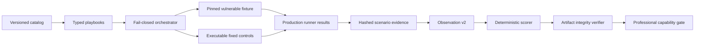

# Phase 54.4: Detection Effectiveness Improvement Plan

Status: Implemented locally on 2026-08-15; authoritative Linux CI and human claim approval pending

Parent plan: `spec/phase-54-release-trust-and-product-value-realization-plan.md`

Owner: vulnWorkbench maintainers

Target: policyを変更せず、OWASP Benchmarkの精度とcategory recallを改善し、
Juice Shop 20 scenarioを実行可能な証拠へ接続する。改善が実測できない場合は
claimを`not_met`のまま保ち、原因をlimitationとして残す。

## 1. 結論

改善は必要であり、実行順は次で固定する。

1. evaluation pathとprovenanceを正す。
2. OWASPのmapped safe false positiveを実測分類し、precision/FPRを改善する。
3. SQL injectionとtrust-boundaryのcategory recallを改善する。
4. Juice Shopの実行状態、証拠、fixed controlをversioned contractにする。
5. 20 scenarioをすべて実行し、既存のproduction primitiveから最低12件を検出する。
6. 同一commitのclean checkoutで全gateを再実行し、別PRのhuman approval後にだけ
   professional capability claimを変更する。

Semgrep ruleを推測で変更しない。Juice Shop challengeが解けたことを、そのまま
製品の「検出」と数えない。raw result、normalized finding、scenario evidence、policy、
corpus、実装hashが追跡できない改善は採用しない。

### 1.1 実装結果（2026-08-15）

- OWASP: TP 1,131 / FN 284 / TN 1,325 / FP 55、recall 0.7993、
  precision 0.9536、FPR 0.0399、score 0.7594。
- OWASP category: SQLi recall 0.75、trust-boundary recall 0.9639。
- OWASP FP分類: mapped safe FP 0、unmapped cross-CWE 55。unmappedは除外せず
  overall FPへ残した。
- Juice Shop: 20/20 scenario完了、12 TP / 8 FN / 20 TN / 0 FP、recall 0.60、
  precision 1.00、外部・public/production request 0、credential leakage 0。
- macOS上の実測はdiagnostic passであり、release claimには使用しない。
  `.github/workflows/verify.yml`のUbuntu jobがpinned imageをpreloadし、同一commit、
  clean tree、Linux、全provenanceを再検証する。
- professional capability claimは、OSV database、persisted passing run ID、Linux CI、
  human approvalが揃うまで`not_met`を維持する。

## 2. レビュー結果

### 2.1 採用する判断

- OWASP overall recall `0.7088`はminimum `0.70`を超えている。
- OWASPの主なoverall未達はprecision `0.6946`、FPR `0.3121`、score
  `0.3967`である。
- policyを下げず、false positiveをrecall拡張より先に分類する。
- Juice Shopはeligible 20、category 9に対してexecuted 0であり、検出不能と
  未実行を区別する。
- vulnerableとfixedを同じdetector pathで実行し、precisionを実測する。
- public/production targetへのactive request、LLMだけの`confirmed`、未実行の
  `not_applicable`化、unmapped CWEの除外を禁止する。

### 2.2 修正した判断

| 元の判断 | レビュー結果 | 本計画での扱い |
| --- | --- | --- |
| Java所有ruleは14本 | catalog上は13本 | manifest/catalogから生成し、手書き数値を置かない |
| 主因はESAPI sanitizer不足 | `encodeForSQL`、`getValidFileName`等はpinned corpusに現れない | source/sink/safe-patternを実測分類してからruleを変える |
| XSSに`encodeForHTMLAttribute`等を追加 | 既にsanitizerとして定義済み | 既実装の変更を計画から除外する |
| FP 441件を300件消すと全件TNへ移る | 441件はmapped safe FP 353件とunmapped 88件に分かれる | unmappedを点数目的で消さず、mapped safe FPを300件以上減らす |
| overall recallが通ればrecall作業は後回しでよい | SQLi `0.4669`、trustbound `0.3494`がcategory gate未達 | precision改善後に最低+9 TP、+13 TPを別sliceで実施する |
| trustboundがFPRの主因になり得る | 現runでは10/441件 | FPR主対象ではなくcategory recall対象とする |
| Juice Shopはwriter接続だけ不足 | status、provenance、orchestration、fixed controlも不足 | measurement contractから作り直す |
| authorization matrixで認可4件を実行できる | matrixはread-only、2 actor、2 object、object pathを要求する | view-basket以外はbusiness/browser primitiveを使う |
| ZAP active 9 ruleはSQLi/XSS系 | SQLi 2、XSS 2、その他5で、path traversal/SSRF ruleはない | rule catalogどおりに能力を表記する |
| owned business logic 8/8がlive検出の証拠 | benchmark observationはfixture一覧から機械生成される | executor contractとしてのみ使い、live Juice evidenceと分離する |

## 3. Source of truth

判断の優先順位を次で固定する。

1. `spec/security-capability/benchmark-policy.v1.json`
2. `spec/security-capability/corpora.lock.json`
3. `spec/security-capability/juice-shop-ground-truth.v1.json`
4. scanner/rule catalog、runner、normalizer、verifierの実装とtest
5. current runのraw artifactと再計算可能なmetrics
6. historical evidence
7. READMEや計画文書などの説明文

historical evidenceの数値はbaselineとして利用するが、HEADのpassing evidenceとは
扱わない。文章とmachine-readable artifactが矛盾する場合は、artifactを再計算し、
verifierを通った結果を正とする。

## 4. Scope

### 4.1 In scope

- OWASP failure analysisのmapped/unmapped、rule contribution、overlap、TP impact分離
- Java owned Semgrep ruleとpaired positive/negative fixtureの限定的変更
- Juice Shop catalog/playbook/observation/reportのversioned schema
- pinned Juice Shop containerのpreflight、prepare、scenario実行、cleanup
- production lower-level runnerを再利用するbenchmark orchestrator
- 実行可能なfixed control fixture
- evidence hash、commit、policy、corpus、scanner、playbook、implementationのprovenance
- professional capability gateとartifact verifierの更新
- Linux/Dockerでのsame-commit closeout

### 4.2 Non-goals

- `benchmark-policy.v1.json`のminimum変更
- unmapped observationの除外またはexpected CWEへの書き換え
- community Semgrep packやFindSecBugs結果をowned Semgrep scoreへ合算すること
- Juice Shop用のDB migrationまたは第二のpassing-run IDを本sliceへ追加すること
- Juice Shop challengeの成功をdetector findingなしで`detected`にすること
- 20 scenario専用の判定をproduct findingに見せかけること
- public Juice Shop、production、第三者環境へのactive request
- Docker socket mount、無制限rule/path/method、外部OAST service
- LLM verdictによる`vulnerableDetected`の決定
- Phase 54.5のreal-repository評価、SARIF、packagingの同時実装
- 本sliceだけを理由にclaimを`met`へ変更すること

## 5. Confirmed baseline

### 5.1 OWASP overall

| Metric | Current | Policy | Gap |
| --- | ---: | ---: | ---: |
| TP | 1,003 | - | - |
| FN | 412 | - | - |
| TN | 972 | - | - |
| FP | 441 | - | - |
| Recall | 0.7088 | >= 0.70 | pass |
| Precision | 0.6946 | >= 0.80 | fail |
| FPR | 0.3121 | <= 0.10 | fail |
| Score | 0.3967 | >= 0.60 | fail |

### 5.2 OWASP false-positive accounting

current raw resultとfailure analysisの対応は次のとおりである。

| Rule | Mapped safe FP | Unmapped cross-CWE | Reported contribution |
| --- | ---: | ---: | ---: |
| `java.xss-response-writer` | 91 | 88 | 179 |
| `java.sql-injection` | 88 | 0 | 88 |
| `java.path-traversal-file` | 86 | 0 | 86 |
| `java.command-injection` | 51 | 0 | 51 |
| `java.ldap-injection` | 16 | 0 | 16 |
| `java.xpath-injection` | 11 | 0 | 11 |
| `java.trust-boundary` | 10 | 0 | 10 |
| Total | 353 | 88 | 441 |

88件のunmappedは、path traversal testに対するCWE-79 findingである。corpusが
一つのexpected CWEしか持たないため、別CWEの実在するfindingがFPとして数えられる
可能性がある。これを無条件に抑止すると製品検出を弱めるため、FPR達成計画には
含めない。

unmapped 88件を維持すると、FPR `<= 0.10`にはmapped safe FPを353件から53件以下へ
減らす必要がある。したがってprecision workstreamの数値目標は「FPをおよそ300件」
ではなく、次で固定する。

```text
mappedSafeFalsePositive <= 53
unmappedCrossCwe is reported and is not filtered for score improvement
overallFalsePositive <= 141
overallFalsePositiveRate <= 0.10
```

### 5.3 OWASP category recall

ground truth positiveが20件以上あるapplicable categoryのうち、現在未達なのは次である。

| Category | Current | Minimum TP | Required gain |
| --- | ---: | ---: | ---: |
| SQL injection | 127 / 272 = 0.4669 | 136 | +9 TP |
| Trust boundary | 29 / 83 = 0.3494 | 42 | +13 TP |

precision-only changeではTPを1件も失わない。recall changeでは対象categoryのTPを増やし、
mapped safe FP、unmapped、他category recallを悪化させない。

### 5.4 Juice Shop

| Item | Current state | Consequence |
| --- | --- | --- |
| Catalog | 20 scenario、9 category | coverage minimumは満たす |
| Observation input | ファイル欠落を`[]`へ変換 | executed 0、FN 20になる |
| Observation schema | booleansとevidence path/hashのみ | blocked/inconclusive/cleanupを表せない |
| Reset | pinned 20.1.1 container recreate実装あり | benchmarkとは未接続 |
| `resetSucceeded` | metricsへ`true`をハードコード | reset実行の証拠にならない |
| `networkRequests` | metricsへ`0`をハードコード | isolationの証拠にならない |
| Fixed pairs | control説明文のみ | precisionの実行可能証拠にならない |
| ZAP | bounded active runnerあり | SQLi/XSSの一部だけに適用可能 |
| Authorization | matrix runnerあり | read-only object matrixに限定される |
| Business logic | scenario executorあり | live playbookとstate observerがない |
| Browser | bounded Playwright adapterあり | DOM action/sink判定のscenario adapterがない |

## 6. Target design

### 6.1 Evidence flow



catalogはscenario identityとground truthを持つ。playbookはactor、entrypoint、runner、
budget、setup/cleanup、evidence kindを持つ。detector resultはproduction lower-level
primitiveの出力だけから作り、catalogのexpected vulnerabilityをdetectorへ渡さない。

### 6.2 Juice Shop scenario state contract

次の用語を混同しない。

- `eligible`: versioned catalogに存在し、policyの分母に含まれる。
- `attempted`: preflightを通過し、runnerがscenarioを開始した。
- `executed`: vulnerableとfixedの両方が完了し、固有evidenceがあり、cleanupが成功した。
- `detected`: production detectorがscenario/CWEへ対応するfindingを出し、実行証拠を持つ。
- `not_detected`: executedだが対応findingがない。
- `inconclusive`: requestは実行したが、transport、auth、応答、oracleが信頼できない。
- `blocked`: Docker、image、browser、auth fixture等が実行前に不足した。
- `failed_cleanup`: cleanupまたはbaseline復元に失敗した。

observation v2は最低限、次を持つ。vulnerableとfixedは別々のexecution/evidenceを
持ち、一方の成功をもう一方へ流用しない。

```text
schemaVersion
scenarioId
runnerFamily
scenarioStatus: completed | inconclusive | blocked | failed_cleanup
vulnerable:
  executionStatus
  detection: detected | not_detected | not_scored
  evidencePath / evidenceHash
  normalizedFindingRefs
fixed:
  executionStatus
  detection: detected | not_detected | not_scored
  evidencePath / evidenceHash
  normalizedFindingRefs
lifecycle:
  targetRequestCount
  externalNetworkRequests
  publicProductionRequests
  prepareBaselineHash / cleanupBaselineHash
  cleanupSucceeded
limitationCodes
```

release scoring ruleは次とする。

1. `executedScenarioCount`はvulnerable/fixed完了、evidence検証、cleanup成功をすべて
   満たすscenarioだけを数える。
2. `blocked`、`inconclusive`、`failed_cleanup`をFN、TN、passへ変換しない。
3. 1件でも未完了なら`measurementStatus`を`completed`にせず、release gateをfail closedする。
4. 20件すべて完了したときだけ、`not_detected`をFN、fixed側の`detected`をFPとして
   authoritative metricsを確定する。
5. `detected`はnormalized production findingがscenarioのpath/CWE mappingと実行証拠を
   満たす場合だけ設定する。challenge solved APIやground-truth labelだけでは設定しない。
6. 同じevidence hashをvulnerable/fixed間または複数scenario間で再利用しない。

### 6.3 Provenance contract

Juice Shop reportは既存DAST standard reportの形を再利用し、少なくとも次を含む。

- `generatedAt`
- `gitCommit`
- `corpusVersion`、archive hash、image digest
- benchmark policy version/hash
- catalog hash
- playbook tree hash
- fixed-fixture tree hash
- detector implementation tree hash
- scanner manifest hash
- toolbox image digest
- observations hash
- raw result/evidence bundle hash
- per-scenario statusとlimitation
- actual request count、public/production request count
- credential canary leakage
- prepare/reset/cleanup result
- gate result

`.artifacts/benchmark/juice-shop-run.json`はattemptの成否にかかわらずtyped reportとして
生成する。`.artifacts/benchmark/juice-shop-metrics.json`は20件がcompleteした場合だけ
authoritative metricsとして生成する。missing observationを空配列へ変換しない。runを
開始していない場合はtyped `not_executed`、dependency不足はtyped `blocked`をrun reportへ
保存し、professional verifierはmetrics欠落をgate falseとして扱う。

### 6.4 Existing primitive reuse

benchmark専用にscannerを再実装せず、次を直接再利用する。

- ZAP: `api/modules/runtime-scans/zap-active-runner.ts`
- container lifecycle: `api/modules/runtime-scans/container-fixture-reset.ts`
- authorization: `api/modules/dast/authorization-matrix-runner.ts`
- business logic: `api/modules/business-logic/business-logic-scenario-executor.ts`
- browser boundary: `api/modules/dast/playwright-browser-adapter.ts`
- target pinning/HTTP: `api/modules/dast/pinned-fetch.ts`
- score: `api/modules/benchmarks/metric-scorer.ts`
- evidence integrity: `scripts/professional-capability-artifact-verifier.ts`

DB、route、UIを通す必要がないbenchmarkではlower-level pure runnerを使う。ただし
request scope、auth redaction、budget、cleanup、normalizationをproduction pathより弱めない。
DOM action、outbound canary、file exposure等で新しいdetector logicが必要な場合は、
`scripts/benchmark/`へJuice専用oracleを実装しない。`api/modules/dast/`または
`api/modules/business-logic/`へ再利用可能なbounded production primitiveとして追加し、
production contract testを通した後にbenchmark adapterから呼ぶ。business logicの
`observed`からfindingへの変換もproduction runnerと共有し、benchmark側で別判定を持たない。

### 6.5 Scenario-to-runner map

| Scenario | Execution/detection primitive | Current gap | Initial 12 candidate |
| --- | --- | --- | --- |
| `juice-admin-section` | business status invariantまたはbounded browser | static GETはcurrent matrix shapeに合わない | yes |
| `juice-view-basket` | authorization matrix | actor/object seedとlive evidence接続 | yes |
| `juice-forged-review` | business owner-isolation scenario | write + cleanup playbook | yes |
| `juice-forged-feedback` | business actor-identity scenario | write + cleanup playbook | yes |
| `juice-login-admin` | ZAP 40018/40019 | auth endpoint seed、path、observation adapter | yes |
| `juice-login-bender` | ZAP 40018/40019 | 同上 | yes |
| `juice-user-credentials` | ZAP 40018/40019 | search endpoint playbook | yes |
| `juice-dom-xss` | bounded browser transaction | DOM action/sink adapterがない | no |
| `juice-reflected-xss` | ZAP 40012 | auth seedとroute mapping | yes |
| `juice-api-only-xss` | ZAP 40014 + seed/cleanup | stored value lifecycle | yes |
| `juice-weak-password` | business credential-policy scenario | ephemeral accountとpolicy observer | no |
| `juice-reset-token` | business replay scenario | token seed、reuse、cleanup | no |
| `juice-captcha-bypass` | business replay scenario | CAPTCHA state observer | no |
| `juice-extra-language` | bounded HTTP + production normalized finding | detector mapping未確認 | no |
| `juice-local-file-read` | bounded HTTP/DAST | current ZAP allowlistにpath traversal ruleがない | no |
| `juice-forgotten-developer-backup` | bounded crawler/passive DAST | scenario-specific route/evidence接続 | no |
| `juice-negative-order` | business numeric invariant | live basket seedとnumeric observer | yes |
| `juice-zero-stars` | business boundary invariant | feedback seed/cleanup | yes |
| `juice-deluxe-fraud` | business state transition | membership state observer | yes |
| `juice-blockchain-hype` | internal outbound canary | external OASTを使わないlocal canary adapter | no |

initial candidateは12件だが、dry run前に検出済みとは表記しない。remaining 8も実際に
scenarioを実行し、production detectorがfindingを出さなければ`not_detected`として
記録する。execution driver自身がground truthを読んでfindingを生成してはならない。

### 6.6 Fixed controls

`tests/security-capability/juice-shop/paired-fixtures.json`の説明文だけでは不十分である。
family別のBun fixed fixtureを`tests/security-capability/juice-shop/fixed-app/`へ作り、
同じplaybook contractとdetector pathを実行する。

fixed controlは次を満たす。

- scenarioと`controlId`が1対1で対応する。
- method、actor count、state transition、evidence kindがvulnerable側と比較可能である。
- fixed用の特別な「常に未検出」adapterを持たない。
- fixed側にもrequest/evidence/cleanup hashを保存する。
- 20 pairすべてをcatalog checkerが検証する。
- TPが12の場合、precision `>= 0.80`を満たすFP上限は3件である。

## 7. Implementation slices

### 7.1 Slice 54.4-A — Baseline and analysis contract

#### Changes

- `scripts/benchmark/owasp-failure-analysis.ts`へ次を追加する。
  - mapped safe / unmapped cross-CWEの分離
  - rule/category/source/sink/test ID別のunique contribution
  - overlapping findingとTP contribution
  - rule無効化を仮定した差分。ただしscore改善目的の自動無効化はしない
- OWASP metricsへ`gitCommit`、policy hash、implementation hashを追加する。
- 現行baselineがTP/FN/TN/FPとreconcileしない場合はfailする。

#### Tests

- safe expected caseのmapped FP
- vulnerable case上の別CWEをunmappedとして保持
- 同一ruleの重複をunique contributionへ二重計上しない
- contribution合計とoverall FPがreconcileする
- raw finding改ざんとhash mismatchを拒否する

#### Exit

- 353 mapped / 88 unmapped / 441 overallを再現する。
- rule変更なしでbaseline metricsが変わらない。

### 7.2 Slice 54.4-B — OWASP precision

#### Procedure per safe-pattern cluster

1. analysis reportから代表test IDを選ぶ。
2. source、sink、branch、sanitizer、expected labelを人が確認する。
3. OWASP方言のnegative fixtureと、近接するpositive fixtureを追加する。
4. 1 clusterだけruleを変更する。
5. Semgrep catalog testとfull OWASP benchmarkを再実行する。
6. TPが1件でも減る、unmappedだけを消す、他category recallが悪化する場合はrejectする。
7. mapped safe FPが減ったchangeだけを統合する。

#### Priority

current mapped safe contribution順にXSS 91、SQLi 88、path traversal 86、command
injection 51を調べる。上位3 ruleだけでは最大265件で、必要な300件へ届かないため、
command injectionまたは下位ruleの改善も必要である。

#### Exit

- mapped safe FP `<= 53`
- unmapped cross-CWEを明示し、scoreから除外していない
- overall FP `<= 141`
- precision `>= 0.80`、FPR `<= 0.10`、score `>= 0.60`
- overall/category TPはbaselineから減っていない
- catalog positive recall 1.0、negative FP 0

### 7.3 Slice 54.4-C — OWASP category recall

#### Changes

- SQLi FNをsource/sink/flow別に分類し、最低9件の新規TPを得る。
- trustbound FNをsource/session flow別に分類し、最低13件の新規TPを得る。
- 新しいsource/sinkごとにpositiveとnegative fixtureを同じchangeへ入れる。
- trustboundをapplicabilityまたはoverall scoreから除外しない。

#### Exit

- SQLi recall `>= 0.50`
- trustbound recall `>= 0.50`
- mapped safe FP、unmapped、全既存passing categoryが悪化しない
- OWASP overall/category gateがすべてpassする

### 7.4 Slice 54.4-D — Juice measurement v2

#### Expected file changes

- `scripts/benchmark/juice-shop-observations.ts`
- `scripts/benchmark/juice-shop-observations.test.ts`
- `scripts/benchmark/juice-shop.ts`
- `scripts/benchmark/measurement-status.ts`
- `scripts/benchmark/all.ts`
- `scripts/professional-capability-artifact-verifier.ts`
- `scripts/verify-professional-capability.ts`
- `shared/schemas/release-evidence.schema.ts`と対応test

#### Changes

- observation/reportをschema v2へ上げ、v1 historical artifactは再解釈しない。
- missing、blocked、inconclusive、failed cleanupを分離する。
- `resetSucceeded`のハードコードを廃止する。曖昧な`networkRequests`はtarget requestと
  external/public requestに分離し、gateway/browser/canary evidenceから算出する。
- catalogの全fieldをtyped schemaで検証する。
- commitとsource tree hashをartifact verifierで照合する。
- `benchmark:all`がblockedをfailedやcompletedへ丸めないようにする。

#### Exit

- missing observationsでrecall 0のcompleted metricsを生成しない。
- blocked/inconclusive/cleanup failureのnegative testがfail closedする。
- v1 historical evidenceのverificationが維持される。

### 7.5 Slice 54.4-E — Juice orchestration and fixed controls

#### Expected new modules

- `scripts/benchmark/juice-shop-runner.ts`
- `scripts/benchmark/juice-shop-playbooks.ts`
- `scripts/benchmark/juice-shop-evidence.ts`
- `tests/security-capability/juice-shop/fixed-app/`
- family別playbook test

新しい検出能力が必要になった場合の候補は、Juice固有名を持たない
`api/modules/dast/browser-transaction-runner.ts`、
`api/modules/dast/outbound-canary-runner.ts`等のgeneric primitiveと対応testである。
実測分類で不要と分かったmoduleは作らない。

#### Delivery order

1. Linux、Docker、pinned image、browser、port、toolbox digestをpreflightする。
2. shared fixture lockを取り、scenarioを直列実行する。
3. vulnerableとfixedのprepare/execute/evidence/cleanupを同じcontractで実行する。
4. authorization、business、ZAP、browser、bounded HTTP adapterを順に接続する。
5. 20 scenarioのID、actor、entrypoint、evidence kind、control IDをcheckerで照合する。
6. cleanup失敗時は後続scenarioを停止し、fixtureをbusy/unknownとして残さない。

#### Exit

- executed 20/20
- scenario固有evidence 20 pair以上
- reset/cleanup success 20/20
- public/production request 0
- credential canary leakage 0
- fixed control 20/20が実行可能

### 7.6 Slice 54.4-F — Juice detection

#### First tranche

- SQLi 3
- authorization 4
- business logic 3
- reflected/stored XSS 2

これら12件を優先するが、production findingとevidenceが得られた件数だけをTPとする。
既存primitiveで不足する場合は、既存ruleのallowlistを無制限に広げず、bounded adapterを
別changeとして追加する。

#### Remaining execution

DOM XSS、weak password、reset token、CAPTCHA、extra language、file access 2件、SSRFも
実行する。検出できない場合は`not_detected`とlimitationを保存し、分母から外さない。

#### Exit

- eligible `>= 20`
- category `>= 8`（current catalogは9）
- executed `20/20`
- TP `>= 12`
- recall `>= 0.60`
- precision `>= 0.80`
- TP 12の場合FP `<= 3`

### 7.7 Slice 54.4-G — Same-commit closeout

- clean checkoutのLinux runnerで全benchmarkを再実行する。
- source inputを実行前後にhashし、途中変更を拒否する。
- OWASP passing runをDBへpersistし、release commit、toolbox digest、policy、manifest、
  corpus、metricsと照合する。
- Juice reportのcommitと全input hashをrelease commitへ照合する。
- claim変更は別PRにし、raw/normalized差分とlimitationをhuman reviewerが承認する。

## 8. Safety boundaries

- active targetは`local`または`ephemeral`だけとする。
- Juice Shop imageはdigest pinし、benchmark中にpullしない。
- target origin、method、path、request budget、rate、durationをplaybookとRoEの両方で
  allowlistする。
- shared Juice fixtureは直列実行し、同時利用を拒否する。
- ZAP containerはinternal networkとbounded gatewayを使う。
- Docker socketをscanner containerへmountしない。
- SSRF canaryは同じ隔離環境内のlocal sinkだけを使い、外部DNS/OASTへ送らない。
- actor secretはauth storeまたはephemeral setupから得て、playbook/evidenceへ保存しない。
- URL query、header、body、browser console、screenshotを既存redaction policyで処理する。
- evidenceはroot外path、重複hash、16 MiB超過、hash mismatchを拒否する。
- cleanupまたはbaseline mismatchはfindingを破棄して`failed_cleanup`にする。
- LLMはsummaryを作れても、scenario statusとdetected flagを決定しない。

## 9. Verification matrix

| Concern | Positive verification | Failure verification | Required evidence |
| --- | --- | --- | --- |
| OWASP accounting | mapped/unmapped合計が441 | overlap、unknown CWE、tampered raw | failure analysis JSON |
| OWASP precision | safe clusterだけFP減少 | TP減少、unmapped除外、category regression | before/after report |
| OWASP recall | SQLi/trustbound TP増加 | FP増加、他category低下 | category metrics |
| Catalog | 20 ID、9 category、20 control | duplicate/missing/unknown runner | catalog check output |
| Preflight | Linux/Docker/image/browser available | missing Docker/image/digest | typed blocked report |
| Scope | local allowlisted requestのみ | public origin、path/method/budget超過 | gateway evidence |
| Auth | actor別実行とredaction | wrong actor、expired auth、secret leak | redacted actor evidence |
| Vulnerable run | production runner findingあり | challenge solvedだけ | normalized finding reference |
| Fixed run | same detectorでfindingなし | fixed用short-circuit | fixed evidence bundle |
| State | completed 20/20 | blocked/inconclusiveをFN化 | observation v2 |
| Cleanup | baseline hash一致 | cleanup timeout/mismatch | prepare/cleanup hashes |
| Evidence | unique hash、root内、bounded | reuse、traversal、oversize、tamper | verifier result |
| Provenance | same commit/input hashes | stale/mixed artifact | release report |
| Claim | all gate + persisted OWASP run | missing run/human approval | approved claim PR |

## 10. Verification commands

### 10.1 Fast contract gate per change

```bash
bun test api/modules/benchmarks/metric-scorer.test.ts \
  api/modules/benchmarks/owasp-benchmark-adapter.test.ts \
  scripts/benchmark/juice-shop-observations.test.ts
bun run test:semgrep:catalog
bun run test:zap-active:contract
bun run test:business-logic
bun run test:security-capability
```

### 10.2 OWASP change gate

```bash
bun run benchmark:owasp
bun run benchmark:owasp:analyze
bun run verify:professional-capability:report
```

期待結果は対象mapped safe FPの減少、TP非減少、unmapped非除外である。

### 10.3 Juice change gate

```bash
bun run benchmark:juice-shop
bun run verify:dast-capability
bun run verify:professional-capability:report
```

Linux/Dockerがない環境ではpassではなくblocked artifactを確認する。release candidateでは
blockedを許容しない。

### 10.4 Final gate

```bash
bun install --frozen-lockfile
bun run verify:strict
bun run test:semgrep:catalog
bun run benchmark:owasp
bun run benchmark:owasp:analyze
bun run benchmark:juice-shop
bun run benchmark:business-logic
bun run verify:dast-capability
bun run verify:professional-capability
bun run verify:clean-checkout
```

## 11. Sub-PR sequence

parent planのPR 5と6を、次のreview単位へ分割する。

| Sub-PR | Content | Dependency | Must not include | Size |
| --- | --- | --- | --- | --- |
| A1 | OWASP accounting/provenance | none | rule変更 | M |
| A2 | XSS safe-pattern clusters | A1 | SQL/path変更 | M |
| A3 | SQLi safe-pattern clusters | A1 | recall拡張 | M |
| A4 | path/cmdi safe-pattern clusters | A1 | policy変更 | M |
| A5 | residual mapped FP | A2-A4 | unmapped suppression | S-M |
| A6 | SQLi/trustbound recall | A2-A5 | Juice infrastructure | M |
| J1 | Juice observation/report v2 | none | live detector追加 | M |
| J2 | orchestrator/preflight/evidence | J1 | claim変更 | L |
| J3 | executable fixed controls | J1-J2 | fixed short-circuit | L |
| J4 | SQLi/authorization adapters | J2-J3 | broad ZAP allowlist | L |
| J5 | business/XSS adapters | J2-J3 | browser/SSRF scope拡張 | L |
| J6 | remaining 8 execution adapters | J2-J5 | denominator削減 | L |
| C1 | same-commit closeout | A6,J6 | unrelated feature、claim変更 | M |
| C2 | human-approved claim change | C1 pass | scanner/evaluation変更 | S |

A streamとJ1-J3は並行可能である。同じrule fileまたはprofessional verifierを変更する
sub-PRはrebase後に全benchmarkを再実行する。

## 12. Failure handling and rollback

| Trigger | Action | Rollback boundary |
| --- | --- | --- |
| Precision changeでTP減少 | mergeしない、patternを狭める | 対象rule + fixtureだけ |
| Unmappedだけ減ってscore改善 | benchmark gamingとしてreject | normalization/rule change |
| Category recallでFP増加 | source/sink拡張を分割または撤回 | 対象category rule |
| Observation v2でhistorical verifier破壊 | versioned readerを分離 | v2 reader/verifier |
| Docker/browser不足 | blocked report、release gate停止 | runtime changeなし |
| Auth/setup不安定 | scenarioをinconclusive、原因修正 | actor/playbook |
| Cleanup/baseline失敗 | 後続停止、findingを採点しない | fixture lifecycle |
| Fixed controlが比較不能 | precision claimを停止 | 対象control fixture |
| Public request/secret leakage | run失敗、artifact隔離、原因調査 | network/redaction adapter |
| same-commit不一致 | artifactを破棄し再実行 | evidence only |

historical evidenceは上書きしない。schema変更はadditive versionを使い、rollback時も
old artifactの意味を変更しない。

## 13. Risks and mitigations

| Risk | Impact | Mitigation |
| --- | --- | --- |
| OWASP corpusへの過適合 | 実案件の検出低下 | TP非減少、paired near-neighbor、後続real-repo shadow |
| Cross-CWE findingの誤抑止 | 製品能力低下 | unmappedを独立表示し、点数目的で消さない |
| Fixed mini-appの非代表性 | precision過大評価 | actor/method/state/evidence contractをpair checkerで比較 |
| Challenge labelのoracle化 | recallの捏造 | detectedはproduction normalized findingだけから生成 |
| Shared fixture contamination | 非決定的結果 | serial lock、per-scenario recreate、baseline hash |
| Linux/Docker依存 | local再現性低下 | typed preflight、Linux release runnerをauthoritativeにする |
| Stateful authのflakiness | inconclusive増加 | ephemeral actor、bounded retry、auth assertion、cleanup |
| ZAP scope拡張 | 安全境界の弱化 | current allowlist維持、rule追加は独立security review |
| Artifact肥大化/secret混入 | release不可 | size limit、redaction、privacy verifier、hash bundle |

## 14. Definition of Done

- [x] policy versionとminimumを変更していない。
- [x] OWASP mapped safe FPとunmapped cross-CWEを別集計している。
- [x] OWASP mapped safe FP `<= 53`、overall FP `<= 141`である。
- [x] OWASP overall recall/precision/FPR/scoreがすべてpolicyを満たす。
- [x] SQLiとtrustboundを含むapplicable category recallがpolicyを満たす。
- [x] Semgrep catalog positive 1.0 / negative FP 0を維持する。
- [x] Juice catalog 20件にtyped playbookとexecutable fixed controlが1対1で存在する。
- [x] Juice executed 20/20、cleanup 20/20である。
- [x] Juice TP 12以上、recall 0.60以上、precision 0.80以上である。
- [x] blocked/inconclusive/failed cleanupを採点へ混入していない。
- [x] challenge labelをdetected flagのoracleに使っていない。
- [x] public/production request、credential leakage、evidence reuseが0である。
- [x] raw、normalized、observation、metricsをhashで再計算できる。
- [ ] OWASPとJuice artifactが同じclean commitへ結び付く。
- [ ] regression benchmarkとfull verificationがgreenである。
- [ ] claim変更が別PRでhuman approvalを受けている。

## 15. Plan quality gate

本計画自体を次のrubricでreviewする。95点未満なら実装へ進まない。

| Axis | Weight | Score | Reason |
| --- | ---: | ---: | --- |
| Evidence and factual correctness | 20 | 20 | baseline、FP分解、category gapをsourceとartifactへ照合済み |
| Architecture and code traceability | 20 | 19 | existing primitiveと変更予定fileを対応付けた。payload detailは安全上実装時reviewへ残す |
| Work breakdown and dependencies | 15 | 15 | slice、dependency、parallel boundary、PR禁止事項を定義 |
| Verification and acceptance | 20 | 20 | positive/failure test、数値exit、same-commit gateを定義 |
| Security and fail-closed behavior | 10 | 10 | scope、auth、network、cleanup、evidence、LLM境界を定義 |
| Rollback and risk management | 10 | 9 | triggerとrollback単位を定義。Linux live dry runは未実施 |
| Clarity and decision traceability | 5 | 5 | 元案の採否、source priority、用語を明示 |
| **Total** | **100** | **98** | **95-point gate pass** |

残る2点は実装前に文章で埋めるものではない。各scenarioのbounded request detailに対する
security reviewと、authoritative Linux runnerでのdry run結果を得た時点で再評価する。
