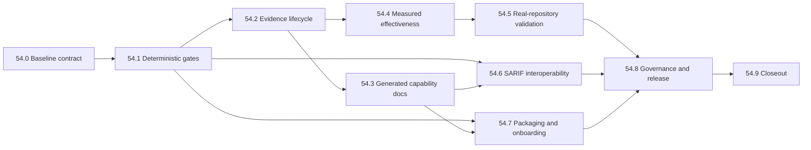

# Phase 54: Release Trust and Product Value Realization Plan

Status: In progress. Slice 54.0 was implemented locally on 2026-08-05; the
remaining P0 release-trust slices are not yet complete.

Planning baseline commit:
`91c1b082da95092a7549606cb8b45d98531c41ad`

Baseline date: 2026-08-05

Owner: vulnWorkbench maintainers

Target: 既存の強いローカルAppSec基盤を、同一commitで再現できるrelease、
測定可能な検出能力、標準形式で連携できる製品へ段階的に引き上げる。

## 1. 結論

現状のvulnWorkbenchは、evidence-constrained LLM review、scanner統合、
安全境界、広い自動testを持つ有望な技術資産である。一方、総合評価74/100を
製品価値へ変換するうえで、次の4点がボトルネックになっている。

1. `format:check`、Phase 50 evidence gate、Linux CIが同時にgreenではなく、
   releaseの再現性を説明できない。
2. OWASP Benchmarkのprecision/FPRとJuice Shop実行が基準未達で、
   professional capability claimは正しく`not_met`のままである。
3. scanner manifestと説明文が乖離し、実装済み能力を過小表示している。
4. 一般的な交換形式、fresh-clone配布証跡、実利用の価値指標が不足し、
   高い内部品質を採用しやすさへ変換できていない。

Phase 54は次の順序で進める。

- **P0 Release trust**: local/Linux gate、evidence lifecycle、docs driftを直す。
- **P1 Measured effectiveness**: benchmark未達を原因別に改善し、実案件で価値を測る。
- **P2 Productization**: SARIF、配布、release/governanceを整える。
- **P3 Enterprise scale**: SSO、組織管理、remote DB等は利用検証後まで延期する。

技術releaseとprofessional capability claimを分離する。Phase 54を完了しても、
benchmark thresholdを満たさない限りclaimを`met`へ変更しない。未達を正確に
公開できることはrelease可能性の一部であり、未達を隠すことは完了条件ではない。

## 2. Planning baseline

### 2.1 五つの評価軸

| 軸 | 現状の強み | 改善が必要な状態 | Phase 54の出口 |
| --- | --- | --- | --- |
| Release trust | `verify:strict`、coverage、E2E、clean-checkoutの入口がある | format、Phase 50 evidence、Linux gateway testが一貫してgreenでない | localとGitHub Linuxが同一入口でgreen、HEADに結び付くrelease reportがある |
| Security effectiveness | 45 owned Semgrep rules、8 OSV ecosystem、DAST/business logic/endpoint benchmarkがある | OWASP precision `0.6946`、FPR `0.3121`、Juice Shop eligible 20に対しexecuted 0 | policyを下げずに測定を改善し、未達項目は明示的limitationにする |
| Product correctness | evidence、provenance、redaction、fail-closed設計が強い | Phaseごとのhistorical evidenceが将来feature commitを阻害する | historical evidenceとcurrent release evidenceが独立して検証できる |
| Interoperability/adoption | Markdown report、NightWorkers provider、CLI/MCPがある | importはfixture中心、machine exchangeと汎用CI接続が弱い | bounded SARIF 2.1.0 import/exportと安定したCLI結果contractがある |
| Sustainability | runbook、security boundary、広い自動testがある | release tagなし、bus factor 1、説明文drift、外部review不足 | versioned release手順、owner/reviewer、生成docs、再現可能な配布証跡がある |

数値は2026-08-05のread-only評価結果をplanning inputとして固定する。
Slice 54.0で再採取し、差異があれば新しいbaselineを正とする。

### 2.2 現在再現するP0 failure

| Gate | Baseline result | 解釈 |
| --- | --- | --- |
| `bun run format:check` | fail | `web/src/domains/scans/technology-coverage-display.ts`にformat差分がある |
| `bun run verify:phase-50-evidence` | fail | historical release commit以後のnon-evidence descendantを拒否する |
| GitHub Linux `verify:strict` | fail | run `30611546902`でcontainer target gateway testが接続失敗した |
| `bun run verify:phase-53-capability` | fail (non-deterministic) | concurrent runで`diff-snapshot`がtimeoutし、isolated retryはpassしたためflaky failureとして扱う |

Linux failureはproductionのbridge bindをloopbackへ弱めて解決しない。host-onlyの
unit testとcontainer reachability integration testを分け、それぞれが意図した
network pathを検証する。

### 2.3 継承する未完了条件

Phase 50から53に残る次の条件を「過去Phaseの問題」として閉じ込めず、
current release reportのlimitationとして継承する。

- external OWASP Benchmark / Juice Shopのpassing evidence
- offline vulnerability databaseを埋め込んだtoolbox verification
- immutable toolbox image digest
- target project code execution sandbox
- same-commit clean-checkout verification
- Python DASTのsandbox gate、Go DASTの`unsupported`

## 3. Scope

### 3.1 In scope

- release baselineとcurrent release evidence schema
- format gateとLinux container gateway testの安定化
- historical phase evidenceとcurrent release evidenceの分離
- scanner manifest由来のdocumentation drift check
- OWASP Benchmark精度改善とJuice Shop実行経路
- consented real-repository evaluation protocolとopt-in集計
- SARIF 2.1.0 import/export
- fresh-clone、migration、backup/restore、toolbox配布の再現性
- release version、tag、changelog、owner/reviewer、support matrix
- Phase 54 closeout report

### 3.2 Non-goals

- benchmark thresholdの引き下げによるclaim達成
- LLMだけによるfindingの`confirmed`昇格
- target repository code、build hook、package installerの無断実行
- patchの自動適用
- production targetへのactive attack
- credential、network、cloud、mobile、wireless、social engineeringの自動拡張
- 一般plugin marketplace
- Go applicationのDAST auto-start
- Windows正式対応
- SSO、組織階層、RBAC再設計、remote multi-tenant database
- GitHub/GitLab/Jira/Slack固有adapterの同時実装
- background telemetryまたはsource/snippetの外部送信

## 4. Fixed decisions

1. **Claim integrity**: `benchmark-policy.v1.json`のthresholdをPhase 54内で
   下げない。policy変更が必要ならmajor version、理由、旧新比較、human approvalを
   別変更として扱う。
2. **Two evidence classes**: Phase 46〜53のevidenceはimmutable historical
   evidence、Phase 54のrelease reportはHEADに対するcurrent evidenceとする。
3. **HEAD binding**: current reportはcommit、clean state、input hash、command、
   result、limitationを持ち、同一commitのclean checkoutからout-of-treeのCI
   attestationとして生成する。source treeへ自己参照的にcommitしない。
4. **No ancestry trap**: historical evidenceは自分が宣言したrelease commitと
   artifact hashを検証する。後続commitがevidence-onlyであることを永続条件にしない。
5. **Fail closed**: corpus、offline DB、image digest、sandboxがない場合、
   `pass`へ丸めず`blocked`、`gap`、`unsupported`のいずれかを保存する。
6. **Manifest is source of truth**: scanner version、owned rule数、language、
   ecosystem、template、image/data digestはmachine-readable manifestを正とする。
7. **SARIF is exchange, not trust**: importされたresultはorigin/provenanceを持ち、
   外部toolのlevelだけで`confirmed`にしない。
8. **Human and machine reports**: Markdownは人向けreport、SARIFはmachine exchange、
   release JSONはclaim/evidence向けとし、役割を混ぜない。
9. **Privacy by default**: 実利用metricsはopt-inのlocal集計exportだけにし、
   source、snippet、secret、absolute pathを既定で含めない。
10. **Product boundary**: 初期positioningは
    “local Security Evidence Compiler for AI coding agents”とする。
    best-in-class SAST、ASPM、pentest suiteの代替とは宣言しない。

## 5. Priority and dependency map



| Priority | Slice | Effort | Exit dependency |
| --- | --- | --- | --- |
| P0 | 54.0 baseline contract | S | none |
| P0 | 54.1 deterministic local/Linux gates | M | 54.0 |
| P0 | 54.2 evidence lifecycle | L | 54.1 |
| P0 | 54.3 generated capability docs | M | 54.2 |
| P1 | 54.4 measured effectiveness | XL | 54.2 |
| P1 | 54.5 real-repository validation | L | 54.4 protocol |
| P2 | 54.6 SARIF interoperability | L | 54.1, 54.3 |
| P2 | 54.7 packaging and onboarding | L | 54.1, 54.3 |
| P2 | 54.8 governance and release | M | 54.5, 54.6, 54.7 |
| P0/P1/P2 closeout | 54.9 same-commit release | M | selected release scope complete |

P0は他のfeature workより先に統合する。P1とP2はP0完了後に並行化できる。
P3 enterprise workはPhase 54の利用検証から明確な需要が得られるまで開始しない。

## 6. Shared contracts

### 6.1 Release evidence state

各gateはbooleanではなく次のstateを返す。

```text
passed | failed | blocked | not_applicable
```

- `failed`: 必要入力があり、検証した結果が基準未達。
- `blocked`: corpus、Docker、offline DB、sandbox等の必要入力がない。
- `not_applicable`: support matrix上で明示的に対象外。
- commandを実行しなかった状態を`passed`にしない。

### 6.2 Current release report minimum fields

```text
schemaVersion
release.version
release.commit
release.cleanCheckout
generatedAt
toolchain
inputHashes
gates[].id
gates[].command
gates[].state
gates[].evidenceRef
gates[].durationMs
claims[].id
claims[].status
limitations[]
approvals[]
```

`generatedAt`や`durationMs`は再現hashから除外してよいが、commit、inputHashes、
gate result、claim status、limitationは除外しない。

current reportはrelease candidateの`HEAD`を変えない一時directoryへ生成し、CI
artifactまたはrelease attestationとして保存する。過去Phase reportをsource treeで
保持することと、current reportを同一commitから生成することを同一保存方式にしない。

### 6.3 Verification tiers

| Tier | Purpose | Required environment |
| --- | --- | --- |
| PR fast | format、type、unit、contract、docs drift | Bun、Chromium |
| Linux integration | gateway、Docker network、fresh DB | Ubuntu、Docker |
| Capability | Semgrep/OSV/DAST/benchmark | pinned corpus/data/toolbox |
| Release | clean checkout、all selected gates、report | immutable inputs、clean commit |

## 7. Slice 54.0 — Baseline and schema

Implementation status (2026-08-05): implemented locally. The committed planning
baseline preserves failed, blocked, and not-applicable states; the collector,
schema tests, privacy checks, historical-blob hash verification, and strict
verification entry are present. Same-commit release closeout is not claimed.

### Objective

改善前の状態を再現可能に保存し、以後のPRが「何を改善したか」を比較できるようにする。

### Changes

- `spec/evidence/phase-54-baseline.json`を追加する。
- release evidence用Zod schemaとJSON schemaまたは同等のsingle-source contractを追加する。
- baseline採取scriptを追加し、commit、dirty state、toolchain、manifest hash、
  test inventory、現行gate result、benchmark summaryを記録する。
- baseline scriptはsource/snippet、credential、absolute home pathを保存しない。

### Acceptance

- baselineがrelease trust、effectiveness、docs、integration、sustainabilityの
  五軸を含む。
- `failed`と`blocked`を区別し、missing inputを成功扱いしない。
- schema-invalid、unknown state、missing commitは検証で拒否される。
- dirty checkoutで採取したbaselineは`workingTree.clean: false`になる。

### Verification

```bash
bun run phase-54:baseline
bun test shared/schemas/release-evidence.schema.test.ts
git diff --check
```

### Failure handling / rollback

このsliceは既存gateの意味を変えない。schemaが確定できない場合はbaseline JSONと
scriptだけをrevertし、後続sliceを開始しない。

## 8. Slice 54.1 — Deterministic local and Linux gates

### Objective

既知のformat failureとLinux network-path test failureを直し、PR gateを
信頼できる状態へ戻す。

### Changes

1. `technology-coverage-display.ts`をBiome出力へ合わせる。
2. `container-target-gateway.test.ts`を次の二系統へ分離する。
   - host-only unit/contract test: `containerAccess: false`でloopbackを使う。
   - Linux Docker integration test: bridgeからの到達性を実containerで検証する。
3. bridge discovery failureは、host unit test failureと混同せずexplicit capability
   resultとして記録する。
4. production実装のLinux container bindをloopbackへ弱めない。
5. CIでfast gateとDocker integration gateの名前、timeout、artifactを分ける。
6. flaky判定用にgateway lifecycle testを繰り返し実行できるscriptを用意する。

### Acceptance

- macOS localの`format:check`と関連testがgreen。
- GitHub Ubuntuでhost-only testとDocker reachability testがgreen。
- container testは実際にcontainer namespaceからgatewayへ到達する。
- timeout、abort、server close後にlistener/processが残らない。
- gatewayのmethod/path/request-budget restrictionにregressionがない。
- 同一testを20回繰り返して偶発failureが0件。

### Verification

```bash
bun run format:check
bun test api/modules/dast/container-target-gateway.test.ts
bun run test:container-gateway:linux
bun run verify
```

### Failure handling / rollback

Docker bridgeを利用できないrunnerでは`blocked` evidenceを返してよいが、
required Linux release runnerではblockをpassに変換しない。production bind policyを
弱める変更はrevertする。

## 9. Slice 54.2 — Evidence lifecycle redesign

### Objective

過去Phaseの証跡を保持しつつ、将来feature commitを正当な理由なく拒否しない
current release verifierへ移行する。

### Changes

- `verify-phase-50-release-evidence.ts`の責務を次に分ける。
  - historical verifier: Phase 50 report自身のschema、declared commit、hashを検証。
  - current verifier: HEADに対するcurrent release reportを検証。
- `verify:release-evidence`を追加し、`verify:strict`のrelease pathから一時reportを
  生成・検証する。明示されたreport fileを再検証するmodeも提供する。
- current verifierはcommit ancestryだけでなく、corpus lock、scanner manifest、
  policy、toolbox、command resultのhash bindingを検証する。
- Phase 50 verifierの「後続commitはevidence-only」という条件を廃止する。
- 旧reportはimmutableに保ち、migrationで書き換えない。
- release report生成とverifyを分ける。通常のverifyは一時出力だけを使い、tracked
  evidenceを勝手に更新しない。
- current reportはCI/release artifactとして保存し、release candidate commitを
  report commitのために進めない。必要ならtag後のhistorical indexにartifact digestを
  記録するが、同一commit gateの代用にはしない。
- reportに各未完了条件とsupport claimを明示する。

### Acceptance

- Phase 50 release commit以後にfeature commitがあっても、ancestryだけを理由にfailしない。
- Phase 50 artifact、declared commit、corpus hashの改ざんは引き続きfailする。
- HEADとreport commitが違う、dirty、input hashが違う場合はrelease gateがfailする。
- report生成後もsource working treeに差分がない。
- historical reportを削除してcurrent reportだけにする変更は拒否される。
- `not_met` claimを持つrelease reportはschema-validであり、正確なlimitationがあれば
  software releaseを自動的には阻害しない。

### Verification

```bash
bun test scripts/verify-phase-50-release-evidence.test.ts
bun test scripts/verify-release-evidence.test.ts
bun run verify:phase-50-evidence
bun run verify:release-evidence
```

### Failure handling / rollback

一つのrelease cycleだけ旧commandをcompatibility aliasとして残す。current verifierが
historical改ざんを見逃す場合は、新verifierをrelease入口から外し旧gateへ戻す。

## 10. Slice 54.3 — Generated capability documentation

### Objective

実装とdocumentationのdriftを機械的に検出し、利用者が実際のsupport範囲を判断できる
ようにする。

### Changes

- scanner-data manifest、plugin registry、support matrixをsource of truthにする。
- READMEと`spec/third-party-scanners.md`の生成対象をbounded markerで囲むか、
  独立したgenerated capability tableをincludeする。
- checkerは最低限次を比較する。
  - scanner versionとimmutable pin
  - owned Semgrep rule countと言語別内訳
  - OSV ecosystem count/list
  - Nuclei owned safe template count
  - toolbox/data digestの有無
  - DAST support tierとsandbox limitation
- 現在の「three owned rules」「npm-only」を最新manifestへ合わせる。
- capability reportに`verified`、`partial`、`gap`、`unsupported`の意味を記載する。

### Acceptance

- ruleまたはecosystemを追加しdocsを更新しないfixtureでcheckerがfailする。
- generated sectionの手編集driftをcheckerがfailする。
- README.jp、README、third-party scanner recordの数値が一致する。
- current release reportのlimitationとsupport matrixが矛盾しない。
- URL、license、exception expiry等の人手管理項目はgenerated dataと分離される。

### Verification

```bash
bun run check:capability-docs
bun test scripts/check-capability-docs.test.ts
bun run verify
```

### Failure handling / rollback

全READMEをgenerator管理にしない。bounded sectionで安定しない場合は、generated JSONと
drift checkerだけに戻し、人手文章を維持する。

## 11. Slice 54.4 — Measured detection effectiveness

### Objective

professional capability claimの未達を、threshold変更ではなく検出とevaluation pathの
改善で解消する。達成できない項目は測定済みlimitationとして残す。

### Workstream A: OWASP Benchmark

- false positiveをsource/sink/category別に分類する。
- 現行baselineで弱いSQL injection recall、trust-boundary recall、
  path traversal false positiveを最初の対象にする。
- rule変更はpositive/negative fixtureを同じPRに追加する。
- ruleごとのcontribution、overlap、unsupported caseをreportへ保存する。
- overallだけでなくground-truthが十分あるcategory gateを維持する。
- normalizationやdedupで数値を上げる場合、raw resultも保存して監査可能にする。

### Workstream B: Juice Shop execution

- eligible 20 scenarioのsetup、reset、execute、cleanupを再現可能にする。
- active requestはephemeral local target、allowlist、budget、explicit authorization内に限定する。
- scenarioごとに`eligible`、`executed`、`detected`、`inconclusive`、`blocked`を保存する。
- setup failureやmissing Dockerを`not detected`にも`passed`にも丸めない。
- cleanup成功をrelease gateに含める。

### Workstream C: regression control

- Semgrep catalog、OSV、business logic、endpoint discovery、DAST standardを毎回再実行する。
- 一つのbenchmark改善によって他のsecurity boundaryやprecisionを悪化させない。
- professional reportはpassing run IDとcorpus/policy/scanner hashを結び付ける。

### Acceptance

- policy minimumを変更せず、全対象benchmarkを同一commitで実行できる。
- OWASP overall precision `>= 0.8`、FPR `<= 0.1`、recall `>= 0.7`、
  score `>= 0.6`を満たすまでclaimは`not_met`。
- applicable category recallはpolicyを満たす。
- Juice Shopはeligible 20以上、8 category以上、recall `>= 0.6`、
  precision `>= 0.8`を満たすまでclaimは`not_met`。
- business logic、endpoint discovery、Semgrep catalog、OSV fixtureにregressionがない。
- `confirmed` findingは実行可能evidenceなしでは0件。
- professional claimを`met`にする変更は別PRとし、human approvalを必要とする。

### Verification

```bash
bun run test:semgrep:catalog
bun run benchmark:owasp
bun run benchmark:juice-shop
bun run benchmark:business-logic
bun run verify:dast-capability
bun run verify:professional-capability:report
```

### Failure handling / rollback

categoryまたはoverall regressionが発生したruleをfeature flagなしで統合しない。
外部corpusを取得できない場合は`blocked`のままreportし、fixture passで代用しない。

## 12. Slice 54.5 — Real-repository product validation

### Objective

benchmarkだけでは測れない「利用者が判断可能なevidenceを早く得られるか」を、
同意済みrepositoryで測る。

### Protocol

- 代表性を定義した10〜30 repositoryを目標とする。
- language、size、framework、monorepo、lockfile有無、generated code有無を層別化する。
- public repositoryまたは明示同意済みprivate repositoryだけを使う。
- private source、snippet、secret、absolute pathをrepository外へ送らない。
- 人手triageは`accepted`、`rejected`、`unknown`と理由categoryだけを記録する。
- 集計exportはopt-in、local、redacted、schema-versionedにする。

### Product metrics

| Metric | Definition |
| --- | --- |
| Scan completion rate | 開始したscanのうちterminal resultまで到達した割合 |
| Coverage-gap rate | unsupported/excluded/oversized/inconclusive pathの割合 |
| Actionable acceptance | triaged findingのうちacceptedとなった割合 |
| Time to first actionable evidence | scan開始から最初のaccepted finding/handoffまで |
| Handoff completion | reproduction/verification付きhandoffが生成できた割合 |
| Verification success | 提示したverification commandがclean environmentで成功した割合 |
| Unknown rate | triageで判断不能のまま残った割合 |

### Acceptance

- evaluation protocolとdataset manifestがversionedである。
- sample size、selection bias、unknown、unsupportedをreportから省略しない。
- benchmark scoreとreal-repository value metricsを一つのscoreに混ぜない。
- background telemetryを追加しない。
- software releaseはcohort不足だけでblockしないが、product-value claimは
  規定sample sizeがない限り`unvalidated`とする。

### Verification

```bash
bun run evaluation:real-repos -- --manifest <consented-manifest> --local-only
bun run evaluation:verify-redaction -- --report <aggregate-report>
```

### Failure handling / rollback

consent、data handling、redactionに不備があれば該当datasetを削除し、metrics claimを
撤回する。private repositoryをtest fixtureとしてcommitしない。

## 13. Slice 54.6 — SARIF interoperability

### Objective

fixture専用importとMarkdown専用reportの間に、scanner/CI間で使えるboundedな
machine exchangeを追加する。

### Changes

- import CLIをparser registryへ分離する。
- SARIF 2.1.0の必要subsetをschema-validateしてimportする。
- `tool`、`driver`、`ruleId`、`level`、`locations`、`fingerprints`、
  `partialFingerprints`、`properties`の許可項目だけを正規化する。
- URI/path traversal、repository外path、oversized log、duplicate result、
  missing locationをfail-closedまたはdiagnostic化する。
- raw SARIFを無制限にDBへ保存せず、hash/provenanceとbounded artifact referenceを持つ。
- finding/export reportからSARIF 2.1.0を生成する。
- imported levelをvulnWorkbenchのconfidence/verdictへ直接昇格させない。
- NightWorkersや一般CIが利用できるstable JSON completion summaryを追加する。
- GitHub/GitLab固有API adapterは後続Phaseに延期する。

### Acceptance

- Semgrep、CodeQL相当、generic SARIFのgolden fixtureをround-tripできる。
- duplicate、multi-location、URI encoding、Windows path、missing locationを検証する。
- repository外pathとsecret-like propertyがUI/reportへ漏れない。
- unsupported SARIF fieldはsilent lossではなくdiagnostic countに現れる。
- same inputは同じnormalized fingerprintを生成する。
- Markdown reportの既存contractにregressionがない。

### Verification

```bash
bun test api/modules/scans/importers/sarif-importer.test.ts
bun test api/modules/reports/sarif-exporter.test.ts
bun run scan:import -- --format sarif --tool semgrep --input <fixture>
bun run report:scan -- --format sarif --scan-run-id <id>
```

### Failure handling / rollback

SARIF pathはfeature flagまたは独立CLI optionとして追加する。parserのsecurity boundaryに
問題があればSARIF入口だけを無効化し、既存fixture/Markdown pathを維持する。

## 14. Slice 54.7 — Packaging and onboarding

### Objective

maintainerの既存環境に依存せず、fresh cloneからlocal-firstの価値を再現できるようにする。

### Changes

- macOSとUbuntuのfresh-clone runbookを一つのcommand sequenceへ統一する。
- temp databaseに全migrationを適用し、bootstrap checkをcurrent schemaで通す。
- backup create/verify/restore drillをrelease verificationへ追加する。
- scanner data preparationとtoolbox buildの入力hashを固定する。
- release対象toolboxのimmutable image digest、SBOM、provenance、license/NOTICEを保存する。
- network disabledでSemgrep、OSV、Trivyのminimum fixtureを実行する。
- local development DBのpending migrationはrelease evidenceに使用しない。
- quickstartは「install→bootstrap→first scan→report」までを最短経路で示す。

### Acceptance

- clean checkout、frozen install、temp DB bootstrap、first scanがmacOS/Ubuntuで成功する。
- migration 0→currentとbackup/restore後currentの双方が成功する。
- toolbox digestとembedded manifest hashがrelease reportにある。
- offline verificationでnetwork requestが0件。
- missing Docker/toolbox/dataは明示的`blocked`となり、host fallbackで成功扱いしない。
- quickstartを初見利用者がrepository固有の暗黙設定なしで実行できる。

### Verification

```bash
bun install --frozen-lockfile
bun run bootstrap:check
bun run verify:clean-checkout
bun run backup:create
bun run backup:verify
bun run verify:toolbox-provenance
bun run verify:toolbox-offline
```

### Failure handling / rollback

toolboxをreleaseできない場合、host scannerへsilent fallbackしない。core applicationと
toolbox artifactのrelease readinessを分け、toolbox機能を`blocked`として表示する。

## 15. Slice 54.8 — Governance, adoption, and release operations

### Objective

技術品質を、第三者が採用・review・保守できるrelease processへ変換する。

### Changes

- package version、changelog、Git tag、release notesを一つのversionへ揃える。
- GitHub repository slugの`vlunWorkbench`/`vulnWorkbench`表記を確認し、
  renameする場合のredirect/clone URL移行手順を作る。
- security/release-sensitive pathのCODEOWNERSまたはreview ownershipを定義する。
- claim変更、evidence policy変更、sandbox/network boundary変更にsecond reviewを要求する。
- support matrix、known limitations、security policy、release runbookを公開入口から辿れるようにする。
- 10分以内のdemo scenarioとsample projectを用意する。
- external read-only security reviewまたは再現可能なreview checklistを実行する。
- issue templateにenvironment、capability state、evidence hash、reproductionを含める。

### Acceptance

- tag、package version、release notes、release reportのversionが一致する。
- release artifactからSBOM、provenance、support matrixへ到達できる。
- claim/policy/security-boundary変更にowner以外のreview evidenceがある。
- bus factor riskと未配置ownerをrelease notesから隠さない。
- demoがfresh environmentで再現し、secret/sourceを外部送信しない。

### Verification

```bash
bun run release:preflight
git tag --points-at HEAD
bun run check:release-version
bun run verify:release-evidence
```

### Failure handling / rollback

repository rename、tag publish、artifact publishは外部state変更であるため、dry-runと
read-only preflight後にmaintainerの明示承認を得る。失敗時はreleaseをpublishせず、
既存clone URLとartifactを維持する。

## 16. Slice 54.9 — Same-commit closeout

### Objective

選択したrelease scopeの全gateを一つのclean commitへ結び付け、公開可能なstatusと
limitationを生成する。

### Required sequence

1. release candidate commitを固定する。
2. clean checkoutを作り、frozen installを実行する。
3. PR fast、Linux integration、capability、packaging gateを実行する。
4. current release reportをout-of-treeのCI artifactとして生成する。
5. report commit/input hashを検証する。
6. source working treeに差分がないことを確認する。
7. human approval後にrelease candidate commitへtagを付け、検証済みreportを
   release attestationとして添付する。

### Acceptance

- P0 sliceは全て`passed`。
- release scopeに含めたP1/P2 sliceは全て`passed`。
- scope外または入力不足は`blocked`/`not_applicable`と理由がある。
- professional capability claimは全policy gateを満たした場合だけ`met`。
- product-value claimはreal-repository protocol/sampleを満たした場合だけ`validated`。
- clean checkout、commit、manifest、corpus、image digestがreportと一致する。
- report生成のためのevidence-only source commitを必要としない。
- tracked `artifacts/`、credential、private sourceがrelease commitにない。

### Verification

```bash
git status --short
bun install --frozen-lockfile
bun run verify:strict
bun run verify:security-capability
bun run verify:dast-capability
bun run verify:phase-53-capability
bun run verify:release-evidence
bun run verify:clean-checkout
git ls-files artifacts
```

## 17. PR sequence

変更をreview可能な単位に保ち、次の順序を標準とする。

| PR | Content | Must not include |
| --- | --- | --- |
| 1 | 54.0 baseline/schema | gate semantics変更 |
| 2 | format + Linux gateway test split | production security weakening |
| 3 | historical/current evidence split | benchmark threshold変更 |
| 4 | capability docs generator/checker | scanner feature追加 |
| 5 | OWASP category improvements | Juice Shop infrastructure変更 |
| 6 | Juice Shop execution/evidence | claim statusの手動変更 |
| 7 | real-repository protocol/local metrics | background telemetry |
| 8 | SARIF import | export/UI redesign |
| 9 | SARIF export/stable summary | SCM-specific adapter |
| 10 | packaging/fresh clone/toolbox evidence | release publish |
| 11 | governance/docs/demo | security feature拡張 |
| 12 | closeout report/version/tag | unrelated feature work |

各PRは対象sliceのacceptance test、failure fixture、documentation、rollback noteを
同じPRに含める。複数sliceを跨ぐ必要がある場合は依存するcontract PRを先に統合する。

## 18. Verification matrix

| Concern | Positive test | Negative/failure test | Evidence |
| --- | --- | --- | --- |
| Format/build | clean format、typecheck、build | intentional format drift | CI logs |
| Gateway | loopback unit、Docker bridge reachability | timeout、invalid path、budget exceed | Linux artifact |
| Historical evidence | declared artifact/hash valid | tampered artifact/hash | historical verification JSON |
| Current evidence | HEAD/clean/input match | dirty、stale commit、missing input | release report |
| Capability docs | generated values match manifest | rule/ecosystem drift fixture | drift-check log |
| OWASP | policy gates pass | category regression | benchmark report |
| Juice Shop | reset→execute→cleanup | setup/cleanup failure | scenario report |
| Real repos | redacted aggregate | source/secret/path leak fixture | local aggregate schema |
| SARIF | valid bounded round-trip | traversal、oversize、duplicate | golden fixtures |
| Packaging | fresh clone/offline toolbox | missing digest/DB/network attempt | provenance + SBOM |
| Release | one clean commit | stale/mixed evidence | signed/tagged report |

## 19. Rollout and rollback

### Rollout

1. P0をmainへ統合し、2回以上の連続Linux greenを確認する。
2. P1 benchmark改善はcategory単位でshadow comparisonする。
3. SARIF import/exportは独立optionとしてcanary利用する。
4. packaging artifactはinternal release candidateでfresh-clone検証する。
5. claim、version、tagは最後に変更する。

### Rollback triggers

- security boundaryの緩和
- evidence改ざんの見逃し
- source/secret/absolute path leakage
- benchmark raw resultとnormalized resultの説明不能な乖離
- persistent process/listenerまたはcleanup failure
- manifest、report、artifact digestの不一致

feature flagまたは独立入口を持つSARIF/evaluation pathは個別に無効化できるようにする。
evidence schemaはadditive migrationを優先し、既存historical reportを上書きしない。

## 20. Definition of Done

### Phase 54 technical completion

- [ ] 54.0〜54.3のP0 acceptanceを全て満たす。
- [ ] localとGitHub Ubuntuで`verify:strict`が同一commitに対して成功する。
- [ ] historical evidenceとcurrent release evidenceを独立検証できる。
- [ ] capability documentation drift gateがstrict verificationに含まれる。
- [ ] selected P1/P2 release scopeと未選択scopeがrelease reportに明示される。
- [ ] clean checkoutから生成したout-of-tree current release reportがHEAD/input
      hashへ結び付き、source working treeを変更しない。
- [ ] known limitation、unsupported capability、blocked external inputを公開する。
- [ ] credential、private source、generated runtime artifactがcommitされていない。

### Professional capability claim completion

- [ ] OWASP、Juice Shop、business logic、endpoint、Semgrep、OSV、DASTの
      policy gateを同一commitで満たす。
- [ ] passing run ID、corpus、policy、scanner、toolbox hashが一致する。
- [ ] executable evidenceなしのconfirmed findingが0件。
- [ ] owner以外のhuman approvalがある。

このchecklistを満たさない場合、technical Phase 54が完了していてもclaimは
`not_met`を維持する。

### Product-value validation completion

- [ ] versioned protocolで同意済みrepositoryを評価する。
- [ ] sample size、bias、unknown、coverage gapを公開する。
- [ ] actionable acceptanceとtime-to-evidenceを再現可能に集計する。
- [ ] background telemetryとsource uploadがない。

このchecklistを満たさない場合は`unvalidated`と表示し、導入実績を推測で補わない。

## 21. Deferred backlog after Phase 54

次はPhase 54のmetricsまたは利用者要求で優先度が証明された場合だけ計画する。

- GitHub/GitLab check、Jira/Slack adapter
- SSO、organization、multi-user RBAC
- PostgreSQL/remote worker/multi-tenant architecture
- Windows support
- additional language/framework plugins
- Go DAST sandbox/start contract
- external plugin distribution
- hosted dashboard/central telemetry

Phase 54の成功は機能数ではなく、再現可能なrelease、正直なclaim、測定可能な改善、
標準的な出口を一つの証拠連鎖として提示できることで判定する。
