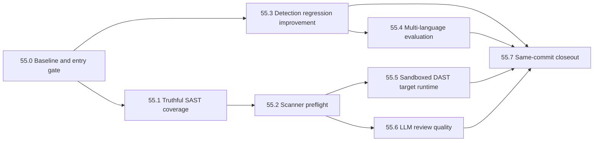

# Phase 55: Security Capability Hardening and Coverage Expansion Plan

Status: In Progress — Slice 55.0 hardened locally; authoritative CI entry pending

Predecessors:

- `spec/phase-54-release-trust-and-product-value-realization-plan.md`
- `spec/phase-54-detection-effectiveness-improvement-plan.md`

Planning baseline commit:
`45ef82d877f5c8413d4d3b7185175d8bdeb7a463`

Baseline date: 2026-08-16

Owner: vulnWorkbench maintainers

Target: Phase 54で実測可能になった診断能力を、既定scan経路で誤解なく利用できる
状態へ引き上げる。その後、未達category、多言語外部評価、sandboxed DAST、
LLM review品質の順にcoverageを拡張し、各改善を再現可能な証跡へ結び付ける。

## 1. 結論

Phase 55では新しいscannerを先に増やさない。現時点の最大課題は、実装済み能力と
既定profileで実際に実行される能力が一致していないこと、実行前提の不足がscan開始後
まで分からないこと、5言語対応のうち外部corpusで測定済みなのが実質Javaだけである
ことにある。

実装順は次で固定する。

1. Phase 54のauthoritative evidenceを入口条件として固定し、Phase 55 baselineを採取する。
2. `full-security-scan`でSAST実行またはcoverage gapのどちらかを必ず記録する。
3. scanner binary、database、container、browser、target startのpreflightを導入する。
4. OWASP Benchmarkの弱いcategoryとJuice Shopの3件の見逃しを改善する。
5. Java以外のsupported languageへversioned external/holdout評価を追加する。
6. Java/Python、次にGoのtarget startをsandbox内でだけ許可する。
7. LLM reviewを人手ラベル付きdatasetで測定し、説明品質をclaimから分離して管理する。
8. 同一commitのLinux evidenceと生成documentationでPhase 55をcloseoutする。

`no findings observed`を`safe`へ変換しない。Semgrep engineがないscanをSAST済みと
表示しない。benchmarkを通すためにpolicy threshold、分母、CWE mappingを変更しない。
target project codeをhostで実行しない。LLMだけを根拠にfindingを`confirmed`へ昇格しない。

## 2. Phase 54との境界

Phase 54は次を所有する。

- OWASP Benchmark / Juice Shopのmeasurement contract
- same-commit closeout runnerとrelease evidence
- professional capability claimのpolicyとhuman approval境界
- historical evidenceとcurrent release evidenceの分離

Phase 55はPhase 54 artifactの意味を書き換えず、次だけを追加する。

- profile実行時のtruthful coverageとpreflight
- Phase 54後に残るfalse negative / false positiveの改善
- Java以外の外部またはholdout評価
- target project code execution sandbox
- evidence-constrained LLM reviewの品質測定

Phase 54のauthoritative Ubuntu closeoutが未完了の場合、Phase 55で許可するのは
Slice 55.0のbaseline、schema設計、fixture設計、documentationだけとする。profile、
runtime、detectorに影響するproduction変更は入口gate完了後に開始する。professional
claimの`met`承認はPhase 55の開始条件ではなく、claim変更時だけ必要な独立gateとする。

## 3. Planning baseline

### 3.1 現在の実測値

Phase 54 local diagnostic evidenceは次を示している。ただしauthoritative Linux evidence
が同じ値を再現するまで、release claimではなくplanning inputとして扱う。

| Benchmark | Current local result | Remaining issue |
| --- | --- | --- |
| OWASP overall | recall `0.7993`、precision `0.9536`、FPR `0.0399` | categoryごとの見逃しとpath traversalの誤検知 |
| OWASP cmdi | recall `0.5952` | source/sink variantの見逃し |
| OWASP hash | recall `0.6899` | weak hash variantの見逃し |
| OWASP XSS | recall `0.6707` | response sink / data-flow variantの見逃し |
| OWASP path traversal | precision `0.6497`、FPR `0.2895` | cross-CWE observationとrule precision |
| Juice Shop | 17 TP / 3 FN / 20 TN / 0 FP | forged feedback、CAPTCHA bypass、zero-stars |
| Owned business logic | 8 TP / 0 FN / 8 TN / 0 FP | owned fixture外の一般化は未証明 |
| Endpoint discovery | recall `1.0`、precision `1.0`、11 framework fixtures | dynamic routeとreal repository coverageは未証明 |

### 3.2 既定経路のgap

- `baseline`はGitleaksとOSVを実行し、source SASTを実行しない。
- `full-security-scan`はGitleaks、OSV、Trivy、SBOM、passive DAST、Nuclei、
  ZAP baseline、Schemathesisを持つが、任意Semgrep adapterを自動参加させない。
- Semgrep rulesetはJavaScript、TypeScript、Python、Java、Goの45 owned ruleを持つが、
  engineは任意adapterでありcore toolboxへ含めない。
- OSV manifestにdatabase bundleが宣言されていても、実行環境からdatabaseを読めない
  状態をprofile開始前に説明できない。
- npm-compatible project以外のauto target start planは生成できても、sandboxがないため
  Java/Python project code executionをfail closedする。Goにはstart plannerがない。
- LLM reviewはschema、evidence制約、fallbackをtestしているが、人手ground truthに対する
  severity、false-positive assessment、evidence引用精度を測定していない。

## 4. Scope

### 4.1 In scope

- Phase 55 planning baselineとversioned acceptance evidence
- `full-security-scan`のconditional Semgrep参加
- SAST未実行時のexplicit coverage gap
- scanner / data / runtime / target start preflight
- preflight resultの永続化、API、CLI、report、UI表示
- OWASP弱点categoryとJuice Shop未検出scenarioの改善
- regression防止用holdout / metamorphic fixture
- JavaScript、TypeScript、Python、Goのversioned evaluation contract
- Java / Python target start sandbox
- 後続sliceとしてのGo target start sandbox
- LLM review quality dataset、runner、metrics、policy
- manifest由来のcapability documentation
- same-commit Linux closeout

### 4.2 Non-goals

- Semgrep engineのcore toolboxへの再配布
- benchmark policy v1 thresholdの引き下げ
- benchmark固有IDやchallenge labelを検出条件へ追加すること
- arbitrary scanner commandまたはuser-supplied shell script
- target repositoryへの設定、dependency、lockfile、script追加
- host上でのJava、Python、Go project code実行
- dependency downloadを伴うDAST auto start
- public / production targetへのactive attack
- unrestricted fuzzing
- WebSocket、gRPC、SOAPの正式対応
- network、cloud、AD、mobile、wireless、social engineering診断
- LLMによるrepository自由探索
- LLMだけによるfinding生成、severity確定、claim変更
- patch自動適用
- remote multi-tenant execution基盤

## 5. Fixed decisions

1. **Optional engine boundary**: Semgrep adapterは任意のまま維持する。engineが利用可能な
   ときだけ`full-security-scan`へ参加させ、未導入を自動downloadで解決しない。
2. **Truthful coverage**: SASTが実行されない場合、scan/report/assessmentは
   `source_sast_not_executed`を保存する。zero findingをcoverageの代用にしない。
3. **Required after selection**: Semgrepを含むresolved profileを開始した後は、Semgrep
   failureをoptional warningへ落とさず、該当SAST stepをfailedまたはblockedにする。
4. **Server-owned preflight**: readiness判定はserver/CLI側の永続化された結果を正とし、
   Web UIだけの推測状態を増やさない。
5. **No preflight network fetch**: preflightはbinary、version、digest、age、path、runtimeを
   確認するだけとし、databaseやbrowserを暗黙にdownloadしない。
6. **Policy stability**: `benchmark-policy.v1.json`は変更しない。Phase 55の改善目標は
   policy v1の上に置くacceptanceであり、professional claimの意味を変えない。
7. **Holdout before claim**: owned positive/negative fixtureだけの改善をexternal capability
   claimへ使わない。rule変更に使わないholdoutを別入力として固定する。
8. **Sandbox before execution**: `requiresProjectCodeConsent`をfalseへ変えてsandbox不足を
   回避しない。sandbox runnerの証拠があるstart planだけを実行可能へ昇格する。
9. **No package installation**: sandboxは準備済みdependency、offline cache、既存artifact
   だけを利用する。不足時は`blocked`を返す。
10. **LLM is review**: LLM quality gateは保存済みfindingの説明品質を測る。scannerの
    recall/precisionやfinding confirmationの代替にしない。
11. **Separate approvals**: capability claim、support tier、LLM quality policyの変更は、
    実装PRとは別のhuman approvalを必要とする。
12. **Independent rollback**: 各sliceはschema compatibilityを保ち、後続sliceをrevert
    せず単独で無効化またはrevertできるようにする。

## 6. Dependency map and PR boundaries



| Priority | Slice / PR | Main result | Dependency | Effort |
| --- | --- | --- | --- | --- |
| P0 | 55.0 baseline | Phase 54 bindingとPhase 55開始条件 | Phase 54 closeout | S |
| P0 | 55.1 SAST coverage | full scanのSAST実行または明示gap | 55.0 | M |
| P0 | 55.2 preflight | scanner/data/runtime不足を実行前に判定 | 55.1 | L |
| P1 | 55.3 detection | 弱点categoryと3 scenarioの改善 | 55.0 | L |
| P1 | 55.4 language eval | Java以外の再現可能な測定 | 55.3 contract | XL |
| P2 | 55.5 DAST sandbox | Java/Python、次にGoの隔離実行 | 55.2 | XL |
| P2 | 55.6 LLM quality | 人手ground truthによるreview測定 | 55.2 | L |
| P0-P2 | 55.7 closeout | 選択scopeのsame-commit証跡 | selected slices | M |

55.3は55.0完了後、55.1/55.2と並行実装できる。55.4のcorpus contractは55.3と
並行設計できるが、release thresholdは55.3のmetric semanticsを再利用してから固定する。
55.5と55.6は互いに依存しない。

## 7. Shared contracts

### 7.1 Preflight state

各checkはbooleanではなく次のstateを返す。

```text
ready | blocked | not_applicable
```

- `ready`: binary/data/runtimeの存在と整合性を実際に確認した。
- `blocked`: applicableだが、実行に必要な入力またはruntimeが不足・不整合・期限切れ。
- `not_applicable`: project/profile/stepに適用されない。

未確認状態を`ready`にしない。optional stepの`blocked`はprofile全体を必ず失敗させる
ものではないが、coverage gapとlimitationを残す。required stepの`blocked`はscanner
processを起動せずprofileをfail closedする。

### 7.2 Minimum preflight record

```text
schemaVersion
projectId
profileId
resolvedProfileHash
sourceRevision
createdAt
checks[].id
checks[].stepId
checks[].required
checks[].state
checks[].reasonCode
checks[].toolId
checks[].observedVersion
checks[].expectedVersion
checks[].dataDigest
checks[].dataGeneratedAt
checks[].evidenceRefs
summary.ready
summary.blockedRequired
summary.blockedOptional
```

recordへcredential、source body、snippet、absolute home pathを含めない。scanner version
stdoutはallowlist済みの正規化値だけを保存する。

### 7.3 Coverage state

各capabilityは次を区別する。

```text
declared -> applicable -> ready -> executed -> verified
```

- manifest/ruleが存在するだけでは`executed`にしない。
- preflight成功だけでは`verified`にしない。
- zero findingでもstepが完了しcoverage evidenceがあれば`executed`にできる。
- scanner失敗、database欠落、target未起動は`gap`または`blocked`としてreportする。

### 7.4 Improvement evidence

detector/rule変更は最低限、次を同一artifact setへ保存する。

```text
baselineCommit
candidateCommit
policyHash
corpusHash
scannerManifestHash
implementationHash
rawResultHash
normalizedFindingHash
metricsBefore
metricsAfter
changedRuleIds
suppressedFindingAudit
limitations
```

## 8. Slice 55.0 — Baseline and entry gate

Implementation status: Hardened locally on 2026-08-16. Baseline inputs are
tracked and exact-bound, and the strict entry command runs the full Phase 54
closeout before emitting a same-commit entry report. The committed planning
baseline remains `blocked` until the Ubuntu CI entry succeeds, so Slice 55.1
以降のproduction変更はまだ開始しない。

### Objective

Phase 54のauthoritative resultとPhase 55の開始commitを固定し、後続PRの改善・回帰を
比較できる状態にする。

### Changes

- `spec/evidence/phase-55-baseline.json`を追加する。
- `scripts/phase-55-baseline.ts`とverifierを追加する。
- baselineへprofile inventory、scanner manifest hash、optional adapter状態、
  professional report summary、OWASP/Juice/OSV/business-logic/endpoint metric、
  test inventory、unsupported capabilityを保存する。
- Phase 54 closeout artifactのcommit、input hash、gate stateを参照し、値を複製して
  新しい意味へ変換しない。
- authoritatively verifiedでないlocal artifactは`diagnostic`として分離する。

### Likely change areas

- `scripts/phase-55-baseline.ts`
- `scripts/verify-phase-55-baseline.ts`
- `spec/evidence/phase-55-baseline.json`
- `shared/schemas/release-evidence.schema.ts`（既存schemaで不足する場合のみ）
- `package.json`

### Acceptance

- baselineがclean commit、manifest hash、Phase 54 evidence refを持つ。
- authoritativeとdiagnosticのmetricを混同しない。
- source/snippet、credential、absolute home pathを含まない。
- Phase 54 gate未達時は、production slice開始可否を`blocked`と記録する。
- baseline再生成時、決定的fieldが一致する。

### Verification

```bash
bun run phase-55:baseline
bun run verify:phase-55-baseline
bun run verify:phase-55-entry # clean Ubuntu + Docker only
bun test shared/schemas/release-evidence.schema.test.ts
git diff --check
```

### Rollback

baseline collectorだけをrevertする。Phase 54 artifact、policy、claim、metricを変更しない。

## 9. Slice 55.1 — Truthful SAST coverage in default workflows

### Objective

`full-security-scan`が、Semgrep SASTを実行したか、実行できなかったgapを記録したかの
どちらかになるようにし、「full」という表示と実際のsource analysisを一致させる。

### Changes

- profile resolution時にoptional Semgrep adapterの登録状態を確認する。
- 登録済みの場合、owned `curated-sast-v1` stepを`full-security-scan`へ追加する。
- resolved profileへSemgrepを含めた後はrequired stepとして扱い、runtime failureを
  `warn_and_continue`へ落とさない。
- 未登録の場合、既存profileの実行は許可するが、profile resolution、scan coverage、
  final reportへ`source_sast_not_executed`を記録する。
- `baseline`、`source-baseline`は現在の軽量contractを維持し、自動的に重いSASTを
  追加しない。UI説明へ「secret/SCA baseline」であることを明記する。
- scan profile API、CLI dry-run、report、UIが同じresolved profileを表示する。
- profile IDは後方互換のため維持し、意味変更はresolved stepとlimitationで表現する。

### Likely change areas

- `api/modules/scans/profiles.ts`
- `api/modules/scans/profile-static-tool-selection.ts`
- `api/modules/scans/optional-scanner-adapter-config.ts`
- `api/modules/scans/runtime-assessment-coverage.ts`
- `api/modules/scans/report-builder-coverage.ts`
- `api/routes/scan-profiles.route.ts`
- `web/src/domains/scans/`
- profile、coverage、reportのfocused tests

### Acceptance

- Semgrep有効時の`full-security-scan`に45 owned ruleのSAST stepが含まれる。
- Semgrep無効時、scan/report/UIに`source_sast_not_executed`が残る。
- SAST未実行のzero findingをsource code安全判定へ変換しない。
- optional adapterのlicense/distribution境界を変更しない。
- `baseline`のtimeoutとtool構成を変更しない。
- dry-run、実scan、stored coverage、reportのstep一覧が一致する。

### Verification

```bash
bun test api/modules/scans/profile-runner.test.ts
bun test api/modules/scans/scan-semgrep.e2e.test.ts
bun test api/modules/scans/runtime-assessment-coverage.test.ts
bun test api/modules/scans/report-builder.test.ts
bun test api/routes/scan-profiles.route.test.ts
bun run security:capability:inventory
bun run typecheck
```

### Rollout and rollback

- 最初のPRではruntime settingまたはrelease defaultによりconditional resolutionだけを
  有効化し、Semgrep未登録環境をfailさせない。
- scan時間、memory、failure率が許容範囲外ならSemgrep自動参加をrollbackし、
  `source_sast_not_executed`表示は維持する。

## 10. Slice 55.2 — Scanner and runtime preflight

### Objective

scan開始後のtool failureを減らし、実行不能とno findingを明確に分離する。

### Changes

- versioned `ScanPreflightResult` schemaを追加する。
- resolved profileの各stepに対して次を確認する。
  - adapter登録とbinary version
  - scanner data manifestとexpected digest
  - OSV / Trivy databaseの実在、readability、age
  - Docker daemon、pinned image、platform compatibility
  - Semgrep owned rulesetのpathとcatalog integrity
  - Playwright browser availability
  - target start plan、required consent、sandbox availability
  - OpenAPI/GraphQL schema applicability
- preflightはscannerを本実行せず、外部network requestやdownloadを行わない。
- required checkが`blocked`ならscanner processを起動せず、既存のfailed終端stateと
  `preflight_failed` reason codeを保存する。新しいscan status enumは追加しない。
- optional checkが`blocked`ならscanを継続し、coverage gapを保存する。
- preflight resultをSQLiteへ保存する。既存diagnostic tableで意味を保てない場合のみ、
  additive migrationを独立PRとして追加する。
- CLI dry-run、Web UI、scan reportが同じstored resultを読む。
- reason codeごとに、設定画面、toolbox build、database prepare等のactionを提示する。

### Likely change areas

- `shared/schemas/`のpreflight schema
- `api/modules/scans/scan-execution-policy.ts`
- `api/modules/scans/profile-tool-provenance.ts`
- `api/modules/scans/tools/scanner-provenance.ts`
- `api/modules/scans/profile-orchestrator.ts`
- `api/modules/scans/scan-preflight.test.ts`（新規）
- `api/modules/dast/target-preparer.ts`
- `api/routes/diagnostics.route.ts`
- `api/routes/scan-profiles.route.ts`
- `api/db/schema.ts` / `drizzle/`（必要な場合のみ）
- `web/src/domains/scans/`

### Acceptance

- OSV database未供給をscan前に`blocked`として検出する。
- manifestが`ready`でもruntime pathが読めない場合は`ready`にしない。
- required scanner不足時にscanner processを起動しない。
- optional scanner不足時にprofile成功を偽装せずcoverage gapを残す。
- preflightとscanの間でversion/digestが変化した場合、scan開始時に再検証して拒否する。
- credential、source、absolute home pathを保存・表示しない。

### Verification

```bash
bun test api/modules/scans/scan-execution-policy.test.ts
bun test api/modules/scans/tools/scanner-provenance.test.ts
bun test api/modules/scans/profile-runner.test.ts
bun test api/routes/diagnostics.route.test.ts
bun run test:security-capability
bun run typecheck
```

### Rollout and rollback

- 最初はCLI dry-runとdiagnostic APIでshadow出力し、既存scan admissionを変更しない。
- shadow evidenceでfalse blockが0件になった後、required checkだけenforceする。
- rollback時はenforcementを無効化し、stored preflightとUI表示は診断情報として維持する。

## 11. Slice 55.3 — Detection regression improvement

### Objective

Phase 54で可視化された弱いcategoryと3件のJuice Shop false negativeを、policyを変えず、
production detector pathと監査可能なsuppressionだけで改善する。

### Slice 55.3-A — Failure classification

- OWASP false negativeをsource、sink、sanitizer、branch、helper、framework patternで分類する。
- path traversal false positiveをmapped safe、cross-CWE、rule attribution、duplicateに分類する。
- Juice Shop 3 scenarioはrequest、response、persisted state、oracleのどこでsignalを失うか
  を分類する。
- 分類不能を除外せず`unknown`として残す。

### Slice 55.3-B — OWASP rule / precision filter changes

- cmdi、hash、XSSの未検出variantを最小rule変更で追加する。
- path traversalはrule削除やbenchmark-specific ignoreではなく、reachable data-flow、
  source/sink compatibility、cross-CWE mappingを根拠にprecisionを改善する。
- suppressionはrule ID、finding ID、reason、source hashをaudit artifactへ保存する。
- 1つのsafe helperを同file内の別sinkへ一般化しない。

### Slice 55.3-C — Juice Shop detector changes

- forged feedbackはauthenticated identity、submitted identity、persisted ownerの差を観測する。
- CAPTCHA bypassは同一challenge/answerの再利用を複数requestのdifferential signalで判定する。
- zero-starsはsubmitted value、persisted value、server validation結果を比較する。
- challenge label、score API、catalog expected resultをdetectorへ入力しない。
- vulnerable/fixedの両方を同じproduction detector pathへ通す。

### Slice 55.3-D — Holdout regression

- rule変更時に参照しないheld-out variantをcategoryごとに追加する。
- whitespace、helper、branch、framework wrapper、safe sanitizer、unrelated 200 response等の
  metamorphic pairを含める。
- detector authorがholdout expected resultを変更する場合、別reviewer approvalを必要とする。

### Improvement acceptance

次はprofessional policy v1を変更するものではなく、Phase 55 improvement gateとする。

| Metric | Baseline | Phase 55 target |
| --- | --- | --- |
| OWASP overall recall | `0.7993` | no regression |
| OWASP overall precision | `0.9536` | no regression |
| OWASP overall FPR | `0.0399` | no regression |
| cmdi recall | `0.5952` | `>= 0.70` |
| hash recall | `0.6899` | `>= 0.70` |
| XSS recall | `0.6707` | `>= 0.70` |
| path traversal precision | `0.6497` | `>= 0.80` |
| path traversal FPR | `0.2895` | `<= 0.10` |
| Juice Shop | 17/20 detected | 20/20 detected、20/20 fixed non-detected |
| Holdout | not measured | vulnerable/fixed gate pass |

category目標達成のために別categoryのrecallを2 percentage point超低下させない。低下した
場合はoverallがpassしてもregressionとして扱う。

### Verification

```bash
bun run test:detection-effectiveness
bun run test:semgrep:catalog
bun run benchmark:owasp
bun run benchmark:owasp:analyze
bun run benchmark:juice-shop
bun run verify:juice-shop-release
bun run verify:professional-capability:report
```

### Rollback

- rule、precision filter、detector、benchmark contractを同じPRへ混在させない。
- metric regression時は該当rule/detector PRだけをrevertする。
- artifact、failure analysis、baselineは原因調査用に保持し、passing evidenceへ昇格しない。

## 12. Slice 55.4 — Multi-language external and holdout evaluation

### Objective

JavaScript、TypeScript、Python、Goについて、owned rule fixtureの100%だけでは分からない
実コードへの一般化を測定する。

### Slice 55.4-A — Corpus contract

- 各言語のcandidate corpusについてlicense、version、source digest、ground truth、
  category、positive/negative数、重複、generated codeをreviewする。
- corpusをrule開発用training setとrelease holdoutへ分離する。
- scanner rule source、test fixture、holdout corpusの同一file/hash混入をrejectする。
- external corpusが適切でない言語は、versioned owned holdoutとして明示し、
  `external`と表記しない。
- networkなしでprepare/verifyできるlock fileを追加する。

### Slice 55.4-B — Common runner and scorer

- Java OWASP runnerと同じmetric semanticsを再利用する。
- language固有normalizerの後に共通TP/FN/TN/FP scorerを置く。
- unknown、unmapped、unsupported syntaxを分母から黙って除外しない。
- category、rule、framework別のmetricsとraw/normalized hashを保存する。
- timeout、memory、network request、unparsed resultを記録する。

### Slice 55.4-C — Release policy

- 最初のrunはdiagnosticであり、直ちに`verified` tierへ昇格しない。
- corpus adequacyとbaseline distributionをhuman reviewした後、language policyを
  versioned fileとして別PRで追加する。
- thresholdはbaseline結果に合わせて成功を作るのではなく、利用目的とfalse-positive
  review capacityから決める。

### Likely change areas

- `spec/security-capability/`のlanguage corpus lock / policy
- `scripts/benchmark/`のcommon language runner / scorer
- `.artifacts/benchmark/`のout-of-tree evidence
- `scripts/verify-professional-capability.ts`
- `shared/schemas/benchmark.schema.ts`
- CI capability job

### Acceptance

- 4言語それぞれでpositive/negativeの両方を測定する。
- corpus、rule、implementation、raw、normalized、metricのhash chainを再検証できる。
- owned fixtureとholdoutのhash overlapが0件である。
- 1言語のfailureが他言語のpassへ丸められない。
- language未測定をproject全体のSAST verifiedとして表示しない。

### Verification

```bash
bun run security-corpora:verify
bun run test:semgrep:catalog
bun run test:security-capability
bun run verify:professional-capability:report
```

### Rollback

languageごとにrunner/policyを分離する。不適切なcorpusはその言語を`diagnostic`または
`blocked`へ戻し、Java evidenceや他言語policyを変更しない。

## 13. Slice 55.5 — Sandboxed DAST target runtime

### Objective

既存Java/Python start planと将来のGo start planを、host project code実行なしで
bounded passive DASTへ接続する。

### Slice 55.5-A — Sandbox contract

sandbox runnerは最低限、次を強制する。

- digest-pinned image
- non-root user
- read-only project mount
- separate writable tmpfs with byte limit
- `--cap-drop ALL`
- `no-new-privileges`
- CPU、memory、memory-swap、PID、process timeout上限
- Docker socket、host credential、LLM credential非mount
- internal-only networkとbounded target gateway
- public DNS / public IP / metadata endpointへのegress 0
- stdout、stderr、artifact byte上限
- start前後のproject tree hash一致
- stop、container removal、network removal、tmpfs破棄

### Slice 55.5-B — Java and Python enablement

- 既存Spring Maven/Gradle、FastAPI/Flask/Django start planをsandbox requestへ変換する。
- Maven/Gradle/Python dependency installを行わない。
- wrapper、offline cache、prepared dependencyが不足する場合は`blocked`にする。
- readiness path、port、method、path、request budgetをcentral target lifecycleへ渡す。
- explicit consentとRules of Engagementを維持する。

### Slice 55.5-C — Go enablement

- net/http、Gin、Echoへdeterministic start plannerを追加する。
- main packageが一意でないprojectは`target_start_ambiguous`にする。
- prepared module cacheまたはprebuilt binaryがない場合はbuildを開始せず`blocked`にする。
- Go対応をJava/Pythonと同じPRへ含めない。

### Likely change areas

- `api/modules/dast/target-preparer.ts`
- `api/modules/dast/`のsandbox runner / lifecycle
- `api/modules/project-capabilities/`のstart plan contract
- `api/plugins/builtin/java/spring.ts`
- `api/plugins/builtin/python/frameworks.ts`
- `api/plugins/builtin/go/frameworks.ts`
- `api/modules/dast/target-sandbox-runner.test.ts`（新規）
- runtime settings、diagnostics、coverage、report
- Docker fixtureとLinux integration tests

### Acceptance

- Java/Python target processがhostでspawnされない。
- project tree hashが実行前後で一致する。
- external/public/metadata request、credential leakage、Docker socket exposureが0件。
- cleanup failureをsuccessまたは`no_findings_observed`にしない。
- sandbox不足時は既存の`project_code_execution_sandbox_required`を維持する。
- Goは一意なstart planとprepared offline inputがある場合だけ実行する。

### Verification

```bash
bun test api/modules/dast/plugin-start-planner.test.ts
bun test api/modules/dast/target-preparer.test.ts
bun test api/modules/dast/container-target-gateway.test.ts
bun run test:technology-plugins
bun run test:security-capability
bun run verify:strict
```

Linux Docker integrationではcontainer inspect、network inspect、project hash、cleanup後の
resource不在をartifactとして保存する。

### Rollout and rollback

- 最初はfixture projectだけを許可し、real projectはdefault OFFにする。
- Java/Pythonを個別feature flagでshadow rolloutする。
- sandbox escape、egress、mutation、cleanup failureが1件でもあれば該当languageを
  即時default OFFへ戻す。host executionへfallbackしない。

## 14. Slice 55.6 — Evidence-constrained LLM review quality

### Objective

LLMが利用可能かではなく、保存済みfindingを証跡から正しく説明・優先付けできるかを
測定し、deterministic reportとの差分と残余リスクを提示する。

### Slice 55.6-A — Dataset and labels

- secret、SCA、SAST、misconfiguration、DAST、authorization、business logicから、
  redacted finding review caseをversion管理する。
- 各caseはinput bundle hash、allowed evidence refs、severity range、false-positive label、
  remediation constraints、must-not-claimを持つ。
- source body、real credential、absolute path、private repository dataを含めない。
- labelは最低2回の独立reviewまたはowner/reviewer sign-offを持つ。

### Slice 55.6-B — Runner and metrics

- deterministic fixture providerとlive opt-in providerを分離する。
- live evaluationはmodel、provider、prompt/schema version、temperature相当設定、token usage、
  latencyを記録し、同じcaseを最低3回実行する。
- 次を測定する。
  - structured output validity
  - evidence ref validity
  - unsupported claim rate
  - severity agreement
  - false-positive assessment precision / recall
  - remediation constraint compliance
  - unknown / assumption disclosure
- promptやresponse本文をrelease artifactへ保存せず、redacted metricとhashだけを残す。

### Slice 55.6-C — Quality policy

hard safety gateは次とする。

- schema-valid output: `100%`
- unknown evidence reference: `0`
- unsupported factual claim: `0`
- credential/source leakage: `0`
- deterministic fallback availability: `100%`

severity agreementとfalse-positive assessmentはbaseline取得後、human reviewを経て
versioned policyへ追加する。最初の数値を通すためにlabelを変更しない。

### Likely change areas

- `contexts/`のversioned review prompt/schema
- `shared/fixtures/`のredacted LLM quality cases
- `api/modules/scans/scan-review-bundle.ts`
- `api/modules/scans/scan-review-output-validator.ts`
- `api/modules/scans/scan-review-output-validator.test.ts`（新規）
- `scripts/benchmark/`のLLM review evaluator
- opt-in CI / release evaluation workflow

### Acceptance

- scanner findingとLLM assessmentを別metricとして表示する。
- invalid evidence refやmust-not-claim違反を自動検出する。
- LLM failure時もdeterministic reportが`ready_with_limitations`で完了する。
- model/provider未設定をquality passにしない。
- live model runを通常unit testの必須条件にしない。

### Verification

```bash
bun test api/modules/scans/scan-review-bundle.test.ts
bun test api/modules/scans/scan-review-output-validator.test.ts
bun test api/modules/scans/scan-diagnostic-runner.test.ts
bun run verify:codex-live -- --model <approved-model>  # opt-in only
```

### Rollout and rollback

- quality evaluationは最初はreport-onlyとし、scan completionをblockしない。
- policy gate導入は別PR・別承認とする。
- model regression時はLLM routeを無効化し、deterministic reportへfallbackする。

## 15. Slice 55.7 — Documentation and same-commit closeout

### Objective

実装、profile inventory、runtime readiness、benchmark、support tier、説明文を同一commitの
証跡へ結び付ける。

### Changes

- capability tableをscanner manifest、profile inventory、preflight contract、language
  policyから生成する。
- READMEにはofficial resultとlocal diagnostic resultを別欄で表示する。
- generated documentation driftをCIで拒否する。
- Phase 55 closeout runnerはclean Ubuntu checkoutで選択済みsliceのgateを実行する。
- release reportへPhase 54 evidence ref、Phase 55 baseline、profile hash、preflight summary、
  language metrics、sandbox evidence、LLM quality summaryを保存する。
- professional capability claim、language support tier、LLM quality gateの変更はそれぞれ
  explicit human approvalがある場合だけ反映する。

### Required closeout commands

```bash
bun run format:check
bun run typecheck
bun run test
bun run test:e2e
bun run test:security-capability
bun run test:detection-effectiveness
bun run verify:strict
bun run verify:professional-capability:report
bun run verify:phase-55-closeout
git diff --check
```

Docker、corpus、offline database、browser、approved modelが必要なgateは、missing inputを
`passed`へ丸めず`blocked`としてreportする。Phase 55 release scopeにrequiredなgateが
`blocked`ならcloseoutを完了しない。

### Acceptance

- selected sliceのrequired gateが同じclean commitでpassする。
- generated docsとmanifest/profile/reportに差異がない。
- old Phase 54 artifactを変更していない。
- source/snippet、credential、absolute home pathをrelease artifactへ含めない。
- claim changeがない場合も、未達を正確に表したrelease reportを生成できる。

### Rollback

closeout failure時はclaim、support tier、default rolloutを進めない。実装済みsliceは
diagnosticまたはdefault OFFで保持できるが、passing release evidenceとして公開しない。

## 16. Cross-cutting verification matrix

| Risk | Positive verification | Negative verification | Release evidence |
| --- | --- | --- | --- |
| SAST未実行の誤表示 | Semgrep step executed | adapter absentでexplicit gap | resolved profile + coverage |
| scanner input不足 | ready preflight | DB/path/image欠落でblocked | preflight record |
| rule recall regression | vulnerable corpus TP | prior TP lossをreject | before/after metrics |
| rule precision regression | safe corpus TN | benchmark-specific suppression拒否 | suppression audit |
| Juice overfitting | live vulnerable detection | fixed + holdout non-detection | scenario evidence hashes |
| corpus contamination | separate lock/digest | fixture/holdout hash overlap拒否 | corpus verifier output |
| sandbox escape | internal fixture reachable | egress/socket/write拒否 | inspect + hash artifact |
| cleanup failure | baseline restored | failed cleanupをsuccess拒否 | lifecycle evidence |
| LLM hallucination | allowed evidence refs | unknown ref / must-not-claim拒否 | redacted quality metrics |
| docs drift | generated table current | hand-edited mismatch拒否 | documentation gate |

## 17. Definition of Done

Phase 55全体の完了は、次をすべて満たした状態とする。

- `full-security-scan`がSAST実行または明示的SAST gapを必ず記録する。
- required scanner/data/runtime不足が本実行前にfail closedする。
- optional step不足がcoverage gapとしてreportされる。
- OWASP improvement targetを満たし、他categoryに許容外回帰がない。
- Juice Shop 20 vulnerable / 20 fixedとholdout regressionがpassする。
- JavaScript、TypeScript、Python、Goの評価が再現可能で、未測定をverifiedと表示しない。
- Java/Python target startがsandbox外で実行されない。
- Go startは独立sliceで安全条件を満たした場合だけenabledになる。
- LLM quality datasetでunknown evidence ref、unsupported claim、secret leakが0件である。
- LLM未設定・失敗時のdeterministic report fallbackが維持される。
- same-commit clean Ubuntu closeoutとprivacy verificationがpassする。
- generated documentationがmanifest、profile、benchmark、support tierと一致する。
- claimとdefault rolloutが実装PRとは別にhuman reviewされる。

## 18. Stop conditions

次のいずれかが発生したsliceはmergeまたはrolloutを停止する。

- policy threshold、分母、ground truthを実装都合で変更する必要が生じた。
- benchmark固有label、test ID、challenge stateをdetectorが参照した。
- Semgrep未導入環境が理由不明のprofile failureになった。
- preflightがnetwork fetchまたは自動installを開始した。
- target project codeがhostでspawnされた。
- sandboxからpublic、metadata、Docker socket、host credentialへ到達できた。
- project treeが実行後に変化した。
- cleanup failureがpassing verdictになった。
- LLMが存在しないevidenceを引用し、それをvalidatorが受理した。
- source、snippet、credential、absolute home pathがrelease artifactへ含まれた。
- required gateが`blocked`のままclaimまたはsupport tierを昇格しようとした。

停止時は同じslice内で安全境界を弱めず、`blocked`または`not_met`を維持して別の
design decisionへ切り出す。

## 19. First implementation tranche

最初のtrancheはSlice 55.0〜55.2に限定する。

| PR | Scope | Merge gate |
| --- | --- | --- |
| 55.0 | Phase 55 baseline、entry verifier、privacy check | Phase 54 bindingとbaseline再検証がpass |
| 55.1 | conditional Semgrep resolution、SAST gap、report/API/UI | adapter有無の両fixtureで実行stepとcoverageが一致 |
| 55.2-A | preflight schema、probe、shadow CLI/API | core scannerごとのready/blocked fixtureがpass |
| 55.2-B | persistence、UI、required-step enforcement | 既存profile fixtureとcore scanner pairでfalse block 0件 |
| 55.2-C | generated capability tableとdocs drift gate | manifest/profile/preflightからの再生成差分が0件 |

55.2-Bのfalse block判定には、Gitleaks、OSV、Trivy、任意Semgrepの各ready fixtureと
missing binary/data/path fixtureを最低1組ずつ含める。単一の開発machineで成功したこと
だけをenforcement開始条件にしない。

このtrancheではSemgrep rule、Juice Shop detector、sandbox、LLM promptを変更しない。
これにより、能力拡張より先に「何が実行されたか」「なぜ実行できなかったか」を
正確に説明できる基盤を完成させる。
