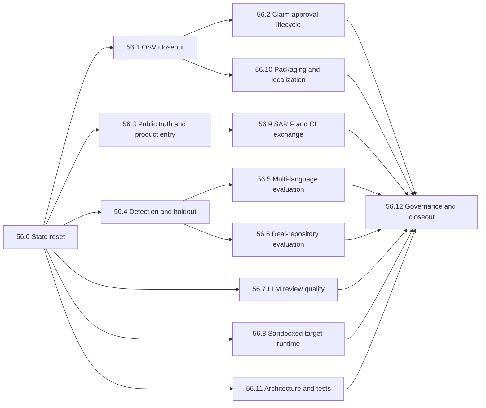

# Phase 56: Capability Claim and Product Completion Plan

Status: Planned

Planning baseline commit: `049335952742e9243302d1a92b115caebc1ec948`

Baseline date: 2026-08-16

Owner: vulnWorkbench maintainers

Target: 最新mainで既に成立したsame-commit Linux closeout、truthful SAST coverage、
server-owned preflight、Juice Shop 20/20を土台に、professional capability claim、
検出の一般化、製品主導線、交換形式、配布、保守性の主要残件を閉じる。

## 1. 結論

Phase 56は、新しいscannerや診断領域を増やすphaseではない。現在の最大課題は、
実測済み能力がclaim、公開文書、製品入口へ完全には接続されていないことと、
外部・holdout・実repositoryでの一般化が不足していることである。

実装順は次で固定する。

1. current stateとmachine-readable evidenceのsource of truthを一本化する。
2. OSV offline evidenceをauthoritative closeoutへ接続し、claimの技術適格性を完成する。
3. persisted run、same-commit report、protected human approvalを分離したclaim lifecycleを作る。
4. README、release metadata、UI入口を現在の製品能力へ合わせる。
5. OWASP弱点category、holdout、多言語、実repository、LLM reviewを順に測定する。
6. sandbox、SARIF、CI exchange、packaging、i18nを製品化gateとして閉じる。
7. test不足と大規模moduleの依存境界を改善し、backup maintainer drillを実施する。

professional claimは、技術gateを満たしただけでは`met`にしない。逆に、未対応の
enterprise機能や境界外診断を理由に、限定scopeのclaimを永久に`not_met`へ固定しない。

## 2. Planning baseline

### 2.1 Authoritative facts

2026-08-16の最新mainについて、GitHub Actions run `31944428118`はclean Ubuntu上で
`verify:strict`、secret scan、Phase 54 same-commit closeout、strict Phase 55 entryを
成功させた。run `31944428132`はcontainer-securityを成功させた。

authoritative closeout artifactは次を示す。

| Gate / metric | Current state |
| --- | --- |
| Release commit | `049335952742e9243302d1a92b115caebc1ec948` |
| Clean Linux checkout | passed |
| OWASP overall | recall `0.7993`、precision `0.9536`、FPR `0.0399`、score `0.7594` |
| Juice Shop | 20/20 vulnerable detected、20/20 fixed non-detected |
| Persisted OWASP run | present in isolated closeout database |
| Semgrep gate | passed |
| OSV professional gate | failed |
| Professional claim | `not_met` |
| Human claim approval | absent |

### 2.2 Completed work that must not be reopened

- Phase 54 same-commit authoritative Linux closeout
- Juice Shop forged feedback、CAPTCHA bypass、zero-starsを含む20/20 detection
- `full-security-scan`へのconditional Semgrep参加
- Semgrep未実行時の`source_sast_not_executed`永続化とUI/report表示
- scanner/data/runtime/target-plan preflightの永続化、CLI/API/report/UI共有、CI検証
- productionでdefaultまたはmissing `JWT_SECRET`を拒否する起動guard
- host上のJava/Python project code executionを許可しないfail-closed境界

これらはregression gateとして維持するが、Phase 56の新規実装項目として数えない。

### 2.3 Remaining problem set

| Area | Remaining issue |
| --- | --- |
| Claim | OSV gate false、claim reportへpassing run未接続、protected human approvalなし |
| Public truth | READMEと`v1.0.0`がPhase 50値、official/local diagnosticの分離なし |
| Detection | cmdi/XSS/hash recall、path traversal precision、独立holdout不足 |
| Generalization | JS/TS/Python/Go source SAST、business flow、dynamic routeの実repository評価なし |
| LLM quality | 人手labelに対するseverity、FP判定、evidence引用精度未測定 |
| Runtime | Java/Python sandbox未実装、Go start planner未実装 |
| Product | `/`とbrandがChat、security主経路とChat/RAG runtimeが同一default surface |
| Interop | SARIF 2.1 import/exportと汎用CI result envelopeなし |
| Distribution | fresh-clone/offline toolbox/release artifactの一体証跡なし |
| Sustainability | module肥大化、test gap、NightWorkers composition結合、bus factor 1 |

## 3. Scope boundary

### 3.1 In scope

- OSV authoritative offline gateとprofessional claim lifecycle
- official result / local diagnosticを分離したgenerated documentation
- Scans中心のdefault product surface
- OWASP弱点categoryとversioned holdout
- JavaScript、TypeScript、Python、Goのsource SAST評価
- consented real-repository business-flow / endpoint evaluation
- evidence-constrained LLM review quality datasetとmetrics
- Java/Python sandbox、独立sliceとしてのGo start planner
- SARIF 2.1 import/exportとversioned CI result envelope
- fresh-clone、migration、backup/restore、offline toolbox packaging
- UI copy catalogと日本語/英語切替
- focused test追加と大規模moduleの依存境界分割
- maintainership/release drillとsource-of-truth整理

### 3.2 Explicitly deferred or outside the claim

- WebSocket、GraphQL subscription、gRPC、SOAPの正式対応
- network、cloud、AD、mobile、wireless、social engineering診断
- production targetへのactive attack
- unrestricted fuzzingまたはarbitrary scanner script
- browser login/token refreshを伴うZAP active
- SSO、組織階層、remote DB、multi-node execution
- C#、PHP、Ruby、Kotlin、Rust、Terraformのsupported tier昇格
- public plugin marketplace

これらはsupport boundaryとして表示するが、Phase 56の未完了件数やrelease blockerへ
混入させない。需要と安全設計が揃った場合に独立phaseで扱う。

## 4. Source of truth and evidence rules

判断の優先順位を次で固定する。

1. current commitに結び付いたauthoritative CI artifactとverifier result
2. versioned policy、scope catalog、corpus/data/image lock
3. production implementationとfocused/negative test
4. `spec/phase-56-capability-product-completion-plan.md`
5. generated capability/release documentation
6. README、historical plan、historical evidence

規則:

- historical evidenceは書き換えず、current claimの入力に流用しない。
- local runは`diagnostic`、Ubuntu protected workflowは`authoritative`と保存する。
- missing、blocked、not measuredをpassへ変換しない。
- generated docsはmachine-readable inputから生成し、手書き数値をsource of truthにしない。
- archived planの未完了項目は、本計画へ明示的に移したものだけをactive backlogとする。

## 5. Dependency and priority map



| Priority | Slice | Main result |
| --- | --- | --- |
| P0 | 56.0 | current state、active plan、archived planの整理 |
| P0 | 56.1 | OSVを含むauthoritative technical eligibility |
| P0 | 56.2 | passing runとprotected approvalを持つclaim lifecycle |
| P0 | 56.3 | 正しい公開数値とScans中心の入口 |
| P1 | 56.4 | 弱点category改善と独立holdout |
| P1 | 56.5 | 4言語のversioned source SAST評価 |
| P1 | 56.6 | 実repositoryのbusiness/endpoint評価 |
| P1 | 56.7 | 人手label付きLLM review品質 |
| P2 | 56.8 | sandbox内だけのJava/Python/Go target start |
| P2 | 56.9 | SARIF 2.1とstable CI envelope |
| P2 | 56.10 | 再現可能な配布と日英UI |
| P2 | 56.11 | test gapと依存境界の改善 |
| P0-P2 | 56.12 | governance、same-commit release、archive closeout |

P0完了前にclaim表現、tag、default support tierを変更しない。P1/P2はP0のschemaと
source-of-truth contract確定後に並行実装できる。

## 6. Cross-cutting contracts

### 6.1 Claim lifecycle

claim状態と技術適格性を分離する。

```text
technicalEligibility: eligible | not_eligible | blocked
claimStatus: met | not_met
approvalStatus: approved | missing | rejected
```

`claimStatus=met`は次をすべて要求する。

- same release commitのclean Ubuntu run
- Semgrep、OSV、OWASP、Juice Shop、business logic、endpoint gate pass
- isolated DBへpersistしたpassing run ID
- policy/corpus/scanner/toolbox/input/output hash一致
- protected release environmentまたは同等の外部reviewer approval
- approverが実装ownerと異なる
- approvalがcandidate report hashとrelease commitを参照する

approvalをsource treeへ自己参照的にcommitしない。protected workflowのattestationとして
out-of-tree reportへ結合する。

### 6.2 Evaluation isolation

- training/analysis inputとholdoutを別lock/digestにする。
- detector authorはholdout labelを同じ変更で更新しない。
- external corpus、owned holdout、owned fixtureを表示上も分離する。
- corpus間のfile/content hash overlapをverifierで拒否する。
- real repositoryは明示consent、license確認、source非保存、local集計exportを要求する。

### 6.3 Stable machine output

CI向けcommandはstdoutへversioned JSON objectを1件だけ返す。

```text
schemaVersion
command
status: passed | failed | blocked | not_applicable
releaseCommit
profileId / resolvedProfileHash
summary
findingsRef
coverage
limitations
artifactRefs
inputHashes
```

Markdown、SARIF、internal DB JSONをこのcontractの代替にしない。

## 7. Slice 56.0 — Current-state reset

### Changes

- 本計画を唯一のactive security/release completion planにする。
- Phase 52、Phase 54、Phase 55の計画を`spec/.archived/`へ移す。
- `spec/README.md`をactive planning indexにし、concept、active plan、historical plan、
  evidenceの役割を分ける。
- Phase 54 historical baselineが宣言した過去path/hashは変更しない。
- stale statusをcurrent factとして読むtest/doc linkを除去する。

### Acceptance

- active phase planが本書1件である。
- archive後にbroken repository referenceがない。
- historical verifierが過去commitのblob/hashを引き続き検証できる。
- `rg`で旧plan pathを探した結果がhistorical evidenceまたはarchive説明だけになる。

### Verification

```bash
bun run verify:phase-54-baseline
bun run verify:phase-55-baseline
bun run check:security-capability-docs
git diff --check
```

## 8. Slice 56.1 — OSV authoritative technical closeout

### Changes

- authoritative workflowに明示的なscanner-data prepare stepを追加する。
- 8 ecosystemのOSV databaseについてversion、digest、generatedAt、freshness、runtime path、
  readabilityを検証する。
- vulnerable/fixed matrixをnetwork noneで実行し、`osv-offline-fixtures.json`を生成する。
- closeout reportへOSV artifact hash、database tree hash、ecosystem matrixを結び付ける。
- OSV prepare失敗、stale DB、runtime unreadableを`blocked`にする。
- container-securityで作ったtoolboxとclaim jobのtoolbox digestを一致させる。

### Acceptance

- professional reportのOSV gateがauthoritative Linuxで`true`になる。
- 8 ecosystemすべてでvulnerable=true、fixed=false、network requests=0になる。
- manifestだけがreadyでも実databaseが読めなければpassしない。
- OSV artifact欠落時にtechnical eligibilityが`eligible`にならない。

### Verification

```bash
bun run scanner-data:prepare -- .cache/scanner-data/phase-56
OSV_SCANNER_LOCAL_DB_CACHE_DIRECTORY=.cache/scanner-data/phase-56/osv \
  bun run test:osv:offline-fixtures
bun run verify:toolbox-offline
bun run verify:professional-capability:report
```

## 9. Slice 56.2 — Persisted run and protected approval

### Changes

- technical candidate生成とfinal claim発行を別workflow/jobにする。
- candidate jobはpassing OWASP runをisolated DBへ保存し、run IDをcandidate reportへ記録する。
- final claim jobは同じSHAをcheckoutし、protected release environmentのapproval後に全gateを
  再検証する。
- final reportへapprover identity、approval source、approvedAt、candidate report hash、
  release commitを保存する。
- passing run IDはworkflow内部のtyped outputで渡し、任意user inputを信頼しない。
- claim verifierはapproverとimplementation ownerの同一性、stale approval、report hash差異を
  拒否する。

### Acceptance

- approvalなしではtechnical eligibilityがeligibleでもclaimは`not_met`になる。
- approval付きfinal workflowだけが`met` reportを生成できる。
- DB backupからrun ID、metrics、input/output hashを再検証できる。
- final reportはsource treeを変更しない。
- claim変更PRと実装PRが分離される。

### Verification

```bash
bun run phase-54:closeout
bun run verify:phase-54-closeout
bun run verify:professional-capability
bun run check:release-metadata
```

## 10. Slice 56.3 — Public truth and security-first entry

### Changes

- authoritative Linux resultとlocal diagnostic resultを別tableとして生成する。
- READMEのPhase 50数値をgenerated current resultへ置き換える。
- `v1.0.0` tagは移動せず、次versionのrelease noteを新規作成する。
- `/`、brand link、login後defaultを`/scans`へ変更する。
- Projects / Scansをprimary navigation、Knowledge / Chat / Searchをsecondary surfaceにする。
- default `security` product modeではChat/Search/Knowledge routeとagentic/RAG runtimeを
  composeしない。必要な環境だけ`extended` modeを明示選択する。
- scan reviewに必要なLLM routeはChat product surfaceから独立させる。

### Acceptance

- fresh loginから2操作以内にscan開始へ到達できる。
- `/`とbrandがScansへ到達する。
- READMEにofficial、diagnostic、limitations、evidence URL/hashが同時表示される。
- security modeでChat/Search/Knowledge navigation、API、background runtimeが起動しない。
- extended modeを無効にしてもscan review/report fallbackが動作する。

### Verification

```bash
bun run docs:security-capability
bun run check:security-capability-docs
bunx vitest run web/src/router.test.tsx web/src/app-header.test.tsx
bun run test:e2e
bun run check:release-metadata
```

## 11. Slice 56.4 — OWASP category and holdout improvement

### Changes

- cmdi、hash、XSSのfalse negativeをsource/sink/helper/branch/framework別に分類する。
- path traversalはcross-CWE attributionとreachable flowを分離し、実findingを単に抑止しない。
- changed ruleごとにsuppression auditとbefore/after artifactを保存する。
- whitespace、helper、branch、wrapper、safe sanitizerを含むheld-out metamorphic pairを追加する。
- current Juice Shop 20/20をnegative regression gateとして固定する。

### Acceptance

| Metric | Minimum |
| --- | ---: |
| OWASP overall recall / precision / FPR | no regression from Phase 56 baseline |
| cmdi recall | `>= 0.70` |
| hash recall | `>= 0.70` |
| XSS recall | `>= 0.70` |
| path traversal precision | `>= 0.80` |
| path traversal FPR | `<= 0.10` |
| Juice Shop | 20/20 vulnerable、20/20 fixed |
| Holdout | vulnerable/fixed pass、fixture overlap 0 |

### Verification

```bash
bun run benchmark:owasp
bun run benchmark:owasp:analyze
bun run benchmark:juice-shop
bun run test:detection-effectiveness
bun run verify:professional-capability:report
```

## 12. Slice 56.5 — Multi-language source SAST evaluation

### Changes

- JavaScript、TypeScript、Python、Goごとにlicense、version、digest、ground truthを持つ
  external corpusまたは明示的owned holdoutを選定する。
- Java OWASPと同じTP/FN/TN/FP semanticsを使うcommon runner/scorerを作る。
- unsupported syntax、timeout、unmapped resultを黙って分母から除外しない。
- 初回runはdiagnosticとし、corpus adequacy review後に別PRでlanguage policyを追加する。

### Acceptance

- 4言語すべてでpositive/negativeを測定する。
- corpus/rule/implementation/raw/normalized/metricsのhash chainを再計算できる。
- owned fixtureとのhash overlapが0である。
- 未測定言語を`verified`と表示しない。

## 13. Slice 56.6 — Real-repository product validation

### Changes

- consent、license、revision、language、framework、sizeを持つopt-in protocolをversion化する。
- 最低3 repositoryかつ2言語以上でbusiness flowとendpoint discoveryを評価する。
- dynamic route、nested router、generated route、middleware ownership、negative routeを含める。
- source/snippet/absolute pathをrelease artifactへ保存せず、redacted aggregateだけをexportする。
- review yield、time-to-first-actionable-result、verification success、coverage gapを測定する。

### Acceptance

- owned business fixture 8件と実repository結果を別表示する。
- endpoint fixture 11件と実repository結果を別表示する。
- repository-specific tuningを一般claimへ混入させない。
- cohort不足時はsoftware releaseをblockせず、product-value claimを`not_measured`にする。

## 14. Slice 56.7 — Evidence-constrained LLM review quality

### Changes

- secret、SCA、SAST、DAST、authorization、business logicのredacted caseをversion管理する。
- 各caseへallowed evidence refs、severity range、FP label、must-not-claim、remediation constraintを付ける。
- labelは独立2 reviewまたはowner/reviewer sign-offを要求する。
- deterministic providerとlive opt-in providerを分離し、live caseは最低3回実行する。
- severity agreement、FP precision/recall、evidence citation precision、unsupported claim rateを測る。

### Acceptance

- schema valid `100%`、unknown evidence ref `0`、unsupported factual claim `0`、leak `0`。
- severity/FP thresholdはbaseline取得後の別policy PRで決める。
- model未設定・失敗時はdeterministic reportが`ready_with_limitations`で完了する。
- LLM metricをscanner recall/precisionやfinding confirmationへ合算しない。

## 15. Slice 56.8 — Sandboxed target runtime

### Changes

- digest-pinned、non-root、read-only mount、tmpfs limit、cap-drop、no-new-privileges、
  CPU/memory/PID/timeout、internal-only networkを持つsandbox runnerを実装する。
- Java/Python start planをsandbox requestへ変換する。
- dependency installを行わず、prepared offline input不足時は`blocked`にする。
- Go plannerは独立PRでnet/http、Gin、Echoを対象に追加する。
- start前後tree hash、container/network cleanup、egress 0をartifact化する。

### Acceptance

- target project processがhostでspawnされない。
- public/metadata/Docker socket/host credentialへ到達できない。
- cleanup failureをsuccessへ変換しない。
- Go main ambiguityを`target_start_ambiguous`として拒否する。

## 16. Slice 56.9 — SARIF 2.1 and CI exchange

### Changes

- SARIF 2.1.0 import/exportをversioned adapterとして追加する。
- origin、tool identity、rule ID、location、fingerprint、artifact hashを保持する。
- imported severityだけでfindingを`confirmed`へ昇格しない。
- path traversal、repository外URI、oversized log、duplicate result、unsupported versionを拒否する。
- scan/profile/report/claim向けのstable JSON CI envelopeとexit-code policyを追加する。

### Acceptance

- Semgrep、Gitleaks、Trivyのfixtureをloss-awareにround tripできる。
- SARIF unknown fieldをboundedに無視し、既知security fieldの型不整合を拒否する。
- GitHub、GitLab等の固有adapterなしで一般CIから結果を判定できる。
- Markdown output変更がCI JSON contractを壊さない。

## 17. Slice 56.10 — Packaging, onboarding, and localization

### Changes

- macOS/Ubuntu fresh-cloneを一つのversioned command sequenceへ統一する。
- migration 0→current、one-version-behind、backup/create/verify/restoreをCIで実行する。
- toolbox image digest、embedded manifest、SBOM、provenance、license/NOTICEをrelease artifactへ保存する。
- third-party corpus/imageを配布できない場合は取得・検証手順と`blocked`状態を明示する。
- 144 npm scriptsと56 CLI entrypointを目的別top-level command/helpへ整理する。
- UI copyをtyped catalogへ移し、日本語と英語を切替可能にする。日英混在を許可しない。
- READMEをoverview、quick start、measured capability、advanced runbookへ分割する。

### Acceptance

- clean macOS/Ubuntuでbootstrapからfirst measured scanまで同じ手順が成功する。
- release bundleだけでoffline toolbox verificationが成功する。
- helpから主要workflowへ2階層以内で到達できる。
- ja/en双方でprimary workflowにmissing keyがない。

## 18. Slice 56.11 — Architecture and focused tests

### Changes

- 先にcharacterization testを追加し、その後にmodule boundaryを動かす。
- `api/modules/diagnostics`へrepository/check/report/inventoryのmodule-local testを追加する。
- admin-users、agentic-search、artifacts、business-logic、chat、finding-reviewsへroute testを追加する。
- Scans UIのlaunch、preflight、result、review、report、zero-findingをcomponent/E2Eで覆う。
- `api/modules/scans`をprofile/preflight/execution/finding/reportの依存方向へ分割する。
- `static-intelligence`をinventory/generation/query/exportへ分割する。
- NightWorkersをapp compositionからintegration module factoryへ隔離する。
- plugin capabilityはcontributionから導出できるものを導出し、semantic declarationだけを手書きに残す。

### Acceptance

- 追加した6 routeすべてに認証/認可、invalid input、successの専用testがある。
- diagnostics各submoduleにpositive/negative testがある。
- scans/static-intelligence間に新しい循環依存がない。
- app compositionがNightWorkers concrete repository/serviceを直接newしない。
- plugin analyzer/extractor追加時に同じ能力を複数registryへ登録しない。
- refactor前後でpublic API/schema/metric hashが意図せず変化しない。

## 19. Slice 56.12 — Governance and same-commit closeout

### Changes

- security、database、scanner、web、releaseのbackup maintainerを実名または検証可能なidentityで割り当てる。
- backup maintainerがbackup/restore、migration、strict、clean-checkout、release metadata drillを実施する。
- production runbookへ`NODE_ENV`誤設定の検出とdeployment preflightを追加する。
- development bootstrapは既知共有JWT secretを再利用せず、local secretを生成・保持する。
- selected scopeの全gateを同一clean Ubuntu commitへ結び付ける。
- source tree、artifact、approval、tag、release note、SBOMのhash/linkをfinal reportへ保存する。

### Acceptance

- backup maintainer 1名以上がrelease drillを独立完了する。
- production-like deploymentで`NODE_ENV!=production`を明示的に拒否できる。
- required gateに`blocked`があればcloseoutしない。
- `v1.0.0`を移動せず、新tagとpackage/release note/report versionが一致する。
- release artifactにcredential、source snippet、absolute home pathがない。

## 20. PR sequence

| PR | Scope | Must not include |
| --- | --- | --- |
| 56-A | state index、archive、baseline contract | runtime変更 |
| 56-B | OSV authoritative evidence | claim `met`変更 |
| 56-C | claim candidate/final approval workflow | detector変更 |
| 56-D | generated docs、README、home/brand | benchmark policy変更 |
| 56-E1..E4 | OWASP categoryごとの改善 | corpus threshold変更 |
| 56-F1..F4 | language corpus/runner/policy | 他言語の同時pass化 |
| 56-G | real repository protocol/metrics | private source保存 |
| 56-H | LLM dataset/runner、別policy PR | scanner verdict変更 |
| 56-I1/I2 | Java/Python sandbox、Go planner | host fallback |
| 56-J1/J2 | SARIF、CI envelope | imported auto-confirmation |
| 56-K | packaging/docs/i18n | enterprise機能 |
| 56-L1..L4 | tests、module boundary、integration isolation | behavior変更の混在 |
| 56-M | governance、final closeout、new release | unrelated feature |

各PRはbaseline、positive test、negative test、rollback条件を持つ。schema、migration、
runtime default、claim、support tierの変更を同一PRへ混在させない。

## 21. Required closeout commands

```bash
bun run format:check
bun run typecheck
bun run test
bun run test:e2e
bun run test:security-capability
bun run test:detection-effectiveness
bun run security-corpora:verify
bun run verify:toolbox-offline
bun run verify:strict
bun run verify:professional-capability:report
bun run check:release-metadata
git diff --check
```

外部corpus、Docker、offline DB、browser、live model、human approverが必要なgateは、
missingをpassにせず`blocked`または`not_measured`として保存する。

## 22. Definition of Done

Phase 56のtechnical completion:

- [ ] OSVを含む全technical claim gateがauthoritative Linuxでpassする。
- [ ] passing run IDと全provenance hashがisolated DB/reportで一致する。
- [ ] READMEとgenerated docsがofficial/local/limitationsを正しく分離する。
- [ ] `/`とbrandがScansへ到達し、security modeがdefault surfaceになる。
- [ ] OWASP弱点categoryとholdout targetを満たす。
- [ ] JS/TS/Python/Go評価で未測定をverifiedと表示しない。
- [ ] real-repository business/endpoint metricsがowned fixtureと分離される。
- [ ] LLM review qualityが人手labelに対して測定される。
- [ ] Java/Python/Go target startがsandbox外で実行されない。
- [ ] SARIF 2.1とstable CI envelopeがnegative test付きで利用できる。
- [ ] fresh-clone、migration、backup/restore、offline toolbox gateがpassする。
- [ ] diagnostics、6 route、Scans UIのfocused test gapが閉じる。
- [ ] selected scopeのsame-commit Ubuntu closeoutがpassする。

Professional claim completion:

- [ ] technical eligibilityが`eligible`である。
- [ ] protected reviewer approvalがcandidate report hashとrelease commitへ結び付く。
- [ ] final reportだけが`claimStatus=met`を持つ。
- [ ] claim scopeとunsupported/deferred boundaryを公開文書で明示する。

Sustainability completion:

- [ ] backup maintainerが1名以上割り当てられrelease drillを完了する。
- [ ] active plan indexとarchiveに新旧混在がない。
- [ ] next versionのtag、package、release note、report、SBOMが一致する。

## 23. Stop conditions

次のいずれかが発生したsliceはmergeまたはrolloutを停止する。

- missing evidence、DB、corpus、runtime、approvalをpassへ丸めた。
- benchmark threshold、ground truth、分母を実装結果に合わせて弱めた。
- holdout labelをdetector変更と同じreview境界で変更した。
- target project codeをhostでspawnした。
- imported SARIFまたはLLM outputだけでfindingをconfirmedへ昇格した。
- source、snippet、credential、absolute home pathをrelease artifactへ保存した。
- security mode無効化によりscan review/reportのdeterministic fallbackが壊れた。
- required gateがblockedのままclaim、support tier、tagを進めた。

停止時は安全境界やpolicyを弱めず、該当sliceをrollbackまたは`blocked`へ戻す。
