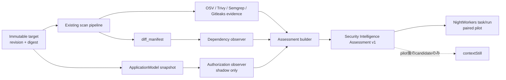

# Security Intelligence Initial Implementation Roadmap

## Status

- Status: Proposed
- Owner: `vulnWorkbench`
- Last updated: 2026-08-15
- Source concept: [Security Intelligence Integration Concept](./security-intelligence-integration-concept.md)
- Scope: 最初の実証を成立させる4 PR。default activationと恒久知識への自動登録は含めない。
- Progress: PR 1 committed as `538866f`; PR 2 implemented and verified; PR 3以降は未着手

## 1. 結論

最初に作るべきものは新しいscannerや大規模な統合基盤ではなく、既存のscan evidenceをrevisionへ結び付けて説明する、小さな`Security Intelligence Assessment` producerである。

実装は次の4 PRへ分割する。

1. assessment contractとbaseline fixtureを固定する。
2. dependency changeを対象に、既存evidenceからassessmentを生成する最初の縦切りを作る。
3. authorization boundary changeをshadow modeで観測する。
4. NightWorkersとのpaired pilotをdefault OFFで実行可能にする。

この順序なら各PRを単独でmerge・revertできる。PR 2で最小価値を確認でき、Authorization解析の不確実性がDependency経路を止めない。

## 2. 実装イメージ



`vulnWorkbench`はscannerの生出力をそのまま「安全判定」へ変換しない。対象revision、確認scope、evidence、coverage gap、unknown、residual riskを一つのassessmentへ投影する。NightWorkersはその結果をtask/runへ関連付け、contextStillへの知識候補生成はpilot後の別段階とする。

## 3. 現在地と再利用方針

| 領域 | 現在あるもの | 初期実装での扱い |
| --- | --- | --- |
| NightWorkers連携 | `shared/schemas/nightworkers-security-scan-integration.schema.ts`とintegration routes | v1を変更しない。新しいassessment contractを別version空間で追加する |
| 差分scope | `api/modules/scans/diff-scan-plan.ts`、`diff-snapshot.ts` | 再計算せず、scan時に保存したtargetとmanifestを利用する |
| Evidence | `diff_manifest` artifact、finding/report、OSV/Trivy等のtool run | assessmentのverification/evidence referenceへ投影する |
| Dependency検出 | npm、Maven、Gradle、Python、Goを扱う既存差分判定 | 最初のproduction-like vertical sliceにする |
| Authorization情報 | `ApplicationModel`のentrypointと`authorizationGuards` | revision bindingと精度を補強し、PR 3ではshadow出力だけにする |
| Static Intelligence | canonical ontologyを所有しないhandoff設計 | 境界を維持する。永続知識へ直接書き込まない |
| Rollout evidence | 既存判断は`INSUFFICIENT_EVIDENCE` | default OFFを維持し、paired pilotの結果で再判断する |

## 4. PR構成

| PR | 成果 | 主な新規・変更箇所 | Merge gate |
| --- | --- | --- | --- |
| [PR 1](./security-intelligence-pr1-contract-and-baseline-plan.md) | Contract + baseline | `shared/schemas/`、`shared/fixtures/`、検証script | schema、negative fixture、hashが決定的 |
| [PR 2](./security-intelligence-pr2-dependency-change-assessment-plan.md) | Dependency縦切り | `api/modules/security-intelligence/`、CLI | 保存済みrevision/evidenceから説明可能なassessmentを生成 |
| [PR 3](./security-intelligence-pr3-authorization-boundary-shadow-plan.md) | Authorization shadow | revision-bound snapshot、observer、fixture | coverage lossをchangeと誤認せず、runtime判断へ影響しない |
| [PR 4](./security-intelligence-pr4-nightworkers-pilot-plan.md) | NightWorkers pilot | 独立integration endpoint、metric、pilot evidence | wrong-revision 0件、既存v1非破壊、default OFF |

依存関係は`PR 1 -> PR 2 -> PR 4`が必須で、PR 3はPR 1 merge後にPR 2と並行開発できる。PR 4のAuthorization出力はPR 3が間に合わなくてもoptionalとして扱い、Dependency pilotを止めない。

## 5. Cross-repositoryの並行開発境界

PR 1のfixtureとcanonical hashを3 repositoryの共通接点にする。実装コードのcopyは行わない。

| Repository | PR 1後に並行着手できること | まだ着手しないこと |
| --- | --- | --- |
| `vulnWorkbench` | Assessment producer、observer、evidence projection | canonical task/knowledgeの所有 |
| `NightWorkers` | fixture-based consumer、task/runへのreference保持、UI/CLIのshadow表示 | assessment内容の再判定、producer evidenceの改変 |
| `contextStill` | candidate受入schemaとprovenance validationの設計 | pilot前の自動登録、candidateの自動昇格 |

Cross-repository契約変更は、次の順で行う。

1. `vulnWorkbench`でschema、positive/negative fixture、hashをmergeする。
2. NightWorkers/contextStillが同じfixtureをconsumer testへ取り込む。
3. 全consumerが新versionを受け入れてからproducerを切り替える。
4. 旧version廃止は別PR・別判断とする。

## 6. 共通実装規則

- 対象はpathだけでなく`projectRef + sourceRevision + targetDigest`で同定する。
- `no findings observed`を`safe`へ変換しない。
- `declared`、`observed`、`inferred`、`task_projection`を混同しない。vulnWorkbenchが生成できるclaimは原則`observed`または`inferred`である。
- `tested`はrequired verificationが完了し、再確認可能なevidence referenceを持つ場合だけ表現できる。
- required toolの失敗、revision不一致、artifact欠落は`inconclusive`またはhard failureにする。
- source本文、secret、絶対pathをintegration responseやtelemetryへ含めない。
- 既存NightWorkers scan contract version 1のfield、enum、意味を変更しない。
- DB migration、UI、MCP tool、新scanner追加は、vertical sliceの成立に必要になるまで遅延する。

## 7. 各PRの共通チェック

各PR descriptionには次を含める。

- このPRが所有する判断と、所有しない判断
- revision/evidence bindingの方法
- positive fixtureとnegative fixture
- focused test、typecheck、`git diff --check`の結果
- failure時の挙動とrollback方法
- 次PRへ進むためのgate

標準検証コマンドは次の通り。各PR計画に追加のfocused testを記載する。

```bash
bun run typecheck
git diff --check
```

## 8. 初期trancheのDefinition of Done

4 PRをmergeしただけではdefault ONにしない。初期tranche完了は、次をすべて満たした状態とする。

- Dependency changeについて、保存済みscan runからrevision-bound assessmentを再生成できる。
- required verificationの未実行・失敗を成功扱いしない。
- Authorization observerの解析不能を`coverage_lost`または`unknown`として表現できる。
- NightWorkersが既存scan contractを壊さずassessmentを参照できる。
- paired pilot evidenceがversion管理されたartifactとして残る。
- 誤ったproject/revisionへの紐付けとsecret/path leakが0件である。
- default activationの判断が、実装PRとは別のdecision recordで行われる。

## 9. 今回含めないもの

- 「安全」「脆弱性なし」という総合判定
- 全言語・全frameworkのAuthorization解析
- LLMだけを根拠とするfindingやverification status
- contextStillへの自動知識登録・自動昇格
- 自動修正、merge block、deployment gate
- 新しいscannerの導入
- 既存NightWorkers scan API v1の破壊的変更

## 10. 最初の着手点

最初の実装作業はPR 1のschema skeletonとnegative fixtureである。特に「revision不一致」「required verificationにevidenceがない」「絶対pathを含む」の3ケースを先にrejectできる状態を作る。それが成立してからpositive fixtureを固定し、NightWorkers/contextStillへ共有する。
